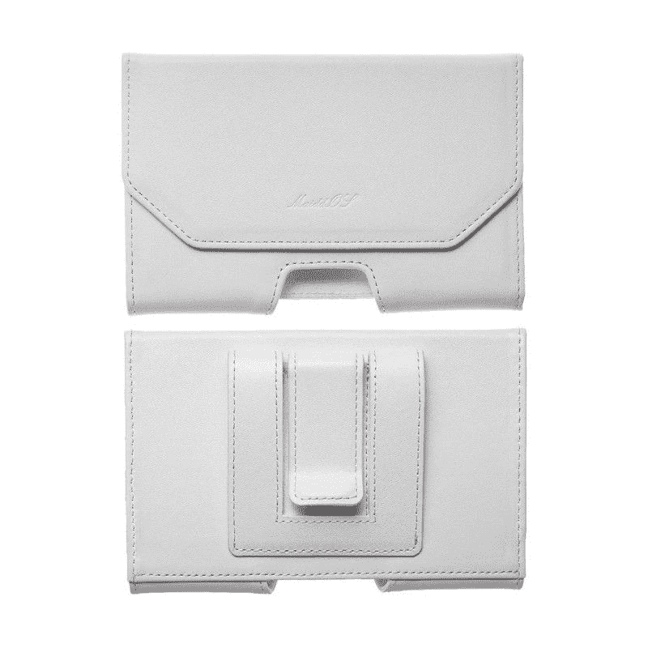
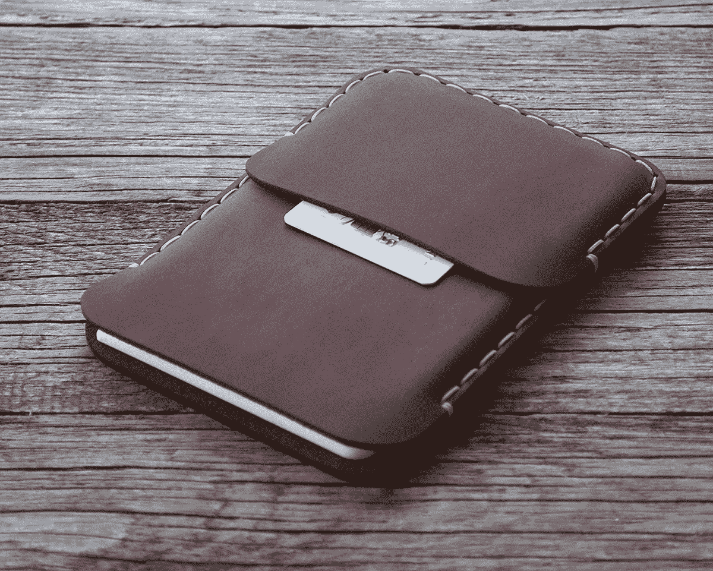
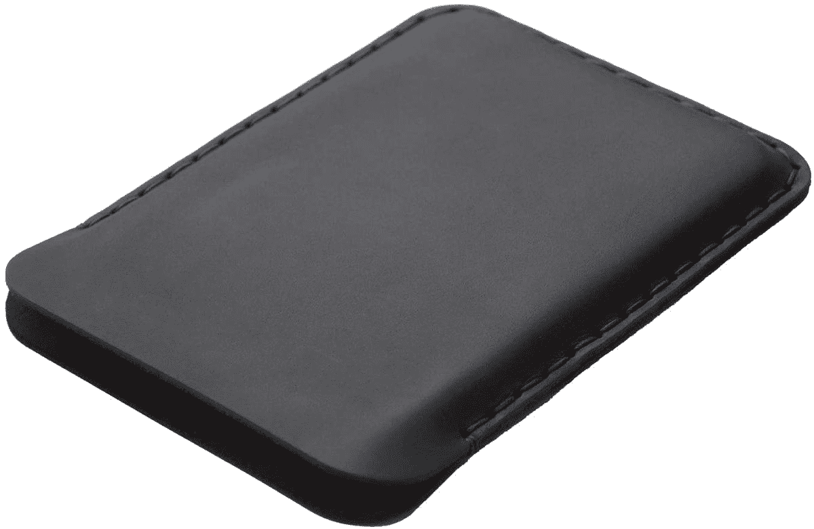
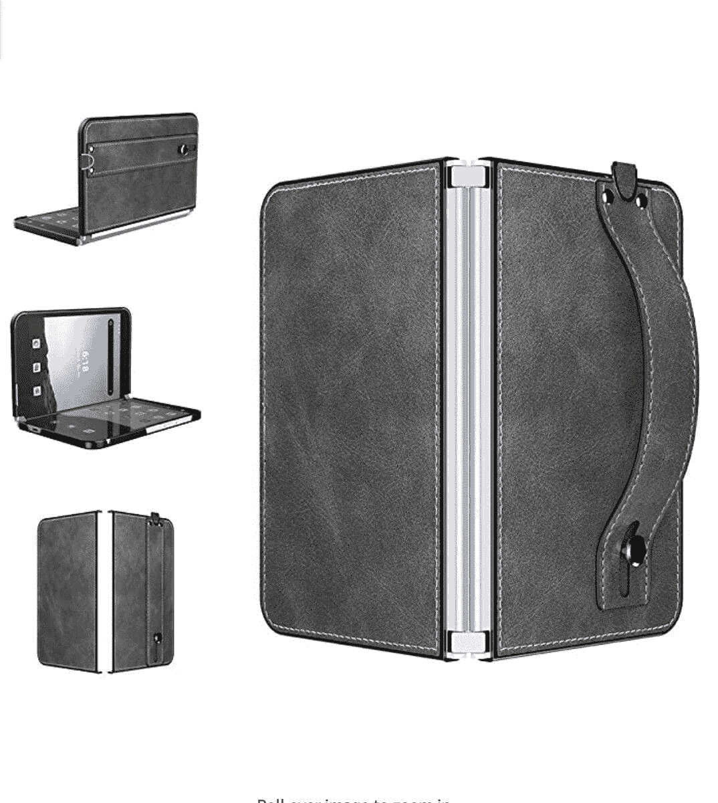
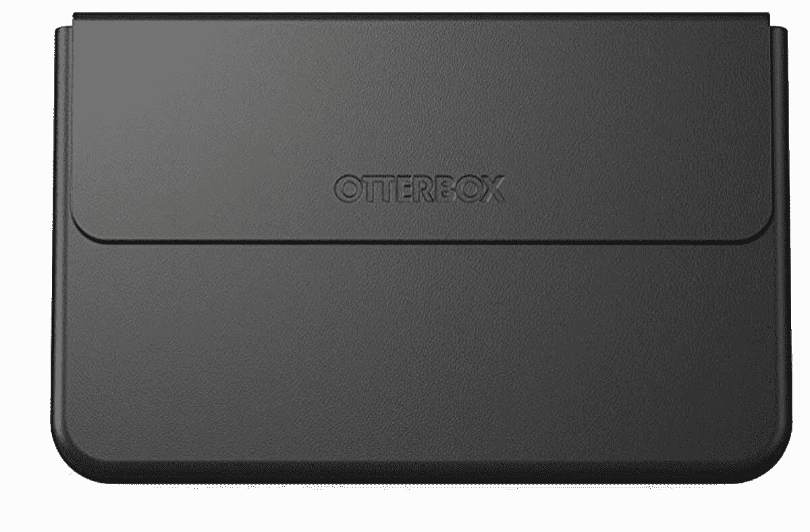
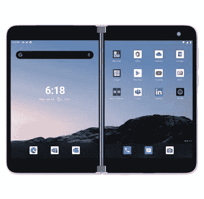

# 2023 年最佳微软 Surface Duo 案例

> 原文：<https://www.xda-developers.com/opinion-in-the-year-of-compromises-microsoft-nailed-flagship-hardware/>

# 2023 年最佳微软 Surface Duo 案例

微软 Surface Duo 售价约 1000 美元，是一项巨大的投资。所以，你会想用最好的微软 Surface Duo 保护它。

微软的双屏移动设备 Surface Duo 是过去几年最令人兴奋的产品发布之一。它装有两个 5.6 英寸的显示屏，可以变成一个 8.1 英寸的平板电脑，一个 360 度铰链，一个骁龙 855 处理器，Android 10 等等。微软 Surface Duo 目前的价格约为 700 美元，价格可能已经下降了很多，但总体而言，它仍然是一款昂贵的设备。如果你已经购买了一台 Surface Duo 或者正在考虑购买一台，你绝对应该将设备放在保护套中，这样它就不会被划伤、碰撞或损坏。

自 Surface Duo 于 2020 年推出以来，市场上已经发布了许多该设备的保护套。为了帮助你选择一个，我们收集了 2021 年微软 Surface Duo 的最佳案例。

 <picture></picture> 

Surface Duo Bumper

##### 微软 Surface Duo 保险杠

如果你不想给 Surface Duo 增加更多体积，你应该看看微软的这款硅胶保险杠。它将保护双屏设备的边缘，同时提供对每个按钮、SIM 卡托盘、指纹扫描仪和 USB-C 充电端口的访问。你可以在冰川、石墨、冰蓝色和灰烬中找到它。

 <picture></picture> 

Maiddos case

##### maridos surface duo 表壳

微软 Surface Duo 的 Maiddos 外壳由 PU 皮革制成，配有超细纤维衬里。它不仅手感好，还能为设备提供必要的保护。此外，它还包括一个皮带支架和一个夹子。

 <picture></picture> 

Happer Studio Case

##### Happer Studio 皮革钱包表面双人袖套

这款包由疯马歌舞秀皮革制成，可安全存放您的 Surface Duo。此外，你可以用你的首字母、名字或座右铭来个性化它。它还带有一个口袋，这样你就可以存放一张卡或一些现金。

 <picture></picture> 

Happer Studio Bovine Leather cover

##### Happer Studio 皮革表面双人袖套

这是 Happer Studio 的另一款皮套，但它去掉了该公司其他皮套中的额外口袋和个性化选项。你仍然会得到一个手工制作的看起来很高级的疯马皮套。

 <picture></picture> 

Foluu Leather Case

##### Foluu 皮革表面双层表壳

这款来自 Foluu 的行李箱采用优质合成革和坚韧的聚碳酸酯外壳制成。它不仅看起来和感觉都很棒，而且配有表带，不会让您的宝贝 Surface Duo 掉落。

 <picture></picture> 

OtterBox Ocity Series

##### OtterBox Ocity Surface Duo 表壳

OtterBox 以制作高质量、坚固耐用的箱子而闻名，Ocity 系列就是一个很好的例子。这款优质袖套专为 Surface Duo 设计，提供全方位保护、纤薄设计、磁性锁扣等。

 <picture></picture> 

OtterBox Theorem Series

##### OtterBox 定理曲面 Duo 情况

OtterBox 定理系列是一款对开风格的表壳，由优质耐用的材料制成。表壳为 Surface Duo 提供防刮擦保护。此外，它还提供了一个内部粘合垫，以防止设备在外壳内移动，不同的支架角度，一个卡和 Surface 笔筒，以及与 Surface Duo Bumper 的兼容性。

 <picture></picture> 

MightySkins Decal Cover

##### MightySkins 表面双人贴花包装

想要为你的 Surface Duo 增加更多色彩，同时保护它免受刮擦？那你应该看看 MightySkins 贴花封面。这是一个柔软的乙烯基盖，可以保护 Surface Duo 前面的玻璃面板和屏幕挡板。你也可以从各种各样的图案中选择。

 <picture></picture> 

Kensington Belt Holster

##### 肯辛顿表面双带皮套

如果你正在寻找可以在不使用 Surface Duo 时保护它的东西，Kensington 的这款皮带皮套值得考虑。从任何意义上来说，这都不是一个箱子，但它可以让设备保持在你的腰带上，提供足够的保护。

* * *

正如你所看到的，微软 Surface Duo 有许多可用的外壳。这些伟大的案件中的任何一个都将保护您宝贵的 Surface Duo，但最终，你应该选择哪一个？如果你在寻找最大程度的保护，我们推荐 [OtterBox Ocity 系列](https://www.amazon.com/dp/B08J4H9JFJ/?tag=xda-7j2ff0c-20&ascsubtag=UUxdaUeUpU2764&asc_refurl=https%3A%2F%2Fwww.xda-developers.com%2Fbest-microsoft-surface-duo-case%2F&asc_campaign=Short-Term)或者[OtterBox theory 系列](https://www.amazon.com/OtterBox-THEOREM-Case-Microsoft-Surface/dp/B08J4JF176/?tag=xda-7j2ff0c-20&ascsubtag=UUxdaUeUpU2764&asc_refurl=https%3A%2F%2Fwww.xda-developers.com%2Fbest-microsoft-surface-duo-case%2F&asc_campaign=Short-Term)。但是它们昂贵的价格标签并不适合所有人。如果你想要更便宜的东西，Foluu 皮套值得考虑，因为它只需 12.99 美元，并提供全方位的保护。

 <picture></picture> 

Microsoft Surface Duo

##### 微软 Surface Duo

Surface Duo 是微软首次尝试制造安卓设备。它有两个屏幕，超薄，是一个生产力发电站。如果你想要一部适合工作的移动设备，Surface Duo 可能适合你。