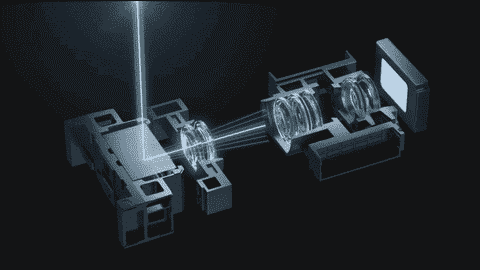
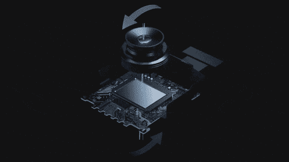
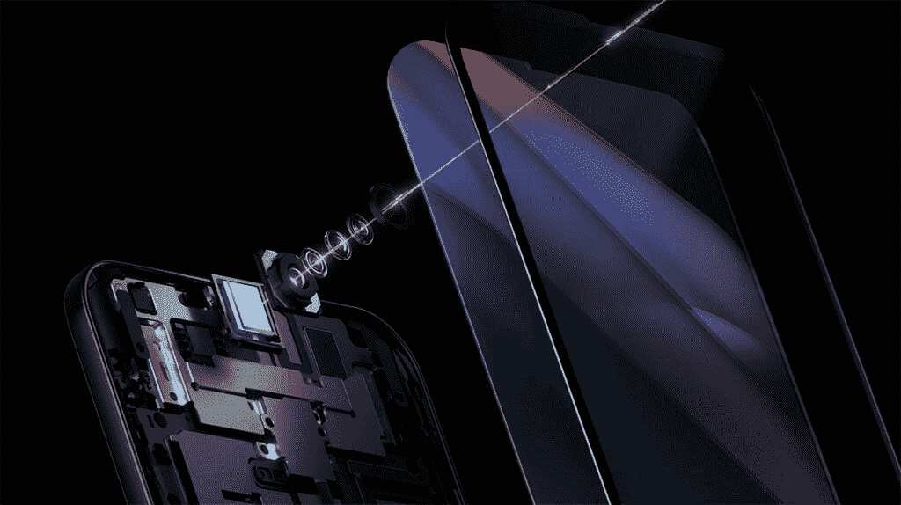

# OPPO 展示面向未来设备的新型成像解决方案

> 原文：<https://www.xda-developers.com/oppo-camera-sensors-promise-better-colors-continuous-zoom-stability/>

OPPO 今天在深圳举办了未来成像技术发布会，展示了几款新的相机创新。该公司向我们详细介绍了其第三代下显示相机解决方案，它在本月早些时候戏弄了一个新的 RGBW 传感器，一个 85-200 毫米连续光学变焦相机和一个五轴 OIS 解决方案。以下是 OPPO 所有新相机创新的简要概述:

## 下一代 RGBW 传感器

OPPO 的下一代 RGBW 传感器承诺显著提高感光度，因为它具有额外的白色子像素、DTI 技术和 OPPO 自制的 4 合 1 像素算法。由于这些改进，新的 RGBW 传感器比以前的传感器多捕获 60%的光，并实现了高达 35%的降噪，在低光照条件下提供更清晰、更明亮的图像。

 <picture></picture> 

OPPO's new RGBW sensor

OPPO 声称，新传感器“采用先进的制造和处理技术制造，提高了执行复杂算法所需的计算能力，并最大限度地增加了通过传感器的白色像素提取的数据量。”此外，该公司专有的 4 合 1 像素算法提高了传感器的色彩性能，防止了色彩不准确和莫尔条纹等问题，DTI 像素隔离技术防止了子像素串扰，提高了图像质量。

下一代 RGBW 传感器将在 2021 年第四季度开始的 OPPO 产品中亮相。

## 85-200 毫米连续光学变焦相机

OPPO 新的 85-200 毫米连续光学变焦相机模块使用玻璃和塑料镜头的组合，提供平滑的光学变焦。该模块具有两个超薄、高精度的非球面玻璃透镜，以提高光学效果，如最大限度地减少杂散光。它还具有隧道磁阻传感器(TMR 传感器)，可确保模块内镜头的移动更加稳定和精确。此外，该模块包括一个升级的导向轴电机，该电机增加了镜头系统可以移动的动态倾斜，从而在更高的放大率下提供连续的光学变焦。

 <picture></picture> 

OPPO's 85-200mm continous optical zoom module

上述创新支持 85-200 毫米等效焦距范围内的连续光学变焦，在整个变焦范围内提供平滑过渡。升级还有助于该模块避免跳跃、白平衡不准确和色彩偏差等常见问题，这些问题困扰着智能手机上的传统多摄像头变焦系统。

## 五轴 OIS

OPPO 新的五轴光学图像稳定(OIS)允许相机系统从陀螺仪接收运动数据，并使用它来提供更好的稳定性。数据被传递到模块的两个可移动组件上——镜头和图像传感器——它们分别由滚珠轴承电机和形状记忆合金驱动。

 <picture></picture> 

OPPO's new five-axis OIS solution

在移动相对较小的情况下，系统使用镜头移动 OIS (X 轴和 Y 轴移动)进行稳定。但当运动幅度较大时，该系统还利用传感器偏移 OIS (X 和 Y 轴偏移和滚动)以及算法补偿来实现稳定。该系统允许最大 3°的稳定角，这是其他设备上传统 OIS 技术的三倍。此外，OPPO 针对夜间或运动拍摄的专有算法可以进一步提高稳定性、清晰度和色彩表现，将振动补偿提高高达 65%。

OPPO 的五轴 OIS 系统将于 2022 年 Q1 奥运会开始在商业产品上亮相。

## 专有的屏幕下摄像机算法

本月早些时候，OPPO 展示了其第三代显示器下摄像头解决方案。今天，该公司强调了支持屏幕下摄像头的新算法。这些算法将有助于减少衍射、防凝聚、HDR 和 AWB，以优化使用新的下显示相机点击的图像。

 <picture></picture> 

OPPO's third-gen under-display camera solution

由于这些专有算法，OPPO 的第三代显示器下相机解决方案将能够提供更好的效果，让用户拍摄更清晰、更自然的自拍。点击上面的链接，您可以了解更多关于 OPPO 第三代显示器下摄像头解决方案的信息。