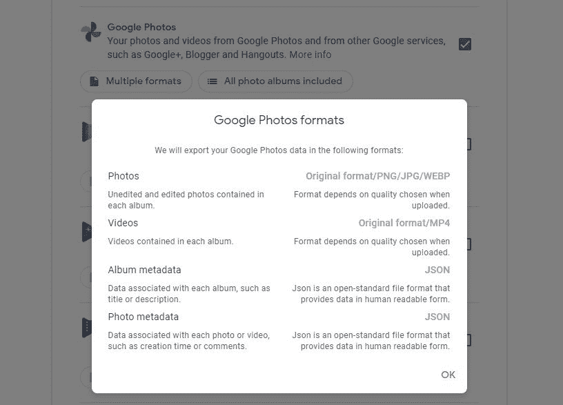

# 使用以下 Python 脚本组织导出的 Google 相册

> 原文：<https://www.xda-developers.com/organize-your-exported-google-photos-collection-with-this-python-script/>

这是我们知道最终会到来的消息。自 2015 年以来提供免费无限制的高质量备份后，谷歌照片将于 2021 年 6 月 2 日开始从你的谷歌账户开始计算高质量上传的存储空间。

自然地，人们已经开始考虑到时候他们会如何处理他们的照片和视频收藏。一种选择是导出您的照片，然后使用替代服务。你可以使用[谷歌外卖](https://takeout.google.com/?pli=1)来下载你的整个图书馆，但是如果你有大量的照片和视频，使用这个选项可能会导致一些麻烦。这是因为，不管出于什么原因，谷歌选择用。json 文件在里面。但是，如果您只想拥有一个按时间顺序存储所有照片的文件夹，或者您想按月份和年份组织所有照片，该怎么办呢？

 <picture></picture> 

Exporting photos and videos from Google Photos using Google Takeout

*Google 外卖导出的输出文件夹结构。*

幸运的是，在你用过谷歌外卖后，有一种方法可以快速整理你下载的谷歌照片。GitHub 用户 TheLastGimbus 创建了一个 Python 脚本，它将组织和清理您的 Google 外卖导出，以便您有一个按时间顺序存储所有照片的文件夹，或者多个按年份和月份分类的文件夹。

要运行照片导出脚本，您需要为您的系统下载并安装 Python 3。然后，您可以使用 Python 的 pip 命令安装脚本。最后，您可以在提取从 Google 外卖下载的归档文件后执行脚本。你可以在下面的 GitHub 上找到 LastGimbus 提供的完整说明。

**[GitHub 上的 Google 相册外卖助手](https://github.com/TheLastGimbus/GooglePhotosTakeoutHelper/)**

谷歌正在改变其关于照片的政策，这非常令人失望，但完全在意料之中。多年来，这一直是该公司最好的服务之一，因此看到它成为付费墙后，它的吸引力就大大降低了。同样值得注意的是[未来的 Pixel 手机](https://www.xda-developers.com/future-pixel-phones-reportedly-wont-get-unlimited-google-photos-backups/)不会提供免费的无限照片上传。但幸运的是，你不会被迫坚持使用这项服务，所以你可以下载你的照片，然后离线或将它们转移到另一项服务，这个 Python 脚本可以帮助你省去这个过程中的一些麻烦。