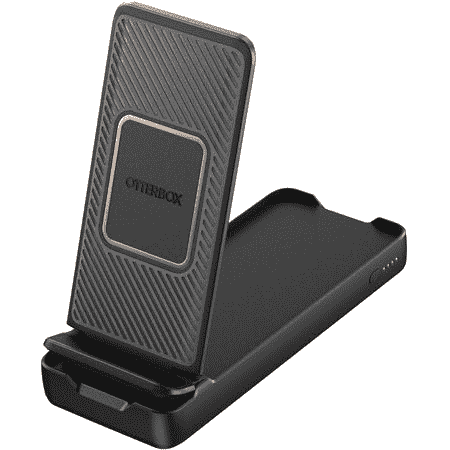

# Otterbox 推出售价 59.95 美元的折叠式无线电源银行

> 原文：<https://www.xda-developers.com/otterbox-folding-wireless-power-bank-launched/>

# Otterbox 的新无线充电电源银行兼作手机支架

Otterbox 推出了一种新的折叠式无线电源银行，可以通过无线和电缆为你的手机充电。售价 59.95 美元。

Otterbox 有一个新的无线充电电源，可以兼作便携式手机支架。它看起来很适合在外出时使用手机，尤其是当你想放下手机，但仍然倾斜着使用的时候。电源组以 18W 充电，并通过 Qi 无线标准以 10W 输出功率。总容量 10000 毫安。你也可以有线使用，输出功率为 18W，因为无线充电会损耗能量。

如上图所示，充电支架可在横向或纵向模式下与手机配合使用。支架也不需要展开，但它让你的手机更容易使用。如果你不想处理电线的麻烦，或者如果你想让你的手机更快地充电，你也可以使用普通的电缆来充电。

包装盒中有一个 15 厘米的 USB-A 到 USB-C 充电器可用于此目的，它使用高通快速充电 2.0/3.0 或 USB PD 2.0/3.0 通过 USB 输出。它还支持苹果快速充电，以及三星 AFC(自适应快速充电)和华为 FCP(快速充电协议)，这是两家公司各自的专有充电技术。

Otterbox 折叠式无线电源银行的价格为 59.95 美元，这使其高于其他 10，000 mAh 的电源银行。然而，它有一些许多竞争对手没有的功能，尽管无线充电对大多数人来说不一定是必备功能。有线充电也更快，而且在紧要关头，我个人更喜欢用电源板给手机充电，而不是选择速度较慢的无线充电。如果你有兴趣的话，可以点击下面的链接。

 <picture></picture> 

Otterbox Folding Wireless Power Bank

##### Otterbox 折叠式无线电源库

Otterbox 折叠式无线电源银行可以在旅途中为您的智能手机无线充电，无需处理任何电缆。另外，你可以把它变成一个电话支架。