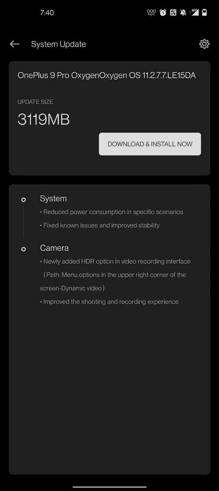

# OxygenOS 11.2.7.7 推出一加 9 和一加 9 专业版

> 原文：<https://www.xda-developers.com/oxygenos-11-2-7-7-oneplus-9-pro-hdr-mode/>

# 一加 9 系列的最新更新为视频录制添加了一个 HDR 开关

OxygenOS 11.2.7.7 公司已经开始在印度的一加 9 号和一加 Pro 装置中推广。此次更新修复了漏洞，并为视频录制添加了新的 HDR 模式。

不久前，一加推出了一加 9 系列的软件更新。一加 9 / Pro 的最后一次 OxygenOS 更新降低了功耗，改善了充电体验，优化了相机性能，等等。但似乎有些错误可能没有得到解决，因此该公司正在推出其 2021 年旗舰产品的另一个更新。

最新的 oxygen OS 11.2.7.7 更新已开始在印度的一加 9 和一加 9 专业单位。这是一个较小的更新，可以降低特定场景下的功耗，修复 bug，并改善视频拍摄和录制。有趣的是，这次更新还在一加 9 Pro 上添加了一个新的 HDR 开关，用于视频录制，但正如 [*Android Police*](https://www.androidpolice.com/2021/06/07/oneplus-9-pro-update-lets-you-turn-off-hdr-video-recording/) 指出的那样，DOL-HDR 在默认情况下是启用的，因此这个开关只是在 9 Pro 上添加了一种关闭它的方式。

oxygen OS 11.2.7.7 更新变更日志:

*   **系统**
    *   在特定场景下降低功耗
    *   修复了已知问题并提高了稳定性
*   **摄像机**
    *   视频录制界面新增 HDR 选项(路径:屏幕右上角菜单选项-动态视频)-仅限一加 9 Pro
    *   改善了拍摄和录制体验

 <picture></picture> 

Image credit: Atul Menon on OnePlus forums

OxygenOS 11.2.7.7 公司目前正在向印度的一加和一加推出 9 Pro 设备，但应该很快会扩展到更多地区。与往常一样，更新是分阶段推出的，因此今天它将覆盖一小部分设备，未来几天将有更大范围的推广。如果你有一个解锁的一加 9 或一加 9 专业版，请留意新的更新。如果你不想等待，你也可以从下面给出的链接中抓取一个与你的机型对应的 OTA 包，手动更新你的设备。

**[一加 9 日 XDA 论坛](https://forum.xda-developers.com/f/oneplus-9.12151/)| |[一加 9 日亲 XDA 论坛](https://forum.xda-developers.com/f/oneplus-9-pro.12153/)**

 <picture></picture> 

OnePlus 9

##### 一加 9

标准的一加 9 提供了一个合理的价格旗舰性能。它配备了 6.5 英寸 120 赫兹 FHD+ AMOLED 显示屏，由哈苏调整的三摄像头设置，以及骁龙 888 SoC。

 <picture></picture> 

OnePlus 9 Pro

##### 一加 9 专业版

一加 9 Pro 是一加最高端的产品，包装了曲面 LTPO QHD+ AMOLED 显示屏，与哈苏合作调整的摄像头和骁龙 888 SoC。

## 为一加 9 系列下载 oxygen OS 11.2.7.7

一些变体的链接尚未上线。我们将更新这篇文章，因为我们可以访问它们，所以请稍后再来查看。

*   一加 9:
*   一加 9 专业版:

* * *

*感谢 XDA 资深会员 [Some_Random_Username](https://forum.xda-developers.com/m/some_random_username.8234677/) 的下载链接！*