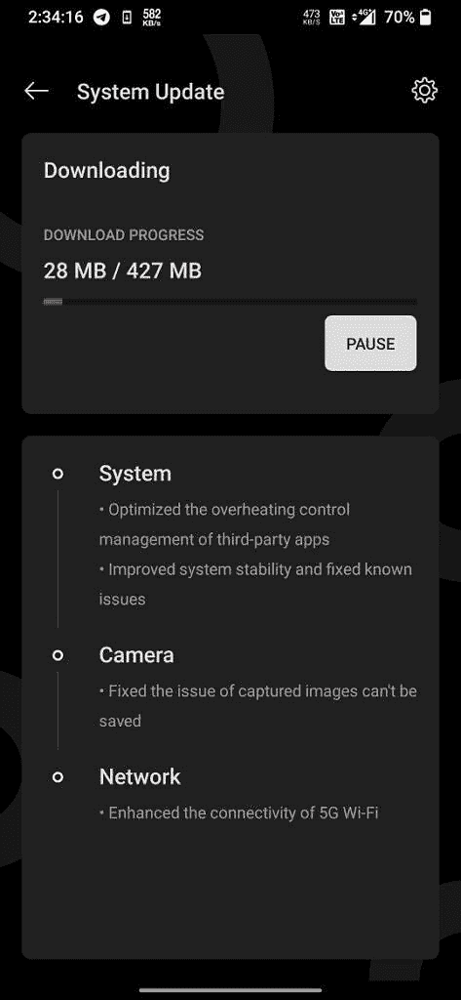

# 下载:OxygenOS 11 Open Beta 2 基于 Android 11，用于 OnePlus 6 和 6T

> 原文：<https://www.xda-developers.com/oxygenos-open-beta-2-android-11-oneplus-6-6t/>

# 下载:OxygenOS 11 Open Beta 2 基于 Android 11，用于 OnePlus 6 和 6T

一加已经开始为 OnePlus 6 和一加 6T 推出基于 Android 11 的 OxygenOS 11 Open Beta 2。下载文章中的链接。

本月早些时候，一加[为 OnePlus 6 和一加 6T 推出了第一个 OxygenOS 11 公开测试版更新](https://www.xda-developers.com/oxygenos-android-11-oneplus-6-6t-open-beta-1/)。此次更新为设备带来了所有新的 Android 11 功能，以及新的用户界面、游戏空间、摄像头改进、新的环境显示选项等。一加现在正在向设备推出第二个 Android 11 测试版，包括系统优化、摄像头改进等。

 <picture></picture> 

Screenshot courtesy: SujoyModi on the OnePlus Community forums

适用于 OnePlus 6 和一加 6T 的 OxygenOS 11 Open Beta 2 具有以下变更日志:

*   系统
    *   优化了第三方应用的过热控制管理
    *   提高了系统稳定性并修复了已知问题
*   照相机
    *   修正了捕获的图像不能被保存的问题
*   网络
    *   增强了 5G Wi-Fi 的连接性

该更新重达 427MB，已经开始向在其设备上安装了第一个测试版的用户推出。如果你还没有收到 OTA 更新，你可以从下面的链接下载并手动刷新。为此，请保存。zip 文件，导航到*设置>系统>系统更新>本地更新*，选择文件开始安装过程。在安装更新之前，请确保您的设备至少还有 30%的电量。

**[一加 6 XDA 论坛](https://forum.xda-developers.com/c/oneplus-6.7609/) || [一加 6T XDA 论坛](https://forum.xda-developers.com/c/oneplus-6t.8257/)**

## 为 OnePlus 6 和 6T 下载 OxygenOS 11 Open Beta 2