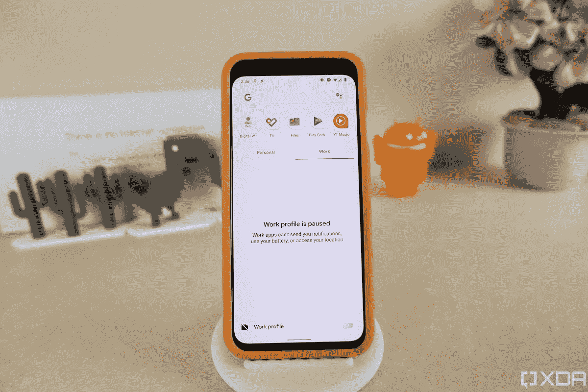

# 如何为你的 Android 手机的工作档案设置一个时间表

> 原文：<https://www.xda-developers.com/pause-work-profile-schedule/>

# 如何为你的 Android 手机的工作档案设置一个时间表

在数字福利中，谷歌增加了一个工作档案调度程序。以下是如何使用它来自动暂停你的 Android 的工作档案。

 <picture></picture> 

binary comment

Digital Wellbeing 是一款帮助 Android 用户减少智能手机使用的应用程序，因此他们可以更好地专注于工作或只是从数字世界中休息一下。自 2018 年推出以来，该应用程序已经进行了一系列更新，似乎谷歌在几个月前悄悄推出了一项新功能。正如我们去年九月报道的那样，谷歌正在开发一个新的工作档案调度程序，它将帮助用户在下班后自动暂停所有的工作档案应用程序。这可能是由于新冠肺炎疫情迫使世界各地的人们习惯了在家工作的环境。

虽然没有正式宣布该功能上线，但在 *[Stack Exchange](https://android.stackexchange.com/questions/217133/automatically-turn-work-profile-off-on-evenings-and-week-ends)* 上的用户注意到，谷歌在数字福利应用中启用了传闻中的工作档案调度选项。我们不知道它何时上线，但我们可以确认它出现在最新版本的应用程序中。话虽如此，[谷歌关于暂停你的工作档案的支持页面](https://support.google.com/work/android/answer/7029561?hl=en)还没有更新日程安排。

### 如何在 Android 上安排工作:

如果你在 Android 智能手机上启用了工作模式，你现在可以根据设定的时间表暂停它。只需进入“设置”>“数字健康和家长控制”。在“断开方式”部分，您应该会看到“工作配置文件计划”设置。点击它来设置您的日程并保存它。现在，您的新时间表应该会添加到列表中。

这项功能应该适用于所有运行最新版本的数字福利应用程序的 Android 智能手机。如果您没有看到它，请务必前往谷歌 Play 商店查看更新。

[app box Google play com . Google . Android . apps . well being]