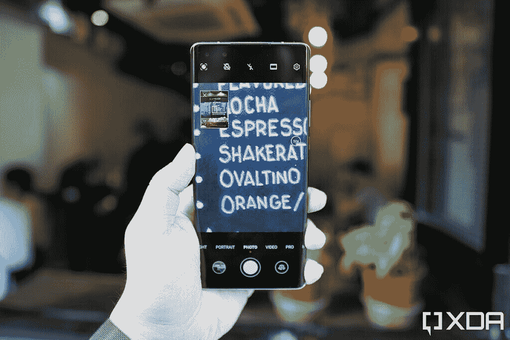
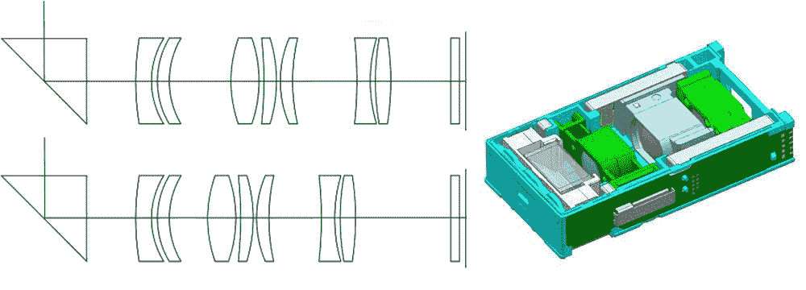
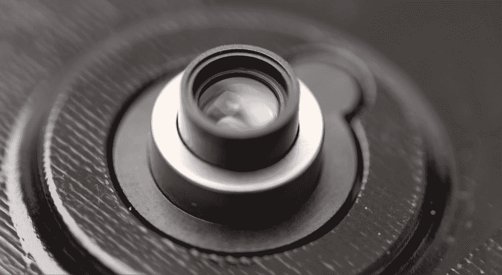

# 潜望镜和长焦相机有什么区别？

> 原文：<https://www.xda-developers.com/periscope-camera-vs-telephoto-camera/>

相机是手机不可或缺的。自从第一部拍照手机问世以来，相机就一直是手机品牌的核心，以至于许多公司仅仅利用其设备捕捉像素完美的照片的能力来获利。近年来，手机制造商已经将他们的创造力投入到改进摄像头和在智能手机上安装更多传感器上。显而易见的结果是品牌间的竞争显著增加，以更低的价格提供更多的相机。创新是在这种竞争环境中生存的关键，潜望镜变焦相机是创新的[缩影。凭借即时 5X 或 10 倍光学放大率，潜望式长焦相机有助于快速轻松地放大远距离。](https://www.xda-developers.com/huawei-p30-pro-first-impressions-design-camera/)

本文讨论了潜望式变焦相机的用途、优缺点以及潜望式变焦相机的发展前景。但是在我们开始讨论最新的趋势之前，这里有一个可能导致这种创新的快速概述。

## 长焦智能手机相机简史

虽然苹果不是第一个引入手机不止一个摄像头概念的公司，但该公司肯定应该受到赞扬，因为它普及了这一概念，并激励其他人加入这一潮流。苹果长期以来一直是智能手机摄影的领导者，2016 年，苹果在 iPhone 7 Plus 上推出了一款具有 2 倍光学变焦的长焦相机。除了光学变焦，这款长焦相机还用于捕捉人像图像的背景深度数据。

然而，智能手机公司在更长时间内一直在寻求将远程对象拉近。2013 年，诺基亚推出了配有 41MP 摄像头的 Lumia 1020。虽然这款旗舰 Lumia 不支持任何类型的光学变焦，但来自 41MP 传感器的巨大图像可以被裁剪以模拟伪变焦。迄今为止，智能手机品牌使用类似的[策略来推广大像素相机](https://www.xda-developers.com/xiaomi-mi-note-10-first-impressions-108mp-of-greatness/)，如 64MP 或 108MP。

与此同时，某些品牌也很快试验了类似于傻瓜相机的实际移动镜头设置。例如，三星在 2013 年推出了 Galaxy S4 变焦，配有突出的 10 倍光学变焦镜头和氙气闪光灯。伸缩镜头和氙气闪光灯与傻瓜相机如此相似，以至于 Galaxy S4 变焦可以被正确地称为运行在 Android 上并支持蜂窝连接的相机。Galaxy K Zoom 紧随其后，于次年推出。

在华为于 2019 年 3 月推出华为 P30 Pro 之前，智能手机上的潜望镜相机的概念一直很新颖。通过这样做，他们成为第一个提供商业服务的品牌。正如我们在手机的[详细相机评测](https://www.xda-developers.com/huawei-p30-pro-camera-review-50x-zoom/)中看到的，华为 P30 Pro 可以以高达 50 倍的放大率拍摄照片。然而，华为并不是第一个尝试这一想法的品牌——是 OPPO 在 2017 年 MWC 展会上首次展示了潜望式相机的光学变焦功能。尽管很早就引进了这项技术，但 T2 花了两年时间才实现。

在华为 P30 Pro 几个月后，OPPO 推出了 OPPO Reno 10X 变焦版，具有类似的潜望式长焦相机设置。大约在同一时间，[三星开始大规模生产潜望镜相机](https://www.xda-developers.com/samsung-mass-producing-slim-5x-optical-zoom-camera-modules/)，让其他制造商加入竞争。

但是在我们了解采用这项技术的手机之前，让我们看看它是如何工作的，以及潜望镜在长焦相机模块中扮演什么角色。

## 什么是潜望镜变焦相机？

根据教科书的定义，潜望镜是一种光学仪器，可以让任何人在看不见障碍物的情况下观察周围。传统上，它包括反射光线的镜子或直角折射光线的棱镜，使人们能够看到他们实际视线上方或下方的东西。潜望镜已经在坦克或潜艇等装甲车辆中使用了几十年。仪器本身是无害的，也可以做一些简单好玩的科学实验。

在智能手机摄像头方面，这款应用并没有太大的不同。与提供 2 倍或 3 倍光学变焦的标准远摄相机相反，潜望式相机通常通过使用多个镜头和相机传感器来提供 5X 或 10 倍变焦。潜望镜的作用是帮助容纳一系列镜头，而不会大幅增加智能手机的厚度。

为了理解摄像头模块中潜望镜的作用，请将智能手机想象成一个三维排列，用 X、Y 和 Z 坐标表示不同的轴。智能手机的屏幕平放在 YZ 平面上，而其厚度可以沿 X 轴测量。传统的相机传感器和连接的镜头也位于垂直于 Z 轴的 YZ 平面上。

然而，在潜望式设置的情况下，传感器和透镜位于 XZ 平面上，并以直角与 Y 轴相交。在末端，与相机传感器相对的是一个棱镜，它可以改变垂直于传感器的光的方向。使用直角棱镜是潜望镜相机具有方形或矩形切口而不是传统圆形切口的原因。

光线通过潜望镜相机的矩形开口进入，以直角折射，然后穿过镜头到达传感器。为了确保 5X 或 10 倍放大拍摄的图像清晰，潜望式长焦相机配备了自动对焦支持，镜头向前或向后移动，以聚焦传感器上的远处物体。三星的以下视频展示了这一点:

此外，在 5 倍或更高的变焦下，即使是细微的晃动也会被放大，看起来就像重大的移动。为了避免这种与预期画面的夸张偏移，潜望镜相机采用 OIS 或光学稳定技术——通常在棱镜中。这意味着棱镜可以响应重力变化沿多个轴自由移动，因此可以适应任何突然的急动。

通过垂直于相机开口排列镜头和直角棱镜，智能手机制造商可以节省大量空间。如果镜头与智能手机上的其他相机放置在同一平面上，这可以防止带有潜望式长焦相机的智能手机厚得离谱。

我们在照相机中看到的潜望镜还有另一个有趣且相当普遍的用途。单反相机或 DSLR 相机利用镜子或棱镜将光线从相机镜头反射或折射到光学取景器。虽然单反相机内的潜望镜和智能手机上的潜望镜长焦相机之间没有直接关系，但我们不能否认前者可能是新时代光学变焦的灵感来源。

## 潜望镜和长焦相机的区别

长焦相机是那些允许有或没有移动部件的光学变焦相机。相比之下，潜望镜相机主要是标准远摄相机的扩展。除了方位的不同，长焦和潜望镜相机可以通过观察相机开口的形状来区分。事实上，潜望镜相机的矩形开口使其易于与其他类型的相机区分开来。另一方面，典型的长焦相机使用标准的圆形开口，无法一眼识别。

鉴于潜望式长焦系统中使用的镜头数量较多，长焦相机的焦距较长。最后，正如我们将在接下来的章节中看到的，无论是长焦还是潜望镜相机目前都不支持可变焦距，但未来一些改进的解决方案可能会支持。

## 带有潜望镜变焦摄像头的智能手机

正如我们上面提到的，华为 P30 Pro 是第一款配备 5 倍潜望式变焦的商用设备；OPPO Reno 10X 变焦版紧随其后。三星的机电公司也在去年夏天开始生产这些潜望镜相机模块，但他们花了一段时间才获得相当数量的订单。

在华为 P30 Pro 推出很久之后， [Vivo 的 X30 Pro](https://www.xda-developers.com/vivo-x30-pro-5g-exynos-980-funtouchos-10/) (仅限中国)曾一度成为“最新的潜望镜相机手机”，但很快被[三星 Galaxy S20 Ultra](https://www.xda-developers.com/samsung-galaxy-s20-ultra-review/) 取代。Galaxy S20 Ultra 于 2020 年 2 月推出，也成为第一款支持高达 100 倍混合变焦的智能手机。

对于大多数派对来说，小米来得比较早，是这一趋势的后来者。他们推出的第一款带有潜望镜变焦模块的手机是 Mi 10 青春版。然后是 Realme 的旗舰杀手——由一岁的骁龙 855 驱动的 [Realme X3 超级变焦](https://www.xda-developers.com/realme-x3-superzoom-review-an-actual-flagship-killer/)。最近加入这一行列的两个产品是三星和 Vivo 的最新旗舰设备——分别是[三星 Galaxy Note 20 Ultra 5G](https://www.xda-developers.com/samsung-galaxy-note-20-ultra-camera/) 和 [Vivo X50 Pro](https://www.xda-developers.com/vivo-x50-pro-camera-review/) 。

在三星发布 Galaxy S20 Ultra 近一个月后，一直在摄影领域引领多项创新的华为品牌推出了 P30 Pro 的继任者。虽然这些智能手机——华为 P40 Pro 和 P40 Pro+——早于上一段提到的其他智能手机，但华为的发布在技术方面超过了它们，值得一提。虽然华为 P40 Pro 和 P40 Pro+都配备了潜望式变焦摄像头，但 Plus 变体上的潜望式摄像头支持 10 倍光学变焦，而普通 Pro 则支持 5X 光学变焦。除了 10 倍光学变焦潜望镜，华为 P40 Pro+还具有另一个固定在 3 倍光学变焦的长焦相机。

最近推出的[华为 Mate 40 系列](https://www.xda-developers.com/huawei-mate-40-pro-leak-reveals-5nm-kirin-9000-soc-circular-camera-bump-curved-display/)采用了与 P40 系列相同的术语。华为 Mate 40 Pro 和 Mate 40 Pro+采用专用潜望镜摄像头，具有 5 倍和 10 倍光学变焦。Mate 40 Pro+还配备了一个辅助长焦摄像头，就像 P40 Pro+一样。保时捷设计华为 Mate 40 Pro RS 沿用了 Mate 40 Pro+的设计，配备了 10 倍潜望式和 3 倍长焦摄像头。

潜望镜相机背后的技术发展速度比相机分辨率的一般数字游戏相对缓慢。虽然它吸引了消费者和制造商，但它并不像超快充电或不断增加的显示刷新率等其他技术那样受人欢迎。像 OPPO 这样的智能手机品牌一直在努力解决这些潜望镜相机的局限性。

在我们研究这些局限性之前，让我们先回顾一下潜望式摄像机的优势。

## 潜望式变焦照相机的优点

正如我们在上面看到的，智能手机的缩放功能在过去十年里有了很大的发展。当谈到智能手机上的光学变焦时，潜望式变焦相机开创了一个新的先例。它们最显著的优点是，你可以在不移动镜头的情况下，用傻瓜相机捕捉远处的物体或风景。同时，潜望镜的垂直方向允许智能手机制造商将相机传感器和一组必要的镜头安装在智能手机的机身内，而不会在厚度方面花费太多成本。

*在华为 Mate 40 Pro 上使用混合变焦和在 iPhone 12 上使用数码变焦以 10 倍放大拍摄的图像上的噪声差异*

除了潜望式长焦相机更长的焦距，这是捕捉远距离对象的理想选择，OIS 确保用潜望式光学变焦拍摄的图像比数字变焦的图像噪音小得多。除了日光之外，该功能在弱光或夜间摄影时也很方便。

除了纠正我们在智能手机上面临的数字变焦挑战和限制，智能手机上的潜望镜变焦模块还允许用户窥视微观世界。您可以使用潜望镜相机捕捉微距镜头，即使没有太靠近物体。如果你热衷于捕捉昆虫或微小的爬行动物，这尤其有用。

然而，正如我们在下面讨论的，这种摄像机布置有某些缺点。

## 潜望式变焦照相机的缺点

虽然潜望式变焦相机比数码变焦更有效地增加了近距离放大物体的能力，但它们也有一定的局限性。潜望式长焦设置的最大挑战是，虽然它让你可以自由地光学放大远处的物体或放大一个微小的物体，但它的焦距——因此变焦能力——是固定的。镜头装置内部的有限空间防止了镜头阵列移动过多。这种移动只能促进自动对焦，而不能放大或缩小。因此，它不能像傻瓜相机、DSLR 相机或无反光镜相机那样让你自由地放大或缩小。

这意味着，尽管有潜望镜设置，数码变焦在潜望镜相机不支持的放大值下发挥作用。例如，如果智能手机支持 5X 光学变焦，潜望式相机将不会起作用，直到你变焦到 5X 变焦，而是继续使用主相机或另一个支持数码变焦的较小放大率的长焦相机。

现在，如果你想以高于 5X 的焦距拍摄一些东西，比如说 10 倍，智能手机会切换到潜望镜相机，然后数码变焦 2 倍，导致复合变焦 10 倍。智能手机公司喜欢将这称为“混合”变焦，即光学和数字变焦的结合。

 <picture></picture> 

Huawei Mate 40 Pro with a 5X periscopic camera using optical and digital zoom to reach 50X "hybrid" zoom. Image by [Ben Sin](https://www.xda-developers.com/author/bensin/)/XDA

例如，华为 Mate 40 Pro+使用 1 倍至 3 倍焦距的主摄像头，随着放大倍数的增加，数码变焦。在 3 倍变焦和更大变焦时，取景器会切换到 3 倍光学变焦的长焦相机。这款相机将继续使用，直到放大 9.9 倍(以数字方式裁剪 3 倍的图像)，超过这个倍数，手机将切换到具有 10 倍光学变焦的潜望镜相机。当放大倍数超过 10 倍时，手机会再次放大到 10 倍——从而依赖于“混合”变焦。自然地，在带有 5X 潜望镜变焦相机模块的设备上，过渡发生在焦距的 5X。

潜望镜相机的另一个关键缺点是，随着焦距的增加，视野变窄，相机开口的光圈比主相机小——假设两台相机使用的镜头几乎相同。光圈越小，落在传感器上的光量越少，因此需要更多的环境光。因此，与光圈大得多的主相机相比，潜望式相机拍摄的图像要么光线暗淡，要么人为曝光过度。

正如所料，数码变焦带来了图像中的噪声和视觉伪像。这证明了虽然潜望镜变焦相当强大，但它缺乏实际移动长焦镜头所允许的多功能性。

## 潜望镜变焦是长焦的未来吗？

潜望式长焦相机的概念是数码变焦的一个进步，但我们上面列出的局限性证明了更好的解决方案的必要性。作为第一家创新潜望镜相机的公司，OPPO 现在正在研究一种可变焦距的先进概念，这将允许可变光学变焦。2020 年 8 月，OPPO 展示了其利用 7 元素镜头设置的“[混合光学变焦](https://www.oppo.com/cn/newsroom/press/415/)的概念。

 <picture></picture> 

A schematic sketch of OPPO's camera with hybrid optical zoom

这些镜头被分成三组，其中两组可以自由移动，而不是所有镜头彼此等距。这种自由移动应该允许可变焦距，范围在 85 毫米和 135 毫米之间，以及在 3.3 倍和 5.2 倍之间改变光学变焦。这可以与分辨率高达 32MP 的 CMOS 传感器和 4 合 1 像素宁滨支持相结合。

与此同时，[小米正在研究一种可伸缩的镜头设置](https://www.xda-developers.com/xiaomi-teases-a-large-telephoto-lens-for-smartphones-that-can-physically-zoom/?utm_content=bufferd9e19&utm_medium=social&utm_source=twitter.com&utm_campaign=buffer)，它既可以安装在主摄像头的顶部，也可以用作分立的长焦镜头。这种机制的一个主要好处是，镜头将利用比潜望式模块大得多的孔径，允许更多的光，从而获得更好的图像。小米最早可能在 2021 年推出带有这种可伸缩宽光圈镜头的智能手机。

 <picture></picture> 

Xiaomi's wide-aperture retractable lens technology with physical zoom.

甚至苹果公司也计划在 2022 年前在 iPhones 上使用潜望镜摄像头。虽然在这之前还有两年时间，但在 iPhone 上采用潜望镜相机可能会让它们变得比现在更主流。在此之前，我们将继续跟踪行业的发展，让我们看到而不会远离现实。

你对潜望式变焦相机有什么看法，你认为未来几年它们在智能手机摄影中会扮演什么角色？请在下面的评论中告诉我们你的想法！