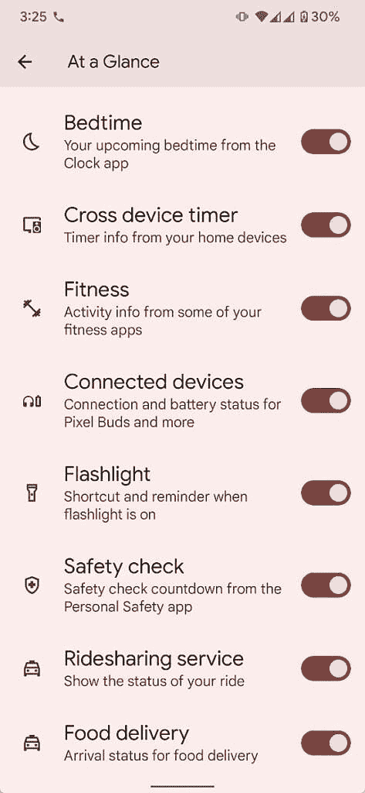

# Pixel 的“一览”小工具将很快让你追踪出租车预订和食品配送

> 原文：<https://www.xda-developers.com/pixel-at-a-glance-widget-track-cab-food-delivery/>

早在 4 月份，谷歌应用程序的拆除显示，Pixel 设备上的概览小工具可能很快就会获得对杂货店送货跟踪的支持。现在，米莎尔·拉赫曼发现了另外三个可能很快就会出现在概览小工具中的功能——跨设备计时器信息、拼车服务状态和食品配送到达状态。

在最近的一条推文中，拉赫曼分享了即将推出的功能的截图，并透露了有关支持服务的一些细节。正如你在附带的截图中所看到的，一览式设置包括三个额外的切换，即跨设备计时器、拼车服务和食品配送。虽然这些功能目前还没有上线，但随着谷歌应用程序的更新，它们可能会出现在用户面前。

 <picture></picture> 

Credit: Mishaal Rahman

一旦这些功能推出，跨设备计时器功能将允许用户在一览窗口小部件中查看连接到他们谷歌帐户的所有设备的计时器信息。此外，用户将能够在这个小工具中跟踪他们在优步和 Lyft 的出租车预订，以及 Doordash 的交付状态。谷歌可能会在推出前及时增加对更多拼车和送餐服务的支持，但目前我们没有任何相关信息。

在过去的几个月里，Pixel 设备上的一览窗口小部件增加了几个有用的功能。随着 2022 年 3 月像素功能的下降，该小工具获得了对[电池和蓝牙设备](https://www.xda-developers.com/at-a-glance-widget-pixel-connected-blueooth-device-status-battery-info/)连接状态的支持。它之前收到过 Nest 门铃提醒、健身应用活动、手电筒提醒、个人安全应用的安全检查倒计时以及时钟应用的就寝时间提醒。

*你对 Pixel At a Glance widget 的这些新功能有什么看法？请在下面的评论区告诉我们。*