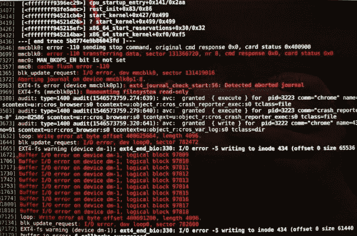

# Pixel Slate 用户抱怨存储故障使一些设备瘫痪

> 原文：<https://www.xda-developers.com/pixel-slate-users-complain-storage-failure/>

少数谷歌 Pixel Slate 用户报告了一个神秘的错误，该错误迫使他们的设备进入只读模式，并顽固地保持只读模式。二合一旗舰产品 Chromebook 在技术方面并不顺利，令人沮丧的错误并不新鲜，但这完全是另一个层面。

根据 [*Android Police*](https://www.androidpolice.com/2020/10/31/the-core-i5-pixel-slates-flash-storage-is-failing-for-some-users/) 收集的报告，一些基于 i5 的机器上的文件系统问题导致它们卸载 SSD 并以只读模式重新装载。似乎由于某种尚未确定的原因，机器失去了与存储的联系，并在安全模式下重新装载。这可能是连接器端口或驱动器本身的故障，无论哪种情况，这都不是软件故障，而是硬件故障或制造错误。

 <picture></picture> 

Credits: /u/[JeffHiggins](https://www.reddit.com/r/chromeos/comments/ac0olg/entire_file_system_becomes_readonly_periodically/)

这个像素板存储问题首次出现在 2019 年，也就是上述 Reddit 屏幕截图出现的地方，但这是固件的几十个不同问题之一，因此大多数情况下被视为又一个小问题。然而，最近，这种情况越来越多，结果越来越糟。

第一个提示来自丢失图标和收藏图标。当你试图工作时，Android 子系统开始出问题，应用程序开始抛出错误信息，真正的问题就开始了。最终，只读光盘名副其实——任何涉及写入光盘的操作都将失败。无论你处于失败的哪个阶段，到目前为止还没有可供用户使用的解决方案。重启会暂时解决问题，但它会重新出现，有时马上，有时几天后。强力清洗没有帮助，硬复位也不是比重启更长久的解决办法。即使刷新 Chrome OS 操作系统也无济于事，这加强了这是组件重大故障的结论。

谷歌已经告诉 Android Police 他们正在“积极寻找这个问题的根源”,但是还没有重现或者指出它的确切原因。与此同时，有像素板问题的用户被引导到[这个页面](https://support.google.com/pixelslate/gethelp)来+1 你自己的体验。