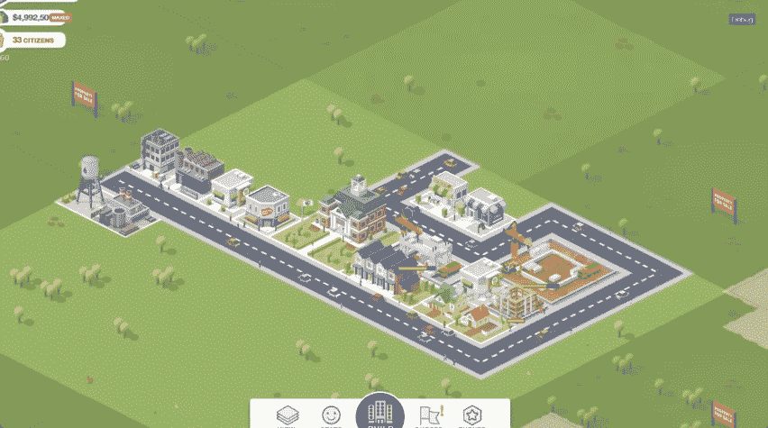

# 2023 年最佳安卓游戏

> 原文：<https://www.xda-developers.com/pixie-dust-xda-game-time/>

智能手机是新的游戏机。智能手机曾经可能被游戏玩家视为休闲游戏的领地，如糖果粉碎或愤怒的小鸟，但现在已经成为几乎任何类型的游戏玩家的头号游戏目的地。你想玩射击游戏吗？Google Play 有那些。你想要一个益智游戏吗？扔一支飞镖，你会击中一个。你想要完整的叙事 RPG 体验吗？你可以拥有它。我们列出了 2022 年最好的安卓游戏。

## 最佳安卓射手

手机上的射手已经有了很大的进步。不到几年前，在快节奏的第一人称射击游戏上使用触摸控制的概念是不可想象的(更不用说不可玩了)，但这几年发生了很大变化。您可以使用触摸控制玩以下任何游戏，并且不会错过传统的游戏控制器。

### PUBG 移动

《堡垒之夜》可能是 PC 和游戏机上领先的《皇室战争》,但 PUBG Mobile 主宰了手机《皇室战争》!PUBG Mobile 从流行的 PC 版本中获得完整的体验，并使其适应小屏幕。PUBG Mobile 提供的操控方案比大多数手游都高出一步，而且免费玩到开机！我们甚至有一些很棒的 [PUBG 移动提示和技巧](https://www.xda-developers.com/pubg-mobile-tips-tricks/)让你开始。

### 使命召唤手机

不喜欢皇家战役吗？使命召唤移动版由与 PUBG Mobile 相同的开发人员开发，但提供了不同类型的第一人称射击游戏体验。你会得到同样棒的控制，但不是纯粹的皇家战役游戏，你还会得到经典的使命召唤模式，如 5v5 和僵尸。当然，如果你想增加趣味的话，皇家战役还在！

### Apex 英雄

Apex Legends 短暂的全球现象进入 Android 智能手机只是时间问题。EA 很久以前就答应了，直到最近才有了结果。这是一个皇家之战的标题，设法捕捉相同的沉浸感的完整游戏在 PC 和游戏机上，也没有支付赢的优势。这是一个已经很棒的游戏的一个非常有品味的港口！

### 死亡效果 2

在线多人游戏固然很好，但是假设你想要一个好的单人游戏体验呢？死亡效果 2 是一款第一人称恐怖游戏，RPG 元素与系统冲击或死亡空间一脉相承。如果你喜欢恐怖的太空游戏，或者甚至你想要一个单人游戏机器人射击游戏，那么你会想要尝试一下这个游戏——只要你不介意一点不寻常的声音表演。

### 杀手:狙击手

这个游戏和你的典型射手有点不同。首先，你面对的不是会射击或反击的角色。在《杀手狙击手》中，你扮演特工 47，任务是从屋顶用狙击步枪暗杀目标。然而，这并不像瞄准和扣动扳机那么简单，而且还有一个主流杀手系列玩家熟悉的谜题元素。

### PUBG:新州

PUBG Mobile 是最受欢迎的智能手机游戏之一，尤其是在印度和中国等一些地区，尽管它们的名字不同。现在，克拉夫顿推出了一款新的皇家战役游戏，可以和原来的 PUBG 游戏一起玩。它被称为 [PUBG: New State](https://play.google.com/store/apps/details?id=com.pubg.newstate&hl=en_IN&gl=US) 虽然游戏背后的核心概念是相同的，但它带来了更好的图形，现代的外观，更好的武器，以及更真实的体验。游戏的机制也将与旧版本略有不同。如果你是皇室战争游戏的粉丝，你可以试试这个！

### 我的朋友佩德罗:复仇的时机成熟了

在《我的朋友佩德罗》中，你扮演一个动作英雄，他有能力在一系列平台场景中表演精彩的子弹时间体操。你根据一个叫佩德罗的会说话的香蕉告诉你的来杀人...哦，你是唯一能看到佩德罗的人。你通过仓库战斗，结合杂技和枪战来通关。很好玩，略显荒诞，还挺上瘾的。

## 最佳 Android RPGs

鉴于角色扮演游戏通常都很大且很有深度，它们可能不太适合手机。然而，这一类型的游戏中有很多已经非常好地过渡到了移动领域。以下是我们推荐你尝试的几个游戏。

### 根申冲击

风靡全球的《Genshin Impact》是一款动作 RPG 游戏，其探索元素与《荒野之息》惊人地相似。随着大量的内容在发布会上发布，这是一个将提供很多娱乐的标题。虽然它是一个 gacha/loot box 游戏(就像在中一样，你需要为掷骰子付费来尝试和获得新角色)，但你可以玩所有的内容，并且仍然可以获得一些付费角色，而不必花费一毛钱。

如果你正在寻找一些帮助，我们已经为初学者整理了一些[幻神冲击技巧，以及为更高级的幻神冲击玩家](https://www.xda-developers.com/genshin-impact-tips-tricks-beginners/)准备的[技巧和窍门。](https://www.xda-developers.com/genshin-impact-advanced-tips-tricks/)

### 移动江湖

MMO 吗？在安卓上？鉴于你对魔兽世界风格 MMORPGs 的了解，这似乎是一个奇怪的想法，但 Runescape Mobile 很好地完成了它。该游戏仍处于早期访问阶段，但你可以免费下载并开始探索世界。Runescape Mobile 也是跨平台的，所以当你想要移动体验时，你可以很容易地在玩 PC 版和登录应用之间切换。

### Baldur’s Gate II

事实证明，老式的点击式 RPG 可以很好地移植到智能手机上！一些经典的 WRPGs 已经跳转到 Google Play，但如果只有一个你打算购买，你会想让它成为博德之门 II。作为早期生物制品中最受欢迎的一款，博德之门 II 是一款龙与地下城风格的 RPG，有很多微观管理和高难度挑战。你需要付费才能玩，但它定期发售！

### 火徽英雄

虽然*火徽*系列通常既是关于角色扮演的，也是关于战术的，但这款手机游戏吸取了两者的最佳元素，并针对手机进行了优化，让你可以规划你的战斗并优化你的团队。虽然*英雄*以其从主要游戏中引入的详尽角色列表(在撰写本文时超过 600 个)来庆祝该系列的悠久历史，但你实际上不必了解任何关于*火徽*的事情就可以进入*英雄*。

* * *

## 最佳安卓益智游戏

最好的智能手机游戏是那些当生活召唤时可以拿起又放下的游戏。慢节奏和有条不紊，益智游戏在这方面是最好的。match-3 是经典的手机益智游戏，但对于那些想尝试不同口味的人来说，还有许多其他选择。它们的共同点是简单的机械装置会让你玩上几个小时。

### 纪念碑谷

最初发布时在苹果设备上大受欢迎,《纪念碑谷》在谷歌 Play 商店也有售！纪念碑谷提供了一种独特的风格，玩家需要操纵和导航周围的建筑才能前进。该系列的第一款游戏只需 4 美元，如果你最终喜欢它，你可以花 5 美元抢到续集！这些游戏还会不时打折出售，所以你要密切关注。

### 三分！

从字面上看，第三场比赛的结果是三分！是一个非常简单的难题，关于如何将数字匹配成 3 的倍数。像任何好的谜题一样，它很容易学，但极难掌握。你可以拿起免费版来试一试，完整的无广告版只要 1 美元。

### 我喜欢色调

我喜欢色相是我一直安装在手机上的谜题，因为它让人放松。这个谜题要求你重新排列颜色，以制作一个色谱样本。很好玩，也很多彩。平和的音乐和不输也提供了一种放松的体验。我爱色相是免费的，广告被限制只是为了获得更多的棱镜，所以他们不会强迫你，打断你的体验。

### 阴影自动的

Shadowmatic 建立在皮影木偶的简单前提上，是一个游戏，在这个游戏中，你在灯光前操纵物体，以获得特定的形状。像这个列表中的其他游戏一样，这是一个简单的前提，已经被完善到完美，游戏中的灯光效果是我们见过的最好的，触摸控制实际上比任何控制器都更适合游戏。https://play.google.com/store/apps/details?id = com . triad studio . shadow matic

* * *

## 最佳安卓卡牌游戏

纸牌游戏是另一种在手机上玩得很好的类型——游戏可以在几分钟内玩完，但其中有足够的种类让你玩上几个小时。下面列出的游戏是 Android 游戏玩家可以玩到的最好的游戏。

### 炉石

暴雪的收藏卡牌游戏可以说是周围最好的游戏之一，并且在 Google Play 上可以免费开始！你不需要知道任何魔兽世界或暴雪的知识就可以进入炉石(相信我，炉石是我投入大量时间的唯一一款暴雪游戏)，开发者通过新卡包和淘汰旧卡来保持游戏新鲜，以防止权力蔓延。你可以在网上与人对战，或者玩得开心，学习新的单人冒险策略。

### 游戏王决斗链接

游戏王，2022 年？这似乎是一个令人惊讶的选择，但游戏王决斗链接是 Google Play 上一个非常强大的卡牌游戏。该节目一直是游戏王系列最引人注目的方面，但实际的纸牌游戏仍然很强劲，决斗链接提供了一个很好的入口。虽然游戏确实有额外的货币来购买新卡中的增强包，但 Konami 定期免费发放这种货币，并且比大多数交易卡类型的游戏更慷慨，所以你将有足够的卡来建立一副牌并与之决斗。

### 格温特郡

任何玩过《巫师 3》的人可能都知道隐藏在大型 RPG 中的纸牌游戏 Gwent。卡牌游戏在粉丝中变得非常流行，所以最终，一个独立的游戏在移动设备上发布了。此外，这是一个有趣的卡牌游戏，与大多数卡牌游戏不同。如果你正在寻找一种有点不同，但仍然足够受欢迎的在线游戏，Gwent 是你最好的选择。

### 爆炸小猫

卡牌建造者和卡牌 RPG 都很好，但更符合传统卡牌游戏的东西呢？爆炸小猫是更有趣的选择之一，被它的创造者描述为“小猫动力版的俄罗斯轮盘赌”关键是要抽牌，直到有人抽到了爆炸的小猫，在这种情况下，你要么需要拆除它，要么它就会爆炸，把你踢出游戏。这是一个很好的基于猫的游戏，可以和朋友一起玩，也可以和陌生人在线玩。

* * *

## 最佳安卓模拟人生

模拟游戏是 PC 和主机的主要时间接收器，已经大规模进入智能手机。现在，你不用从你的 [PlayStation 5](https://www.xda-developers.com/playstation-5-restocks/) 或 [Xbox Series S](https://www.xda-developers.com/xbox-series-s-review/) 控制器上抬起头来，想知道时间都去了哪里，你可以从你的智能手机上抬起头来，想知道你是如何设法花时间玩这些游戏的。

### 星光谷

如果你喜欢《收获的月亮》系列，并希望你能在手机上得到类似的东西？星空谷就是你的答案！这款独立游戏包含了《收获之月》系列的所有农业和浪漫元素，并带有额外的机制，让你流连忘返。使用智能手机意味着你可以在等待或无聊的时候轻松地玩一天，然后继续你的一天。

### 邪教模拟器

邪教模拟器和一般的 sim 游戏有点不一样，而且不仅仅是从名字上。一个基于卡的标题，邪教模拟器的任务是你试图成为一个邪教的领导人。牌和动作必须打好才能成功，有很多方法可以做到这一点。如果你正在寻找不同类型的东西，这是一个值得尝试的游戏。

### 《我的世界》

《我的世界》很可能是有史以来最受欢迎的游戏之一。它的流行也有一个很好的原因，作为一个伟大的沙盒模拟游戏。你甚至可以在 Google Play 上构建并玩你梦想中的沙盒，只需 6 美元。移动版的《我的世界》也可以联机，这样你就可以在旅途中和别人一起玩了！

### 游戏开发大亨

想过游戏开发者的生活吗？*游戏开发大亨*顾名思义，让你建立自己的游戏，并向世界发布，然后管理善后事宜。这是一个有趣的大亨模拟子类别，实际上是一个生活片段的故事，而不是一个巨大的商业建设模拟。然而，这是一个令人惊讶的深度模拟，在其中你必须创造你的产品，并向世界销售，以取得成功。https://play.google.com/store/apps/details?id=com.greenheartgames.gdt

### 游戏开发故事

如果你想过游戏开发者的生活，但是是以一种更可爱的 8 位风格，那么游戏开发者的故事可能值得看看。你也可以建立自己的公司和游戏，也可以为现实生活中的公司制作游戏的模拟版本。这很有趣，也是我多年来一直喜欢玩的游戏。

### 袖珍城市

一个既有免费游戏又有付费游戏选项的游戏,《口袋城市》让你管理自己的城市。这有点类似于城市:天际线，因为你向人们提供电力、水和其他必要的便利设施，作为回报，你向它提供资金，你收税并从拨款中获得资金。这是我个人最喜欢的手机游戏之一，它在提供免费游戏体验方面做得很好，没有广告和微交易。

* * *

## 最佳安卓节奏游戏

节奏游戏从未消亡——它们只是迁移到了手机上。这些游戏会让你随着音乐及时敲击手机屏幕，这是老式摇滚乐队和吉他英雄游戏的缩影。

### BanG 梦想！女子十二乐坊派对！

我个人的 Android 节奏标题，BanG Dream 是一个超级甜美的节奏游戏，由一些女孩主演，她们正在努力成为偶像。采取一点吉他英雄节奏游戏的方法，你将点击并按住每个偶像的音符。虽然 gacha 机制有时会令人讨厌，但你可以轻松地不花钱，与朋友在线玩是一种享受。

### 击败危险 2

玩节奏游戏想听自己的音乐？Beat Hazard 2 将你的轨迹变成射击关卡，让你躲避子弹并击败 bosses。这是一个简洁的概念，拍摄镜头是智能手机的完美组合。下载这个，开始拍吧！

### 热爱生活！学校偶像节全明星赛

是的，不是一个，而是两个安卓上最好的节奏游戏包括可爱的动漫少女偶像对着你唱可爱的歌。爱活的一部分！特许经营，你不需要看动漫就能享受游戏性。与初音未来的游戏类似，你可以随着节拍，在偶像们跳舞的时候做一些动作。这很有趣，但是如果你很容易分心就很难了。

### 几何虚线

这个游戏结合了节奏和平台游戏，当你随着音乐的节奏引导你的小身体越过障碍时。你将面临各种危险和障碍，比如钉子和移动的砖块，它们可能会让你的小家伙很快结束歌唱。除了跳跃关卡之外，还有飞行关卡和反重力章节。它旨在让你保持警觉，所以如果你想要一个有点挑战性的游戏，试试*几何破折号*。

* * *

## 最佳叙事安卓游戏

到目前为止，我们已经讨论了具有稳定游戏循环的游戏，但是故事呢？不是每个游戏都专注于它的故事，但 Android 上有很多游戏提供了很好的故事供体验。一个好的游戏故事，讲得好，真的会让你难以忘怀。下面是我们最喜欢的一些。

### 统治

你认为你有统治的能力吗？一个简单的叙事标题，统治让你控制一排国王或王后，因为你试图保持你的统治(这不会持续很久)。你需要平衡四个不同群体的偏好——偏好不能太低(或太高！)，你很可能会以人头落地而告终。三部《君临》、《君临:女王陛下》、《君临:权力的游戏》都值得一试。

### 80 天

根据经典小说《80 天环游世界》改编,《80 天有你……尝试在那个时间段环游世界》。然而，更有趣的是，作为一个类似俄勒冈小径的标题(没有痢疾)，每个游戏都是一次不同的冒险，不同的挑战将阻止你环游世界。

### 一部正常丢失的手机

一个普通的丢失的手机是一个游戏，很大程度上说明了它是什么。你找到了一部丢失的手机，由你来找出失主是谁，这样你就可以归还它。一部普通的丢失的手机需要你解谜，并挖掘一个陌生人的个人数据，以解开核心谜团。山姆是谁，他们在哪里？

### 拟像

如果你想体验另一款“丢失的手机”类型的游戏，它不像普通的丢失的手机那么卡通，也更真实，那么试试 Simulacra 吧。预先警告:这是一个恐怖游戏，从一开始就很恐怖。但如果你想体验一个充分利用移动平台的令人毛骨悚然的故事，这是一个你需要尝试的游戏。

* * *

## 最佳安卓街机游戏

游戏中最古老和最令人满意的部分之一是获得高分。街机游戏仍然活跃在游戏商店里。这里有几个游戏可以试试。

### 卡纳巴尔特角

Canabalt 是一个帮助启动整个 auto-runner 流派的标题，现在你可以在 Android 上获得它的高清版本！在城市景观中奔跑跳跃，试图逃脱毁灭。只需点击跳转的简单控制使其成为移动设备的理想选择，并为通勤时的快速游戏带来许多乐趣。

### 吃豆人 256

吃豆人，最古老的流行游戏之一。Pac-Man 256 是对经典公式的一个非常有趣的演绎。小球咀嚼公式混合了自动滚动扭曲，你需要摆脱故障板。它是关于连续吃掉难以捉摸的 256 个小球，它的街机般的游戏性让你回来再玩一次。

### 喷气背包乔伊斯

Jetpack Joyride 是一款快节奏的自动跑步游戏，非常适合玩。你需要学习你的喷气背包独特的物理特性，以避免敌人和障碍，在你最终失败之前走得更远。通过奖励获得硬币来解锁新的升级和外观，Jetpack Joyride 会让你回来一段时间。

### 十字路口

如果你想玩一个现代版的青蛙过河游戏，你可以去 Crossy Road。免费游戏， *Crossy Road* 让你扮演数百个不同的角色，默认是小鸡，你必须尽可能多地穿过一条无尽的高速公路。这听起来很简单，但是你可以玩上几个小时而不会感到无聊。https://play.google.com/store/apps/details?id=com.yodo1.crossyroad

* * *

## 其他优秀的安卓游戏

这些标题并不完全符合特定的类型，但仍然非常值得你关注。给他们下载！

### 在我们中间

曾经只是一个简单的独立游戏，现在是世界上最受欢迎的游戏之一，在我们中间本质上是棋盘游戏叛徒类型的数字版本。看紧飞船，顺利完成任务，就看你的党了。然而，有一个外星人冒名顶替者(或冒名顶替者！)想要谋杀你的船员，而他们正尽最大努力隐藏起来。《我们当中》最好在大群好友中玩，安卓上免费下载！

### 迷你地铁

谁知道城市规划会如此紧张？迷你地铁让你在有限的预算下建造地铁线路。平衡你的钱与需要更多的火车，车站和线路。瓶颈太多，你就会失败！简单的艺术风格很好地配合了缓慢加快的游戏节奏，让你不至于过度紧张。

### 画出来

画它基本上是象形图采取其数字，在线结论。赶紧把屏幕上的字勾画出来，争取头把交椅！它简单、古怪、有趣，而且不需要你举办一整个派对来享受。

### 云顶之弈

在 PC 上掀起波澜的自动象棋游戏现在可以在 Android 上使用了！团队作战战术更少依赖于抽搐反应时间，更多地依赖于理解协同作用和适当的计划。不需要快速反应或过于华丽的图形，TFT 很容易过渡到移动设备，非常适合 Android。

### 劳拉·克劳馥走了

劳拉·克劳馥 GO 是一个老古董，她将《古墓丽影》的女主角放在一个回合制的益智游戏平台中。就单人游戏而言，它非常完美，具有挑战性的关卡、强大的中心目标和侧面挑战。这是你需要尝试的游戏之一，即使你不是《古墓丽影》的粉丝。

### 隐藏的人

隐藏的人是一个有趣的小黑白隐藏对象游戏。除此之外真的没什么了。用你的眼睛和可爱的提示找到人、动物和物体！虽然只有 5 美元，但你会有足够的钱来花的。

### 网格自动运动

想找一款好看的赛车游戏？只需看看 GRID Autosport。作为 PC 和主机游戏的直接接口，GRID Autosport 不会偷工减料，它提供了大量赛车和赛道，同时看起来非常棒。如果你对大多数移动赛车感到失望，一定要试试这个。

### 雷顿教授和好奇的村庄

任天堂 3DS 令人难以置信的成功系列在几年前进入了移动领域。当然，好奇村和其他雷顿游戏比这个列表中的其他游戏要贵一些，但你会以这个价格得到完整的游戏，如果你还没有玩过它，你就不应该错过这个经典。

### pokemon 联合起来

如果你是一个神奇宝贝粉丝，你肯定会喜欢这个在 2021 年推出的新游戏。Pokémon Unite 是一款五对五对战的游戏。你可以和你的神奇宝贝人物一起训练，并在游戏中提升你的技能。

* * *

## 最佳安卓模拟器

虽然这些不是严格意义上的游戏，但它们绝对是 Android 游戏生态系统的一部分。模拟器允许你在许多不同的平台上体验成千上万的游戏，这些是我们最喜欢的。不过，在模拟时，你通常需要一部功能相当强大的智能手机来支持更新的设备，因此你的里程数可能会有所不同。

### 海豚模拟器- Wii 和 GameCube

如果你想在智能手机上玩 Wii 和 GameCube 游戏，那么看看 [Dolphin Emulator](https://www.xda-developers.com/dolphin-emulator/) 就知道了。它支持动作输入、控制器、自制软件，以及你能想到的运行在 Wii 或 GameCube 上的任何东西。它是 Android 上最受欢迎的模拟器之一，绝对值得一试。

### aether x2-PlayStation 2

Android 上最好的 PlayStation 2 模拟器是 [AetherSX2](https://www.xda-developers.com/aethersx2-playstation-emulator/) ，甚至都不接近。由于这个模拟器，你可以播放索尼庞大的 PlayStation 2 back 目录中的几乎任何游戏，它基本上可以在任何功能不错的 Android 智能手机上运行。我曾顺利地玩过《T2》、《极品飞车》、《T4》、《叮当》、《辛普森一家》等游戏，我强烈建议试一试。

### 鸭子站- PlayStation 1

如果你想在智能手机上玩 PlayStation 1 游戏，那么你的 go-to 模拟器绝对应该是 [DuckStation](https://www.xda-developers.com/duckstation-playstation-1-emulator/) 。DuckStation 的目标是尽可能精确，同时仍然保持适合低端设备的性能。默认配置应该支持几乎所有的游戏，只有一些增强有兼容性问题。

### 雪铁龙-任天堂 3DS

如果你想在智能手机上玩任天堂 3DS 游戏，如*动物穿越:新叶*、*神奇宝贝 X* 或*神奇宝贝 Y、新超级马里奥 3D 乐园*或许多其他游戏，那么 Citra 应该是你的首选。这是一个优秀的模拟器，在几乎所有你喜欢的 3DS 游戏中，它在高端设备上都有出色的性能。

### melonDS -任天堂 DS

melonDS 是一款开源的任天堂 DS 模拟器。谷歌 Play 商店上只有一个非官方的端口(因为它是作为一个 PC 模拟器开始的)，但它工作得非常好。最棒的是，它是免费的！请务必[查看 GitHub](https://github.com/rafaelvcaetano/melonDS-android) 以获得更快的更新。

这个列表可能看起来很详尽，但我们实际上只是触及了 Android 可用游戏的皮毛。无论你想玩什么——深度 RPG、快速卡牌游戏还是引人入胜的故事 Play Store 上都有多种游戏可以满足你的需求。

如果你决定不想在小屏幕上玩这些游戏，你很幸运。这些游戏中的几个——不是全部，但有很大一部分——也可以在 PC 上玩，这意味着你可以买到一台好的、[便宜的游戏笔记本电脑](https://www.xda-developers.com/best-cheap-gaming-laptops/),轻松地玩其中的一些游戏。