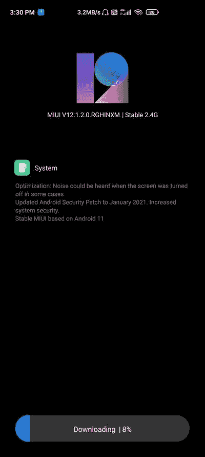

# 下载:X2 POCO 公司将通过 MIUI 12 获得其 Android 11 更新

> 原文：<https://www.xda-developers.com/poco-x2-android-11-miui-12/>

去年 2 月推出的 POCO X2 ( [我们的评论](https://www.xda-developers.com/poco-x2-review-better-than-poco-f1/))提供了一些可靠的规格，例如高通骁龙 730G SoC，4,500mAh 电池，支持 27W 快速充电，以及 64MP 索尼 IMX686 传感器作为主后置摄像头。手机上的出厂预装操作系统是 Android 10 之上的 MIUI 11，但在随后的 [MIUI 12 更新](https://www.xda-developers.com/download-miui-12-stable-update-rolling-out-several-xiaomi-redmi-mi-poco-devices/)中，底层 Android 层保持不变。现在，接近手机发布一周年，POCO 已经开始向印度 POCO X2 用户推出 Android 11 的稳定版本。

 <picture></picture> 

Thanks to Twitter user [AviSaHa_01](https://twitter.com/AviSaHa_01/) for the screenshot!

承载版本号 **V12.1.2.0.RGHINXM** ，更新大小为 2.4GB，用于恢复可闪存 ZIP。它还将 Android 安全补丁级别(SPL)提升至 2021 年 1 月。在新功能方面，用户可以期待所有新的 Android 11 产品，包括聊天气泡、[智能设备控制](https://www.xda-developers.com/how-to-access-android-11-device-controls-feature-xiaomi-devices/)、无线 Android 自动支持等等。

build 号明确表示 POCO X2 的 Android 11 更新仍然基于 MIUI 12，而不是 [MIUI 12.5](https://www.xda-developers.com/xiaomi-announces-miui-12-5-mi-redmi-smartphones/) 。然而，这款手机的中国版本，即 Redmi K30 4G，已经通过[封闭测试版渠道](https://www.xda-developers.com/download-miui-12-closed-beta-xiaomi-redmi-devices/)尝到了 MIUI 12.5 的味道。

**[POCO X2 XDA 论坛](https://forum.xda-developers.com/c/xiaomi-poco-x2.9865/)**

您可以等待更新到达您的手机，也可以下载下面链接的更新包后下载新版本。值得注意的是，该公司将当前版本视为“稳定测试版”，这意味着可能需要一个授权的 Mi 帐户来下载更新包。

**[下载安卓 11 搭配 MIUI 12 的 POCO X2(代号:phoenix in)——v 12 . 1 . 2 . 0 . rghinxm](https://bigota.d.miui.com/V12.1.2.0.RGHINXM/miui_PHOENIXININGlobal_V12.1.2.0.RGHINXM_b85dc670a6_11.0.zip)**

如果您的 POCO X2 的引导加载程序解锁，并且您想要立即安装更新的版本，您可以使用自定义恢复(如 TWRP)来刷新恢复 ROM，从而有效地绕过 Mi 帐户验证。需要一个服务器端开关来消除对这种授权的需要，这通常在快速启动可闪存固件时发生。