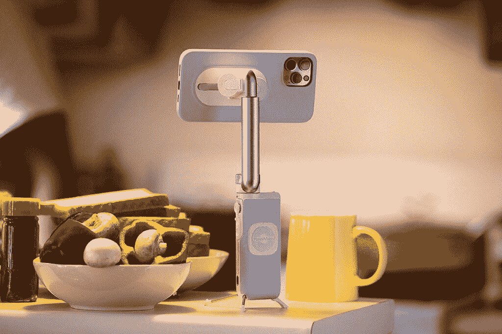

# PowerVision S1 是最小的智能手机稳定器，具有人工智能跟踪和 3 轴万向节

> 原文：<https://www.xda-developers.com/powervision-s1/>

我们的智能手机配有摄像头，可以拍摄一些非常棒的视频和照片。通过配备 100 万像素以上传感器、4K 和 8K 视频、变焦和超宽镜头的手机，您可以拍摄一些精彩的照片。即使有了所有这些技术，如果你正在拍摄手持视频和照片，你也只使用了你的相机所能使用的一小部分。通过使用智能万向节来稳定你的手机，你将能够解锁照片和视频质量，你甚至不知道你的手机能够实现。

\ r \ nht TPS://www . YouTube . com/watch？v=YaLxCeGE378\r\n

智能手机有不同的万向节，但大多数都很笨重，不方便随身携带。因此，为了在更好的摄影和便利性之间取得平衡，你需要一款小巧、易用、能满足多种相机相关需求的产品。这就是新的**动力视觉 S1** 发挥作用的地方。这是一款功能丰富的智能手机伴侣，重量仅为 298 克。它只有试图提供这些功能的其他产品的三分之一大小。

 <picture></picture> 

PowerVision S1

## 更清晰的照片和更流畅的视频

PowerVision S1 是一款多功能智能手机伴侣，带有智能 3 轴万向节，能够稳定您的镜头并拍摄更好的照片。这可以用来捕捉流畅的 4k 视频，减轻智能手机的光学或数字图像稳定压力。当您使用手机的内置稳定功能时，您的视频质量会降低，以便能够执行必要的数字稳定。当您使用 PowerVision S1 时，您可以以最大分辨率拍摄，创建更高质量的视频。

在拍摄自己的视频时，您可以使用**集成三脚架**设置 S1，同时使用手势控制相机的位置。万向节的智能功能使用一种叫做 **PowerFollow** 的功能来保持相机指向主体。这样，您就不必离开框架，从显示器的另一侧重新定位摄像机。当你在你的环境中移动时，人工智能跟踪将使你保持在镜头中。拍摄完成后，您可以使用智能编辑应用程序来修剪片段。这些智能功能也可用于直播，因此您的观众永远不会错过内容。

[video width = " 911 " height = " 480 " webm = " https://static 1 . xdaimages . com/WordPress/WP-content/uploads/2021/05/power visions 1-webm-2 . webm "]

照片也可以受益于万向节。当你拿着手机拍照的时候，你会因为你的自然动作而产生大量轻微的紧张和抽搐。如果您在使用万向节拍摄照片，您将消除运动模糊和人工锐化效果，相机软件将使用这些效果来尝试给你更好的结果。它创建了一个更自然的照片，有更多的细节和更好的整体质量。您甚至可以使用内置支架将 PowerVision S1 放置到位，捕捉完美的镜头。

使用手持智能手机时，全景照片可能是偶然的。当你的图像拼接在一起时，任何小的碰撞都会引起小故障。使用 PowerVision S1，您可以使用该应用程序拍摄平滑的全景图像，这些图像可以完美地拼接在一起。

 <picture></picture> 

PowerVision S1

## 集无线充电器、万向架和三脚架于一体

PowerVision S1 公司能够在一个小得多的封装中提供智能手机万向节的所有好处。除了万向节功能，PowerVision S1 还充当了一个无线电源库，可以用来给你的手机充电。它甚至支持无线充电，允许你简单地将手机放在 S1 上，让它充电。**磁性手机套**让你的手机安装到万向节非常容易。它只是扣在适当的位置，当你完成后可以移除。

您共有三种不同的方式将手机连接到 S1。可以用磁性手机壳，磁性手机支架，磁性夹子。这些不同的连接选项使得 S1 可以兼容多种设备。当使用磁性选项时，您将打开您的设备，进入 PowerVision 的磁性配件的整个**生态系统。使用它与他们的磁性车载支架和粘性贴片，可以让你把你的手机贴在你的仪表板或任何墙壁上。**

PowerVision S1 旨在为所有智能手机用户提供完整的解决方案。你不仅可以获得 3 轴万向节的所有好处，而且通过将它用作移动电源库，你可以使用手机，而没有电池寿命短带来的焦虑。

您可以使用下面的链接在他们的网站上注册购买 PowerVision S1。在发布日的特别交易中，早期用户可以获得高达 49%的折扣。**【限时优惠】**

[**得到动力视觉 S1**](http://igg.me/at/powervisions1)

###### 我们感谢 PowerVision 赞助这篇文章。我们的赞助商帮助我们支付与运行 XDA 相关的许多费用，包括服务器成本、全职开发人员、新闻撰稿人等等。XDA 绝不会通过接受金钱来赞扬一家公司，或以任何方式改变我们的观点或看法，从而损害其新闻诚信。我们的意见不能被收买。