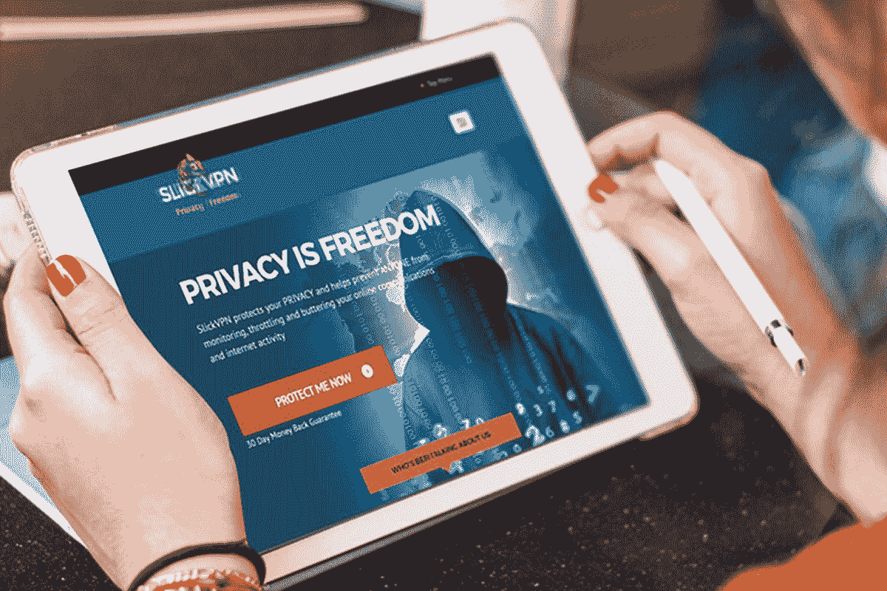
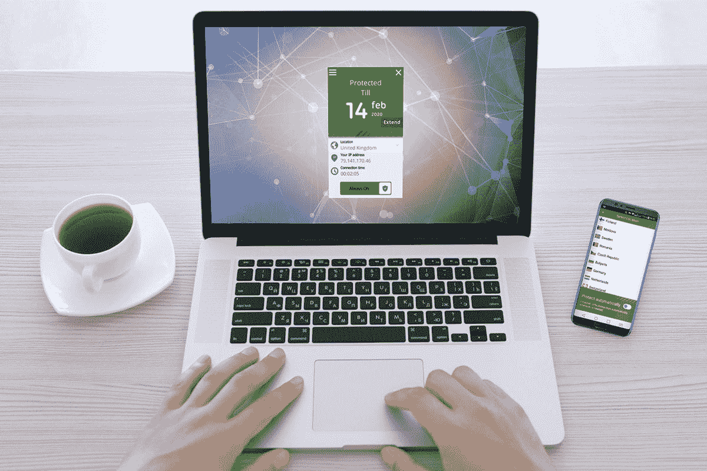
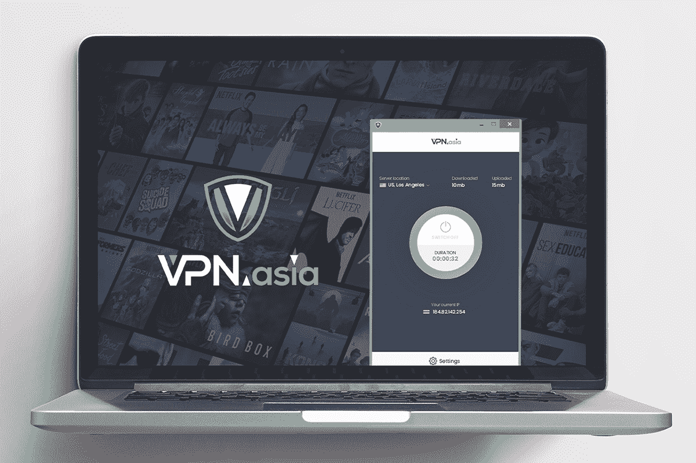

# 在有限时间内享受 30%的顶级 VPN 订购优惠，保护您的在线隐私

> 原文：<https://www.xda-developers.com/protect-your-online-privacy-with-30-off-top-vpn-subscriptions-for-a-limited-time/>

从政府收集数据到公共 Wi-Fi 上的黑客，有许多使用 VPN 的好理由。为了帮助您以更低的价格获得保护，XDA Developers Depot 在有限的时间内为您提供额外 30%的 VPN 订购优惠，前提是您使用促销代码 **下载** 。这里有一些最好的交易。

## **VPNSecure:终身订阅**

****

通过严格的禁止登录政策，VPNSecure 提供了真正的在线隐私。这项服务被 vpnMentor 和 Best VPN 评为 4 星，允许您同时连接 5 台设备，并从全球 46 个国家的服务器中进行选择。

花费 13.99 美元获得一份 [VPNSecure 终身套餐](https://depot.xda-developers.com/sales/vpnsecure-lifetime-subscription-2?utm_source=xda-developers.com&utm_medium=referral&utm_campaign=vpnsecure-lifetime-subscription-2&utm_term=scsf-482793&utm_content=a0x1P000004eofVQAQ&scsonar=1) (注册$450)和促销代码 **下载它** 。

## **SlickVPN:终身订阅**

****

与银行级别的 256 位加密一起，这项服务提供了令人印象深刻的速度。SlickVPN 还在 45 个国家提供服务器，并支持 P2P 共享，使其非常适合流媒体。该套餐一次最多可覆盖五台设备，带宽不限。

花费 13.99 美元获得一份[slickvn 终身订阅](https://depot.xda-developers.com/sales/slickvpn-lifetime-subscription?utm_source=xda-developers.com&utm_medium=referral&utm_campaign=slickvpn-lifetime-subscription&utm_term=scsf-482796&utm_content=a0x1P000004eofVQAQ&scsonar=1)(reg。1200 美元)，促销代码为 **DOWNLOADIT** 。

## **种子 4。Me VPN:终身订阅(无限设备)**

****

简单而高效，Seed4。Me 在 Windows、Mac、iOS 和 Android 上提供即时保护。您可以在一次订阅中覆盖无限的设备，访问 30 多个国家的服务器。PCMag、Wired 和 CNET 对此进行了专题报道。

得到一个 [种子 4。Me VPN 终身订阅](https://depot.xda-developers.com/sales/seed4-me-lifetime-subscription-unlimited-devices?utm_source=xda-developers.com&utm_medium=referral&utm_campaign=seed4-me-lifetime-subscription-unlimited-devices&utm_term=scsf-482792&utm_content=a0x1P000004eofVQAQ&scsonar=1) 售价 27.99 美元(reg。$432)带有促销代码 **下载它** 。

## **KeepSolid VPN Unlimited:终身订阅**

****

KeepSolid VPN 功能丰富，速度极快，是隐私、安全和流媒体的绝佳选择。这项服务被称为 PC Mag 的顶级 VPN，在全球拥有 400 多台服务器，支持 P2P、AES-256 加密、零日志记录和有效的 kill switch。

以 27.99 美元的价格获得一个 [KeepSolid VPN 无限期套餐](https://depot.xda-developers.com/sales/vpn-unlimited-lifetime-subscription?utm_source=xda-developers.com&utm_medium=referral&utm_campaign=vpn-unlimited-lifetime-subscription&utm_term=scsf-482798&utm_content=a0x1P000004eofVQAQ&scsonar=1)(reg。$199)带促销代码 **下载 IT** 。

## **WifiMask VPN 无限设备:3 年订阅**

****

WifiMask VPN 是访问在线内容的理想选择，是 Mac 和 iOS 的轻量级选项。这个应用程序有一个传送功能，可以让你在八个国家的服务器之间跳转，还有广告拦截功能，可以改善你的浏览体验。

以 27.99 美元的价格获得 [WifiMask VPN 3 年期套餐](https://depot.xda-developers.com/sales/3-yrs-of-wifimask-vpn-unlimited-devices?utm_source=xda-developers.com&utm_medium=referral&utm_campaign=3-yrs-of-wifimask-vpn-unlimited-devices&utm_term=scsf-482794&utm_content=a0x1P000004eofVQAQ&scsonar=1) (无限制设备)(reg。$143)带促销代码 **下载 IT** 。

## **Goose VPN: 2 年订阅**

****

用 CNET 的话说:“鹅虚拟专用网是值得夸耀的东西。”这种 VPN 可以在所有主要平台上工作，在一个订阅上有无限的设备和令人印象深刻的加密。同样重要的是，没有日志记录或带宽限制。

花费 13.99 美元获得一个 [鹅 VPN 2 年期套餐](https://depot.xda-developers.com/sales/goose-vpn-2-yr-subscription?utm_source=xda-developers.com&utm_medium=referral&utm_campaign=goose-vpn-2-yr-subscription&utm_term=scsf-482795&utm_content=a0x1P000004eofVQAQ&scsonar=1)(reg。$349)与促销代码 **下载它** 。

## **终极 KeepSolid 终身订阅包**

****

这个捆绑包结合了两大服务。KeepSolid SmartDNS 允许您像 VPN 一样取消阻止内容，但对于 [高清观看](https://www.xda-developers.com/curiositystream-lets-you-stream-over-2000-documentary-shows-for-29-99/) 连接更快。当你需要更强的保护时，可以使用 KeepSolid VPN。捆绑包包括两个应用程序的终身订阅。

以 41.99 美元的价格获得 [终极 KeepSolid 终身套餐](https://depot.xda-developers.com/sales/the-ultimate-keepsolid-lifetime-subscription-bundle?utm_source=xda-developers.com&utm_medium=referral&utm_campaign=the-ultimate-keepsolid-lifetime-subscription-bundle&utm_term=scsf-482791&utm_content=a0x1P000004eofVQAQ&scsonar=1)(reg。$438)与促销代码 **下载它** 。

## **Hop VPN:终身订阅**

更喜欢完全控制您的数据？有了 Hop，你可以把自己的 Mac 变成 VPN 服务器。您可以从世界上任何地方的任何设备访问此服务器，非常适合在度假时连接到 airport Wi-Fi 或流媒体电视节目。

花 27.99 美元获得一个 [Hop VPN 终身订阅](https://depot.xda-developers.com/sales/hop-vpn-lifetime-subscription?utm_source=xda-developers.com&utm_medium=referral&utm_campaign=hop-vpn-lifetime-subscription&utm_term=scsf-482797&utm_content=a0x1P000004eofVQAQ&scsonar=1)(reg。$148)带促销代码 **下载 IT** 。

## **VPN.asia: 10 年订阅**

****

这项快速发展的服务在 Trustpilot 上被评为 4.9/5 颗星，它可以帮助你避开审查，在网上保持匿名。VPN.asia 将 256 位加密应用于您的所有流量，它可以在大多数连接的设备上工作。该协议涵盖 10 种设备，为期 10 年。

花费 55.99 美元获得一份 [VPN.asia 10 年期套餐](https://depot.xda-developers.com/sales/vpn-asia-10-year-subscription?utm_source=xda-developers.com&utm_medium=referral&utm_campaign=vpn-asia-10-year-subscription&utm_term=scsf-482788&utm_content=a0x1P000004eofVQAQ&scsonar=1)(reg。1080 美元)，促销代码为 **下载** 。

*价格随时变化*