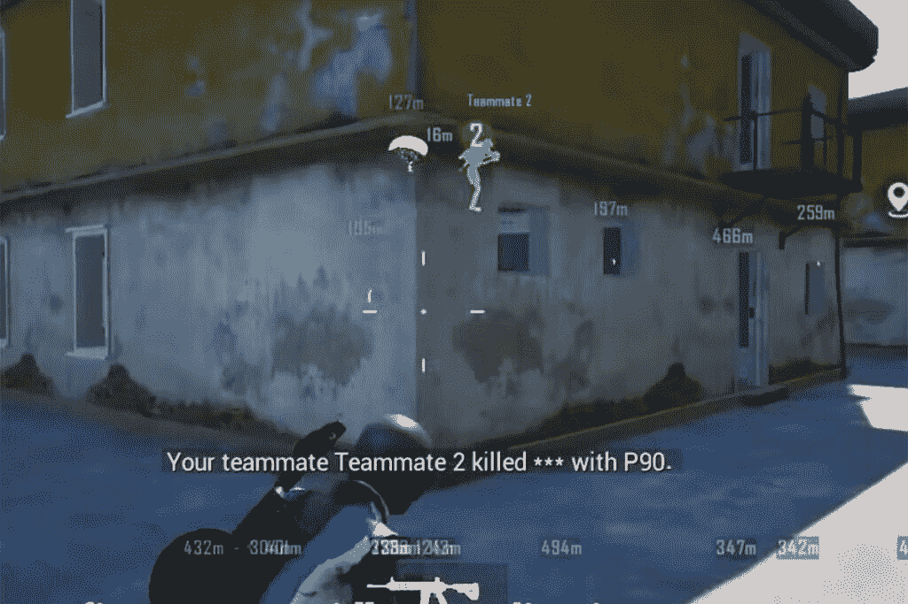
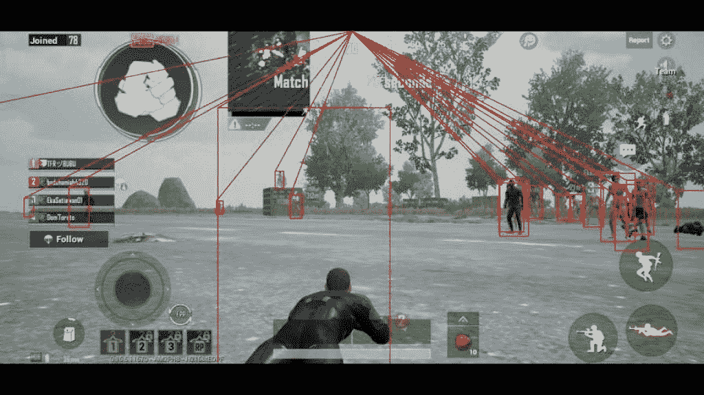

# PUBG 手机秘籍 top 5:wall hack、ESP、Aimbot、Speed、Jump

> 原文：<https://www.xda-developers.com/pubg-mobile-cheats/>

作为最受欢迎的手机游戏之一，PUBG Mobile 继续吸引着广泛的观众，其中也包括一些骗子或黑客。游戏开发商对作弊的使用非常积极和直言不讳，今年早些时候开始发布每周报告。根据上周(10 月 9 日至 10 月 15 日)的最新反欺诈报告，超过 2872644 个账户被永久禁止使用 PUBG Mobile。

根据我们的经验，在 PUBG Mobile 上对付黑客会非常令人沮丧。对付这类玩家的最好方法是通过游戏内的反作弊系统举报他们。还有一个视频审查系统来追捕作弊者。但在此之前，最好先了解这些黑客和骗子是如何运作的。这里我们有一些玩家在 PUBG Mobile 中使用最多的黑客和骗子。

这篇文章的目的是传播对 PUBG Mobile 等游戏中使用的各种类型的黑客攻击的认识。我们不鼓励使用这样的黑客，因为它可能会导致您的帐户永久暂停。此外，使用作弊和黑客只是一种不公平的优势，你赢得了一场比赛，有什么乐趣呢？尝试使用这些 [PUBG 移动提示](https://www.xda-developers.com/pubg-mobile-tips-tricks/)来代替。

### -是啊

 <picture></picture> 

Image credits: PUBG Mobile

这是几乎所有射击游戏中最常见的作弊手段之一，因为它很容易实现。使用这种黑客技术，玩家可以发现他们的敌人，即使他们不在视线范围内。人们可以很容易地通过墙壁发现每个玩家的位置，因此得名 wallhack。传统上，这种欺骗使墙壁透明，但 PUBG Mobile 上最常见的墙壁黑客用亮绿色突出对手玩家。黑客可以很容易地发现他/她的对手，并有策略地攻击。最近，PUBG Mobile [发现了](https://www.pubgmobile.com/en-US/news_detail/webplat/info/news_version3/35372/35373/35374/35386/35387/m20497/202007/863251.shtml)一种黑客用来实施防火墙攻击的新方法。显然，他们会组队故意在比赛中被杀。然后使用旁观者选项，黑客将帮助他/她的队友获得不公平的优势。PUBG Mobile 已经引入了一些改变来防止这种情况发生。

### 电动选择型

 <picture></picture> 

Image credits: 60fps.in

ESP 或超感官知觉是另一种流行的黑客手段，用于在 PUBG Mobile 上获得不公平的优势。你可以称之为超越 wallhack 的一步，除了对手的位置，黑客还可以获得额外的信息。ESP 系统基本上是将代码注入到游戏客户端，该客户端监控你的设备内存中的游戏数据。这是最先进的黑客技术之一，可以提供关于你的对手的各种信息，如姓名、健康、距离、使用的武器等等。它也被称为雷达黑客，因为它最受欢迎的功能之一是能够使用类似雷达的引导线来精确定位物品和玩家。这是为数不多的难以发现的黑客攻击之一。

[这些是目前最好的 PUBG 移动模拟器](https://www.xda-developers.com/pubg-mobile-emulator/)

### Aimbot Hack

这非常简单，就像 wallhack 一样，在多个射击游戏中都可以看到。使用这种攻击，玩家在与对手战斗时获得 100%的准确率。某些 aimbot 黑客甚至不需要黑客瞄准对手或靠近对手。它可以将你的球射向对手的头部，从而毫不费力地杀死对手。这种攻击很容易被发现。如果当你躲在完全保护的地方时，对手设法造成伤害，他或她很有可能使用了 aimbot 黑客。

### 速度黑客

另一个很容易被发现的攻击是速度攻击，它被用来在游戏中快速移动。值得注意的是，这种黑客技术并不真的安全可靠，而且有一定的缺陷。一个人可以很容易地通过速度识别出一个使用速度攻击的玩家，杀死他们并不完全困难。增加的速度有时很难控制，黑客可能会陷入困境，特别是在驾驶车辆时。在短距离战斗和快速移动地图收集战利品时，速度黑客可以提供不公平的优势。

### 向后跳转

 <picture></picture> 

Image credits: Mr Ghost Gaming (YouTube)

jump hack 可以让用户跳到空中，鸟瞰地图。它也被称为反重力欺骗，因为其效果类似于人们在失重或零重力时的感受。就像 speed hack 一样，这可以在驾驶车辆时使用。虽然这个黑客是用来从上面发现和追捕敌人的，但它非常明目张胆，很容易被发现。

如果你在印度，由于最近针对中国出版商的禁令，PUBG Mobile 和 PUBG Mobile Lite 目前在该国被禁。政府建议不要下载这两款游戏。