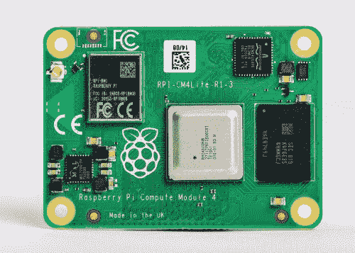
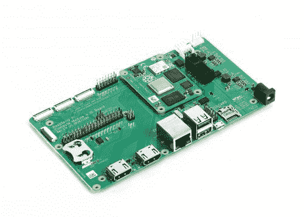
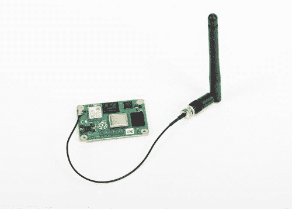

# Raspberry Pi 计算模块 4 推出 32 种版本，价格低至 25 美元

> 原文：<https://www.xda-developers.com/raspberry-pi-compute-module-4-launched-32-variants/>

全新的 Raspberry Pi 计算模块 4 已经正式发布。作为树莓 Pi 计算模块 3+的继任者，新版本在[树莓 Pi 4](https://www.xda-developers.com/raspberry-pi-4-upgraded-cpu-4gb-of-ram-dual-4k-displays/) 推出一年多后问世。据该公司称，它将提供 32 种版本，你今天就可以订购一种，起价 25 美元。新的计算模块 4 构建在与 Raspberry Pi 4 相同的 64 位四核 BCM2711 应用处理器上。据说与前代计算模块 3+相比，它提供了更快的 CPU 内核、更好的多媒体和更多的接口功能。该公司还将首次提供内存密度选择和无线连接选项。

据说，计算模块 4 带来了一种新的外形，并打破了与早期计算模块的兼容性。现在，I/O 信号通过两个高密度垂直连接器获得，一个用于电源和低速接口，另一个用于高速接口，而不是边缘连接器上的 JEDEC DDR2 SODIMM 机械标准。通过这样做，Raspberry 成功地减少了模块的整体占用空间，让用户可以为他们的产品实现更小的外形尺寸。

谈到规格，计算模块 4 支持高达 4K 分辨率的双 HDMI 接口、单通道 PCI Express 2.0 接口、28 个 GPIO 引脚、双 MIPI DSI 显示器和双 MIPI CSI-2 摄像头接口。它将提供 1GB、2GB、4GB 或 8GB LPDDR4-3200 SDRAM，以及可选的 8GB、16GB 或 32GB eMMC 闪存。

 <picture></picture> 

Raspberry Pi Compute Module 4 Lite without eMMC Flash Memory

对于图形，你得到 VideoCore VI，OpenGL ES 3.x，H.265 (HEVC)视频的 4Kp60 硬件解码。还支持 H.264 (AVC)视频的 1080p60 硬件解码和 1080p30 硬件编码。除了具有 IEEE 1588 的千兆以太网 PHY，Raspberry Pi 计算模块 4 还具有可选的 2.4GHz + 5GHz 802.11b/g/n/ac Wi-Fi 和蓝牙 5.0 无线连接。

 <picture></picture> 

IO Board

此外，还有一个新的 IO 板与计算模块 4 一起发布。据该公司称，这将打破从计算模块到标准连接器的所有接口。你有两个全尺寸 HDMI 端口，两个 USB 2.0 端口，一个 MicroSD 卡插座，千兆以太网插孔，PCI Express 插座，40 针 GPIO 连接器，12V 电源输入插孔，摄像头和显示器连接器，以及一个带备用电池的实时时钟。IO 板售价 35 美元。

 <picture></picture> 

Raspberry Pi Compute Module 4 with Antenna Kit

还有新的计算模块 4 天线套件，它带有一个拉杆天线、一个隔板螺丝固定装置和一个 U.FL 连接器，用于连接模块上的插座。