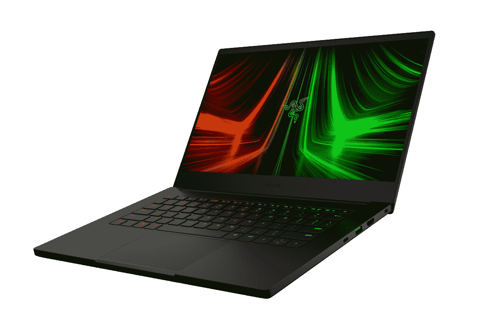

# Razer 最新的刀片式笔记本电脑在 Prime Day 优惠高达 400 美元

> 原文：<https://www.xda-developers.com/razer-blade-laptops-400-off-prime-day/>

亚马逊优惠日即将过去，但现在仍有一些你可以利用的优惠。举个例子，微软商店正在为几台 Razer Blade 笔记本电脑提供大幅折扣，以配合 Prime Day——而且它们也是最新的型号。我们在其他任何地方都找不到这样的价格，所以这是给自己买一台出色的游戏笔记本电脑的好机会。

首先，有雷蛇刀片 15。微软提供的配置配备了英特尔酷睿 i7-12700H，这是一款 14 核 20 线程处理器，时钟速度高达 4.7GHz。它配有 Nvidia GeForce RTX 3080 Ti，这是目前最快的笔记本电脑 GPU，你还可以获得 32GB 的内存和 1TB 的固态硬盘。这是一个糟糕的笔记本电脑，它可以很好地处理你扔给它的任何游戏。为了与之匹配，您可以获得 15.6 英寸的全高清显示屏，具有超快的 360Hz 刷新率，可以在竞争对手的游戏中实现瞬间反应。

当然，你通常需要支付 Razer 税——这些笔记本电脑并不便宜。这种配置通常售价 3699.99 美元，但微软正在大幅降价 400 美元，所以你可以花 3299.99 美元买到它。诚然，这仍然不便宜，但对于这样的顶级笔记本电脑来说，这是一个稳定的价格，肯定比 MSRP 更容易接受。

Razer Blade 15 甚至拥有 1080p 分辨率的出色网络摄像头和 Windows Hello 面部识别功能，这些东西在游戏笔记本电脑中并不常见。还有很多端口，一个 Thunderbolt 4 端口，一个标准 USB-C 端口，三个 USB Type-A 端口，一个耳机插孔和一个 SD 读卡器。

不过，如果你想要更小巧的东西，还有 Razer Blade 14。这款电脑采用 AMD 锐龙 9 6900HX 处理器，这是一款 8 核 16 线程处理器，主频可达 4.9GHz。这种配置包括英伟达 GeForce RTX 3070 Ti GPU，运行现代游戏仍然绰绰有余，此外你还可以获得 16GB 的内存和 1TB 的固态硬盘。您也可以在具有 165Hz 刷新率的四核高清显示器上享受游戏，让您在图像质量和流畅度之间获得最佳平衡。

通常，这种配置的售价为 2，599.99 美元，但微软商店给你 300 美元的折扣，所以这款强大而小巧的笔记本电脑可以花 2，299.99 美元买下。

 <picture></picture> 

Razer Blade 14

##### 雷蛇之刃 14

Razer Blade 14 是一款紧凑型笔记本电脑，仍然配备顶级 AMD 处理器和强大的 Nvidia 显卡。此外，它有一个四核高清 165 赫兹显示屏，非常适合游戏和工作。它便宜 300 美元，所以现在是购买它的好时机。

与 Blade 15 一样，您还可以在显示器上方获得一个带有 Windows Hello 的全高清网络摄像头。连接也很牢固，有两个 USB Type-C 端口(带 DisplayPort 和充电)，两个 USB Type-A 端口和 HDMI。这里没有雷电，因为是 AMD 的笔记本电脑。我们还应该提到，您不能升级刀片 14 上的内存，尽管 16GB 应该足够长时间了。

与“适当的”Prime Day 交易不同，这些 Razer Blade 折扣从技术上讲将持续到本周末，但它们可能会缺货。事实上，Razer Blade 17 似乎也有一笔交易，但它已经售罄，所以趁你还能利用这些机会。