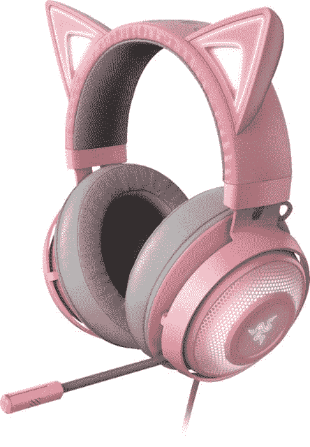
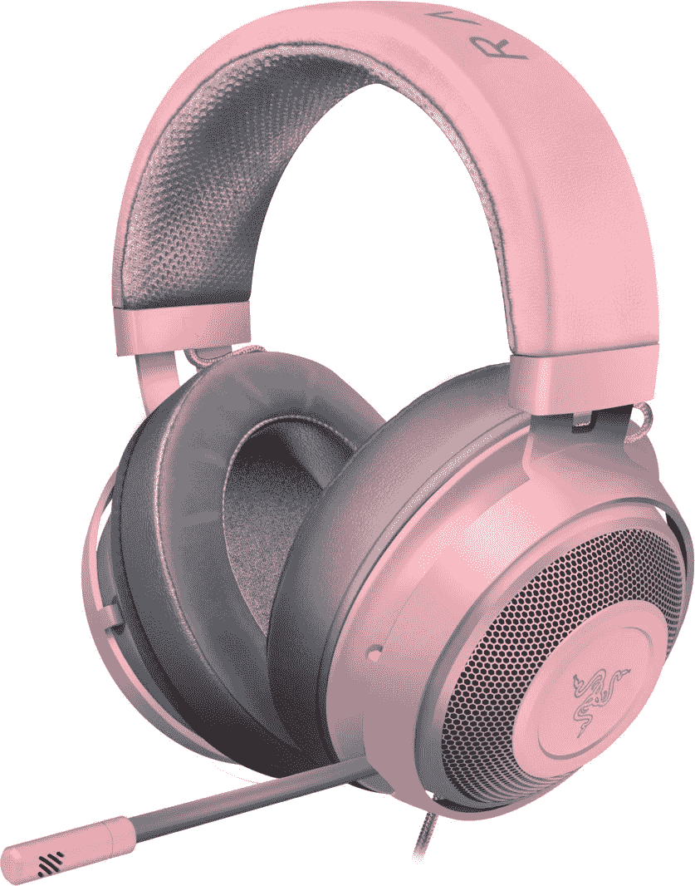
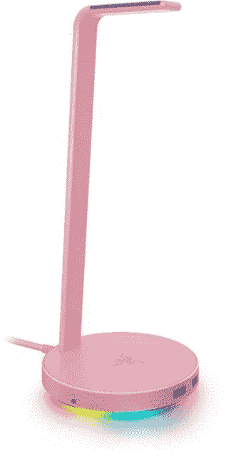
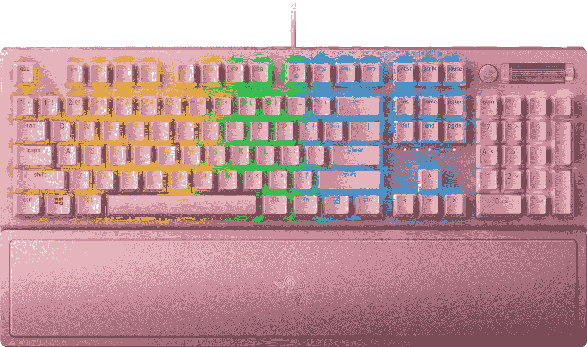
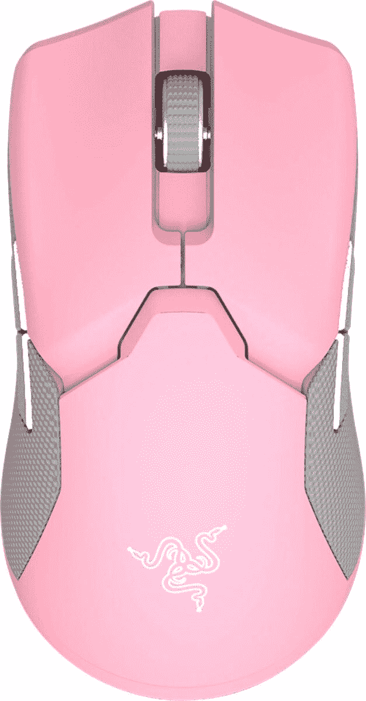
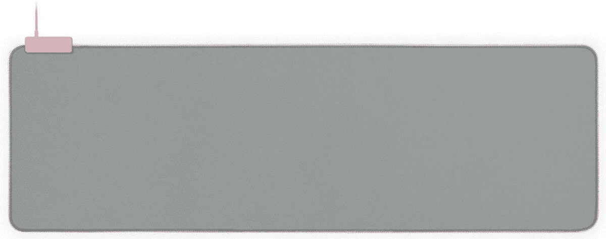

# 用情人节特卖的雷蛇石英产品说“我爱你”

> 原文：<https://www.xda-developers.com/razer-quartz-deals/>

我很高兴粉红色的科技产品最近开始流行。这是一种非常适合高科技的颜色！黑色令人厌烦，如果材料不符合标准，白色看起来很脏，很容易被弄脏。粉红色和玫瑰金的颜色看起来很棒，但又不会太抢眼。真是太好了！现在，为了情人节，雷蛇在百思买打折了他们的雷蛇石英系列，这样你就可以为你生活中的游戏爱好者挑选这些配件。遗憾的是，你还不能赠送榛树项目的礼物，但也许明年吧？

首先，让我们从 Razer Quartz 耳机开始。可爱的雷蛇北海巨妖凯蒂 RBG 耳机是 23 美元的石英颜色，使总价格下降到 127 美元。对于那些喜欢猫耳耳机的人来说，这是一个完美的礼物！但是，这也是一个非常喜欢它或讨厌它类型的礼物-如果你不确定你爱的人会喜欢猫耳朵，最好是谨慎为上。当然，你可以把耳朵摘下来，但是为什么要付保险费呢？

在这种情况下，你可以拿起标准的雷蛇北海巨妖石英耳机！这款耳机没有出售，但它有一个免费赠品——与之匹配的雷蛇基站 V2(当然是石英的)，带有 RGB 照明。通常 70 美元，这不仅是一个耳机支架，而且你可以直接将耳机插入其中。它非常适合插入电脑背面的 USB 端口进行线缆管理。虽然它在活动中以 59 美元的价格出售，但购买粉红色的雷蛇北海巨妖耳机可以免费获得它，这可能是最划算的交易！

 <picture></picture> 

Razer Quartz Kraken Kitty Headset

##### 拉扎尔·季茨·克拉肯·基蒂

 <picture></picture> 

Razer Quartz Kraken Wired Headset

 <picture></picture> 

Razer Quartz Base Station V2 Headset Stand

##### Razer 石英基站 V2 耳机支架

当然也不能忘了电脑配件！虽然我们上周关注的是罗技和欧凯的设备交易，但大多数交易并不乐观。那一点都不好玩！Razer 知道粉红色的计算机配件是将整个设备连接在一起的东西，所以现在是时候拿起它们了。首先，Razer BlackWidow V3 的石英版降价 21 美元，总售价仅为 119 美元。这个版本的黑寡妇使用了 Razer 定制的绿色开关，除此之外的颜色与标准黑寡妇相同。

接下来是 Razer Viper 终极无线游戏鼠标。虽然我不是无线鼠标的粉丝，但如果你在家里没有蓝牙问题，这将是一个很好的购买。鼠标的石英色是 127 美元，比建议零售价低 23 美元。哦，别忘了石英鼠标垫！匹配的 Razer Galiathus 鼠标垫实际上主要是浅灰色，但这意味着它非常适合帮助您的石英配件流行。当然，RGB 照明对此也有帮助！减价 9 美元，你可以花 51 美元买到这个配件。

 <picture></picture> 

Razer Quartz Blackwidow V3 Keyboard

##### 雷蛇石英黑寡妇 V3

 <picture></picture> 

Razer Quartz Viper Ultimate Gaming Mouse

##### 雷蛇石英毒蛇终极版

 <picture></picture> 

Razer Quartz Goliathus RGB Mousepad

##### Razer 石英 Goliathus RGB