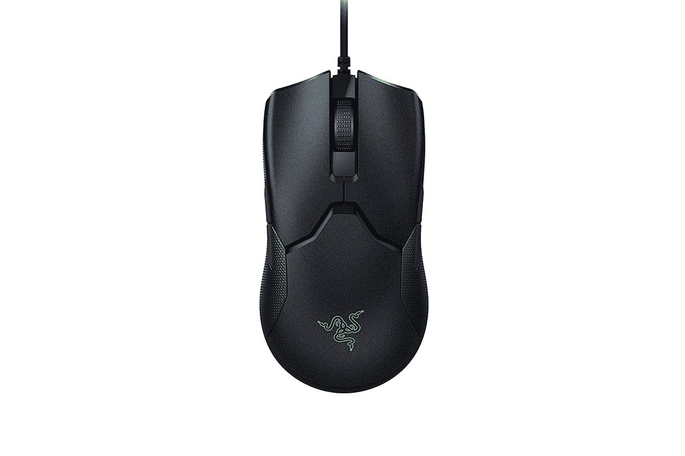

# 以 40 美元的价格获得 Razer Viper 双手通用游戏鼠标

> 原文：<https://www.xda-developers.com/razer-viper-ambidextrous-gaming-mouse-black-friday-sale-best-buy/>

# 在这个黑色星期五，以 40 美元的低价获得 Razer Viper 双手灵巧游戏鼠标

Razer Viper 是一款双手灵巧的鼠标，它提供了轻量级设计、8 个可编程按钮和可定制的 RGB 照明。

对于游戏玩家来说，这绝对是一年中最棒的一年。我们看到[索尼](https://www.xda-developers.com/playstation-5-restocks/)和[微软](https://www.xda-developers.com/xbox-series-x-restocks/)推出了他们新的游戏主机，而另一方面，NVIDIA 和 AMD 在他们新的 GPU 产品线上针锋相对。现在，如果你是团队 PC，并且正在寻找一个轻量级和快速的游戏鼠标这个黑色星期五，你是幸运的。Razer 的 Viper 双手通用鼠标在百思买上以 40 美元的低价出售。如果与 80 美元的发行价相比，这是一个 50%的实实在在的折扣。

 <picture></picture> 

Razer Viper Gaming Mouse

##### 雷蛇蝰蛇

Razer Viper 适用于左手和右手用户，并提供了一个坚固的 16，000 dpi 传感器以及 8 个可编程按钮。

Razer 拥有制造一些最好的游戏硬件和外设的血统，这一款也不例外。蝰蛇是一种双手灵巧的鼠标，这意味着它对右手和左手用户都很好。它有一个低调的设计，但它适合几乎任何类型的握持。就我个人而言，我觉得更喜欢爪握或指尖握的用户会有宾至如归的感觉。如前所述，Viper 重量很轻，只有 69 克，您可以使用它进行长时间的游戏，而不会对您的手造成压力。除了常规的左右点击按钮、滚轮和 DPI 开关之外，它还提供了四个侧按钮——每侧两个。所有按钮都可以使用 Razer Synapse 软件进行编程。

鼠标采用 Razer 的光学鼠标开关，额定点击次数为 7000 万次。它还包括该公司的 5G 高级光学传感器，可提供高达 16，000 DPI 的分辨率)。这使得它适合电子竞技游戏玩家。对于 RGB 爱好者来说，掌托上的 Razer 徽标下方有 led，提供 1680 万种颜色，可以通过 Razer Chroma 软件进行配置。

如果你喜欢雷蛇的产品，那就去看看这个黑色星期五特价出售的北海巨妖锦标赛版游戏耳机。此外，请确保您也浏览了我们这里的最佳[黑色星期五博彩交易](https://www.xda-developers.com/black-friday-gaming-deals/)指南。