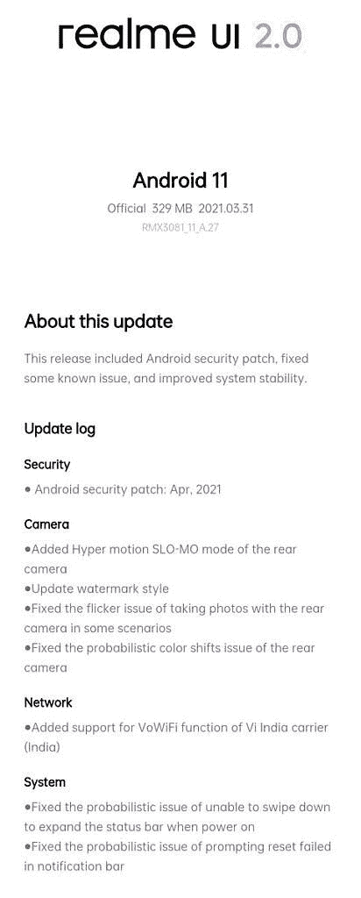

# Realme 8 Pro 更新 ADS 2021 年 4 月安全补丁，960fps 慢动作

> 原文：<https://www.xda-developers.com/realme-8-pro-ui-2-update-april-2021-security-patches/>

Realme 上周发布了 Realme 8 和 8 Pro T1，以及一些物联网产品。高级型号 Realme 8 Pro 的主要亮点是其 [108MP 摄像头](https://www.xda-developers.com/samsung-isocell-lineup-promises-smaller-camera-bumps-future-smartphones/)，该公司一直在努力提高智能手机的摄像头性能。Realme 8 Pro 也是该公司第一款配备稳定 [Realme UI 2.0](https://www.xda-developers.com/realme-7-realme-ui-open-beta-android-11/) 的手机，自上周推出以来，已经收到了第二次 OTA 更新。最新的更新为 2021 年 4 月带来了谷歌安全补丁和一系列对相机的改进，包括 960fps 模式的慢速视频录制。

Realme 8 Pro 的最新 Realme UI 2.0 更新重达 329MB，并将内部版本号提高到 **RMX3081_11_A.27** 。如上所述，此次更新的主要附加功能是更新了 2021 年 4 月最新补丁的安全性。除此之外，此次更新为 SLO-莫模式带来了 960fps 的设置——仅适用于主后置摄像头。

 <picture></picture> 

Realme 8 Pro RMX3081_11_A.27 update changelog

此次更新还为 Realme 8 Pro 的 108MP 摄像头拍摄的图像添加了新的水印样式。新的水印设置允许用户根据水印打开或关闭徽标、设备名称以及照片的日期和时间。你还可以看到 Realme 的新“infinity”标志，这是用来促进 108MP 相机的细节捕捉能力。

此外，该更新声称可以解决某些用户在使用主相机拍摄图像时出现的颜色偏移和闪烁问题。此次更新还修复了一些 bug，比如在状态栏上向下滑动以展开和重置失败的问题。

最后，此次更新专门为印度的 Vi 蜂窝运营商增加了 Vo-WiFi(Wi-Fi 语音)功能。印度的 Airtel 和 Reliance Jio 等其他电信运营商已经支持该功能。

**[Realme 8 Pro 论坛](https://forum.xda-developers.com/f/realme-8-pro.12171/)**

**要检查 OTA 更新，请前往“设置”并向下滚动至“软件更新”如果您的设备上有更新，您将看到“立即更新”选项**