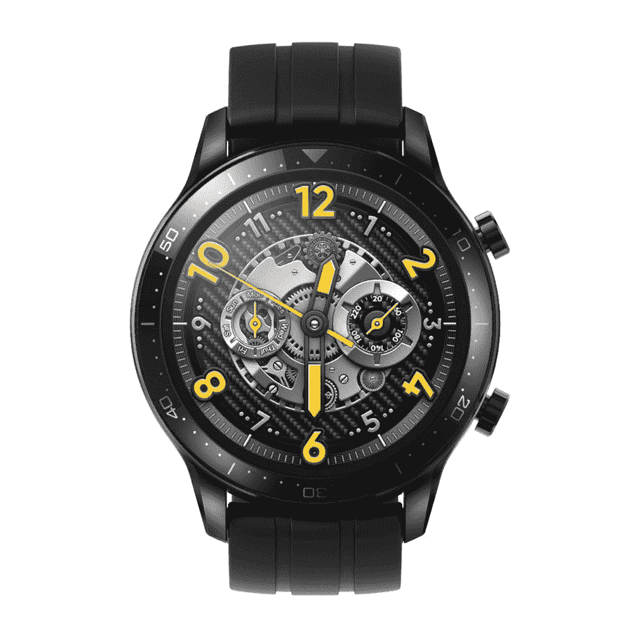
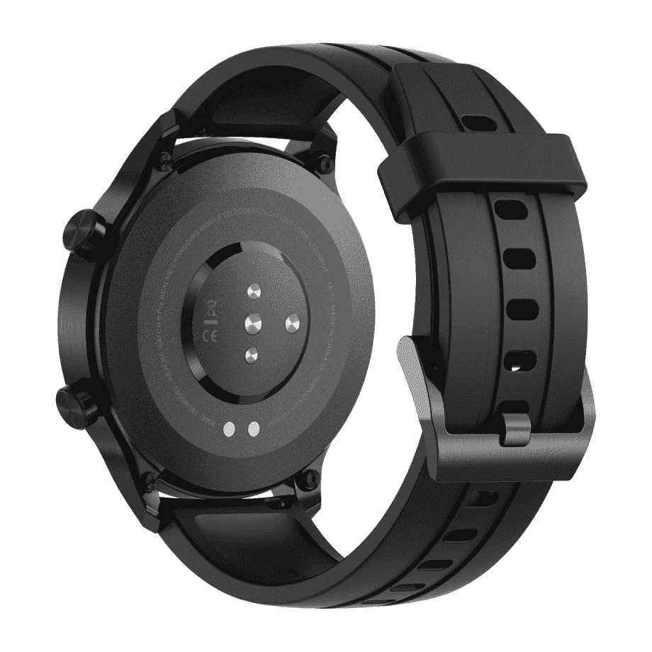
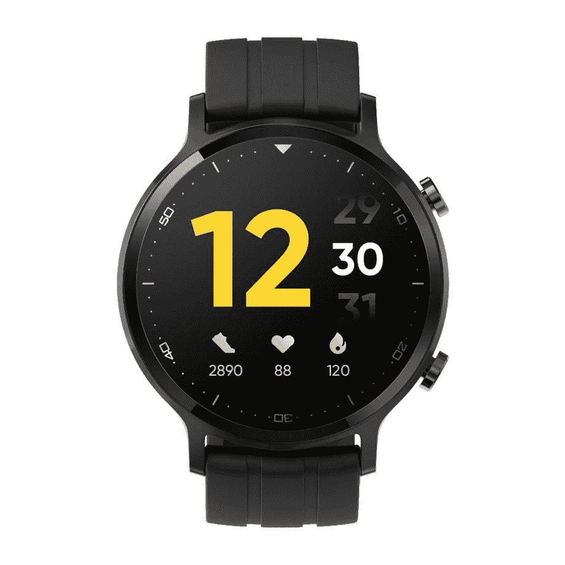
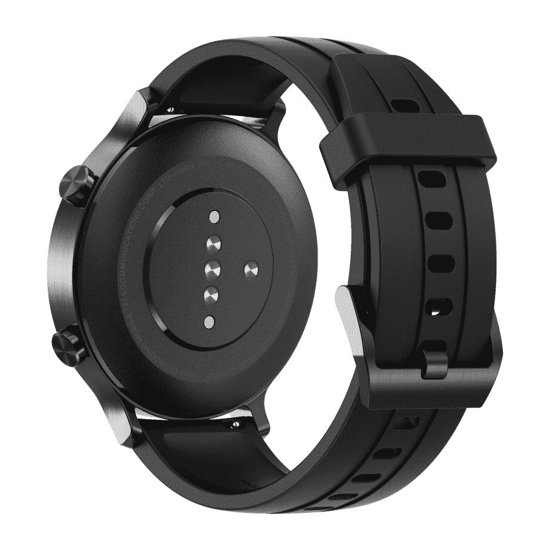
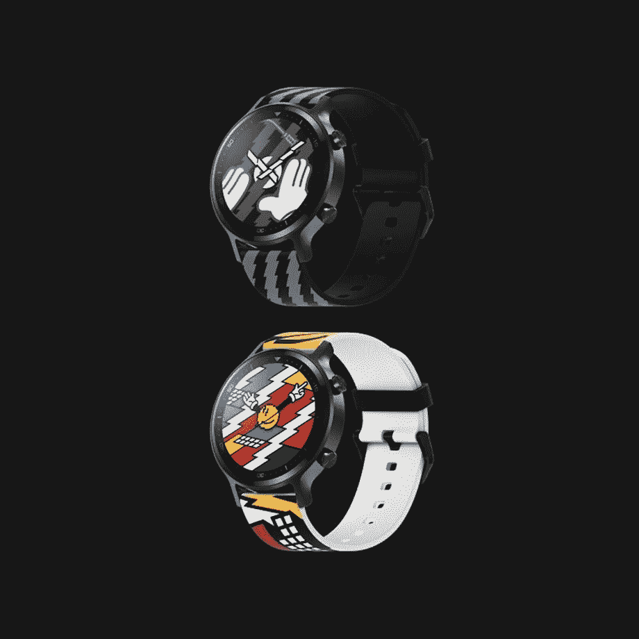

# 印度推出 Realme Watch S、Watch S Pro 和 Realme Buds Air Pro ME

> 原文：<https://www.xda-developers.com/realme-watch-s-watch-s-pro-realme-buds-air-pro-me-launched-india/>

在今年 9 月的 IFA 贸易展上，Realme 宣布计划向欧洲市场推出 10 款新智能手机、一款智能手表、一台智能电视、2 只耳塞和一系列物联网设备。在发布会上，该公司[向我们展示了一款名为 Realme Watch S Pro 的智能手表](https://www.xda-developers.com/realme-ifa-2020-10-new-smartphones-smartwatch-smart-tv-earbuds-europe/)，它的特色是一个圆形表盘，带有 AMOLED 显示屏，右侧有两个按钮，还有一条硅胶表带。虽然 Realme 尚未在欧洲推出手表 S Pro，但它现在已经在印度推出了高级智能手表，以及 Realme Watch S 和 Realme Buds Air Pro ME。

## Realme Watch S 和 Watch S Pro

Realme Watch S Pro 是中国 OEM 厂商的第一款高端智能手表，采用 1.39 英寸 AMOLED 显示屏，封装在圆形不锈钢外壳内。该显示器提供 450 尼特的峰值亮度，支持 AOD，并提供大猩猩玻璃 3 保护。

 <picture></picture> 

Realme Watch S Pro

在健身跟踪功能方面，Realme Watch S Pro 支持持续心率监测、血氧水平监测、15 种运动模式、步数跟踪、睡眠跟踪等。此外，智能手表还具有通知支持、相机快门功能、查找我的手机功能、音乐控制、高精度双卫星 GPS、IP68 防水等级和 100 多种独特的表盘。

 <picture></picture> 

Realme Watch S Pro

Realme Watch S Pro 装有 420mAh 电池，在连续心率监测打开的情况下，一次充电可以使用 14 天。该手表配有一个专有的磁性充电座，能够在大约 2 小时内从 0-100%充电。

另一方面，Realme Watch S 配备了一个 1.3 英寸的液晶显示屏，位于圆形铝制外壳内。该显示器的峰值亮度为 600 尼特，具有 5 级自动亮度和 Gorilla Glass 3 保护。

 <picture></picture> 

Realme Watch S

在健康跟踪功能方面，Realme Watch S 与更高端的 Watch S Pro 并没有太大区别。它还支持持续心率监测、血氧监测、步数跟踪、睡眠跟踪等。智能手表还带有通知支持、相机快门功能、查找我的手机功能、音乐控制、IP68 防水等级和 100 多个表盘。然而，它没有像更高级的产品那样内置 GPS。

 <picture></picture> 

Realme Watch S

Realme Watch S 装有一个较小的 390mAh 电池，在连续心率监测打开的情况下，一次充电可以使用 15 天。这款手表还配备了一个类似的专有磁性充电支架，可以在大约 2 小时内从 0-100%充电。

 <picture></picture> 

Realme Watch S Master Edition

Realme 与韩国设计的 Grafflex 联手推出了一款特别版 Realme Watch S，名为 Realme Watch S Master Edition。特别版智能手表有两种独特的设计，提供与普通 Realme 手表相同的硬件和功能。

## Realme Buds Air Pro 大师版

除了两款新的智能手表，Realme 还推出了一款新的特别版 Realme Buds Air Pro。Realme Buds Air Pro Master Edition 是与设计师 José Lévy 合作设计的，它具有闪亮的金属质感。

 <picture></picture> 

Realme Buds Air Pro Master Edition

除了新的完成，Realme Buds Air Pro Master Edition 提供了与普通 Realme Buds Air Pro 相同的硬件和功能。这意味着它还支持主动噪音消除，它具有 10 毫米低音增强驱动器，94 毫秒超低延迟模式，25 小时的总音乐播放，以及快速充电支持。

## 定价和可用性

Realme Buds Air Pro Master Edition 在₹4,999 定价，将于 1 月 8 日通过 Flipkart 和 [Realme 的网站](https://buy.realme.com/in/goods/268?id=759)上市销售。Realme Watch S 的定价也在₹4,999，将于 12 月 28 日通过[相同渠道](https://buy.realme.com/in/goods/288)上市销售。

虽然 stock watch 将配备硅胶黑色表带，但 Realme 将为硅胶表带提供三种其他颜色的选择——蓝色、橙色和绿色——以增加一个₹499.这些硅胶表带将于 1 月 5 日在 Realme 的网站上发售。此外，Realme 将为这款手表提供四种高级纯素皮革表带，有棕色、黑色、蓝色和绿色可供选择，价格将在₹999.确定截至目前，该公司尚未公布同一款手机的发布日期。

Realme Watch S Master Edition 的₹1,000 溢价高于普通 Watch S。它的定价为₹5,999，将在未来几周内通过 Flipkart 和 Realme 的网站销售。最后，Realme Watch S Pro 的定价为₹9,999，将于 12 月 29 日通过 Flipkart 和 [Realme 的网站](https://buy.realme.com/in/goods/287)上市销售。与 Realme Watch S 非常相似，Watch S Pro 将配有黑色硅胶表带，但买家可以选择上面提到的额外表带。