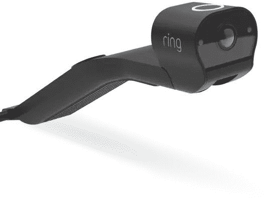

# 环形汽车摄像头刚刚泄露，但这就是为什么你不应该买它

> 原文：<https://www.xda-developers.com/ring-car-cam-leak/>

Ring 是最大的家庭安全产品制造商之一，这在很大程度上要归功于它被亚马逊(Amazon)收购。该公司因其糟糕的数据安全性以及与警方组织合作建立广泛的监控网络而多次受到批评，但 ring 正在推进新产品计划。几个即将推出的产品的图像已经被发现，包括一个奇怪的汽车摄像头。

[*磁带机*](https://thetapedrive.com/amazon-plans-to-release-a-suite-of-ring-product-including-amazon-fetch-ring-auto-and-this-strange-looking-jaws-camera)(via*[The Verge](https://www.theverge.com/2021/6/18/22540298/amazon-ring-car-dash-cam-image-support-article)*)为 Ring 目前正在开发的几款产品发现了新的镜像。一些设备已经展示过了，比如模仿苹果 AirTags 的“Amazon Fetch”跟踪器，以及用于汽车警报的 Ring Auto。然而，一张 Ring 未来 dashcam 的照片——称为 Ring Car Cam——也被公布(由*磁带机*和*Zatz 不好笑* )这是我们看到的该设备的第一张图片。

 <picture></picture> 

The Ring Car Cam dash camera (Source: Zats Not Funny)

新的环形汽车摄像头应该可以记录汽车的内部和外部。这种设计当然是独一无二的，目前还不清楚它是如何安装在汽车上的。摄像机可以贴在车顶上，也可以贴在后视镜的后面。这种摄像头应该可以插入任何汽车的 OBD-II 端口，这将允许它接收诊断信息。

Ring 似乎也很早就发表了一篇支持文章 ( [镜报](https://web.archive.org/web/20201126064520/https://support.ring.com/hc/en-us/articles/360049596812-Ring-Car-Cam-Information))，其中包括之前没有公布的更多细节。环形车载摄像头“有助于保护你的车，无论它停在哪里”，这表明它可能只在你不开车的时候记录视频——这使它严格地成为一个安全摄像头，而不是传统的仪表板摄像头。亚马逊提到，你可以说“Alexa，我要靠边停车”来记录与警察的互动。

Ring 预计将这款相机的售价定为 199 美元，可选配 LTE 连接，用于云录制备份。尽管如此，我还是强烈建议*不要在一款*上市时购买它，因为 Ring(以及亚马逊)已经证明[时间](https://www.businessinsider.com/ring-doorbells-live-video-security-camera-police-fusus-2020-11)和[时间](https://theintercept.com/2019/02/14/amazon-ring-police-surveillance/)再次证明，它对向当地警方出售监控数据比对保护其客户更感兴趣。

*特色图片:环形室内摄像头(鸣谢:环形)*