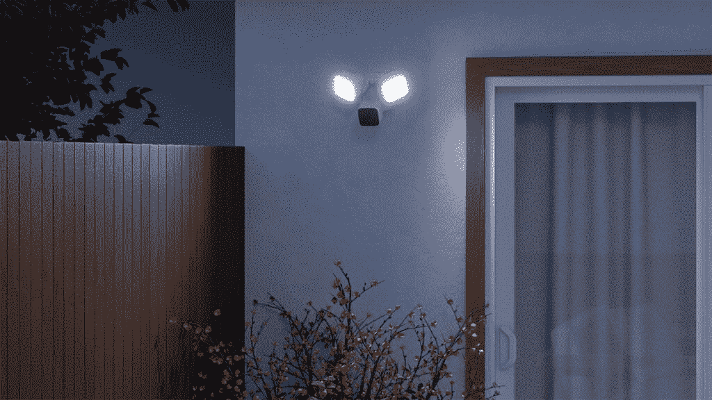

# Ring Spotlight Cam Pro 亮相，完全无线，具有高级跟踪功能

> 原文：<https://www.xda-developers.com/ring-spotlight-camera-pro-released/>

如果你想加强你的家庭安全，环聚光灯凸轮专业看起来是一个诱人的选择。包装一个完全无线的设计与所有的跟踪软件，你可能会需要，它看起来非常适合家庭安全网络。由于内置雷达，它具有 3D 运动检测功能，这有助于该公司的“鸟瞰”功能。此功能显示画中画布局，显示移动路径和亮起的灰点，以便您可以看到触发它的运动事件开始的位置。

整个套装最棒的地方在于，这是第一次在一个完全无线的套装中提供这些功能。通过鸟瞰视图绘制的轨迹可以向您显示东西移动和移动的确切位置，即使它没有记录，只要您有一个 [Ring Protect](https://www.xda-developers.com/do-you-need-ring-protect/) 订阅，您就可以在事后查看这些事件。

一个叫做鸟瞰区域的新功能建立了一个鸟瞰图，在这里你可以勾勒出你家的特定部分来定制你的提醒。此功能允许您使用类似于鸟瞰图的航空地图，在您的院子、草坪或车道周围设置特定的运动检测区域。

除此之外，Ring Spotlight Cam Pro 还拥有您从 Ring 了解和喜爱的所有其他功能。这包括双向通话、彩色夜视、实时取景和安全警报器。它也有一个全新的设计，看起来像一个普通的安全摄像头。它并不华丽也不时尚，但无论如何，你也不会真的想要这种东西作为家庭安全外设。

Ring Spotlight Cam Pro 可以通过电池、太阳能电池板供电，甚至只需插入电源即可。你可以以 229.99 美元的价格预订电池和插入式型号，而太阳能电池板型号的价格为 249.99 美元。

 <picture></picture> 

Blink Wired Floodlight Camera

与此同时，亚马逊还公布了 Blink Mini 云台和 Blink 有线泛光灯摄像头。奇怪的是，这两种设备是不同的系统，不能与 Ring 互操作。Blink 摄像机是一种硬连线摄像机，可用于家庭安全中的运动检测，并可提供高达 2600 流明的 LED 照明。还有一个 1080p 的实时视图和双向音频。通过 Blink 订阅，您可以在云端存储视频剪辑和照片。

至于 Blink Mini 云台，它是 Blink Mini 的一个附加组件，可以让你远程向上、向下、向左和向右平移 Blink Mini。如果你已经有了一个 Blink Mini，可以通过 micro USB 添加挂载，你可以把它放在任何表面上。

在接下来的几个月里，这款闪光有线泛光灯相机将以 99.99 美元的价格在美国上市。Blink Mini 云台支架现已在美国和加拿大接受预购，捆绑价格为 59.99 美元，或者仅售 29.99 美元。