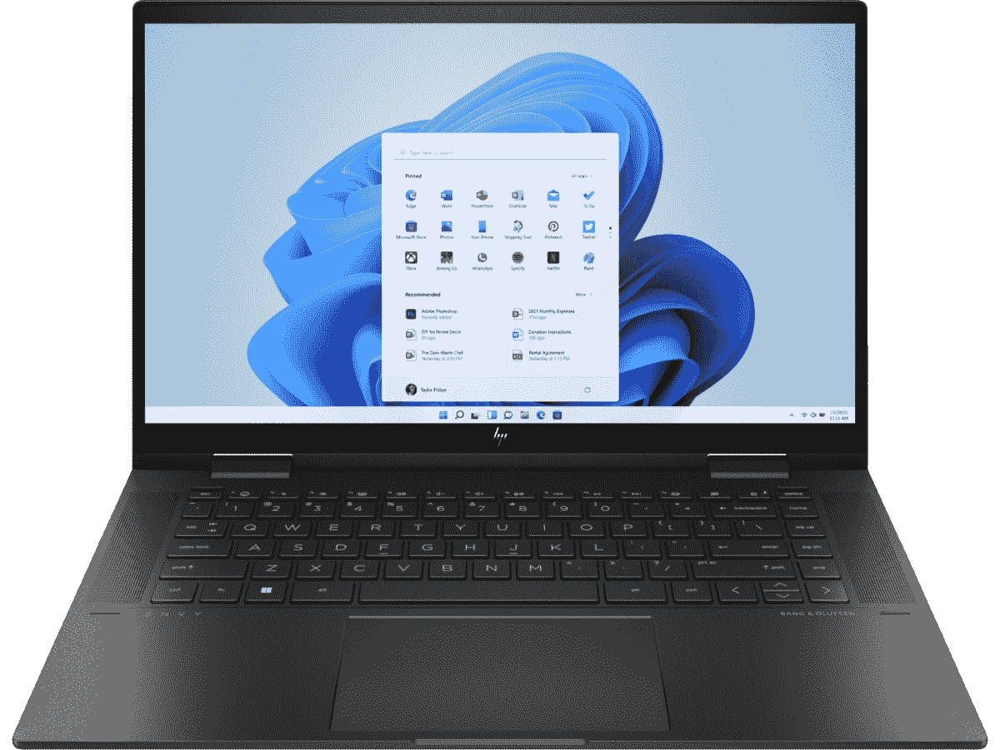
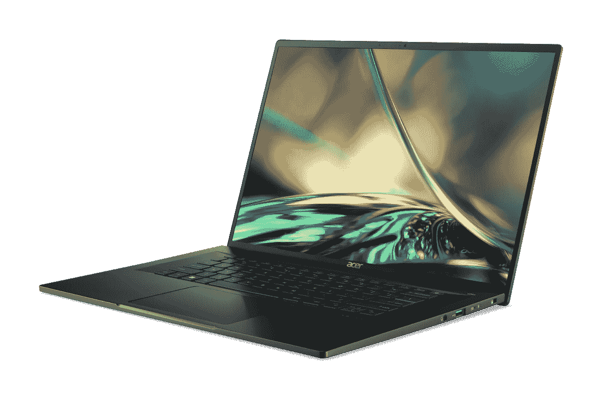

# 2023 年最佳 AMD 锐龙笔记本电脑

> 原文：<https://www.xda-developers.com/robert-hallock-gpuopen-is-amds-long-term-open-source-strategy/>

通常，英特尔处理器比 AMD 处理器更受欢迎，尤其是在笔记本电脑中。即使在今天，你能买到的许多最好的笔记本电脑都是由英特尔处理器驱动的。然而，自从引入锐龙家族以来，AMD 在变得更受欢迎方面取得了长足的进步，越来越多的出色的笔记本电脑显示出了 AMD 锐龙处理器。

这些天来，你可以在市场的各个领域找到由 AMD 锐龙处理器驱动的非常棒的笔记本电脑。无论您是想要一台新的游戏装备、一台高级笔记本电脑，还是想要完成工作，AMD 处理器现在都是许多设备的核心，它们也是您能找到的最好的处理器之一。如果您想升级到新的 AMD 笔记本电脑，我们已经收集了您今天可以找到的最佳选项。正如我们提到的，这些笔记本电脑覆盖了很多地方，所以无论你在寻找什么，你一定会在这里找到你喜欢的东西。让我们开始吧。

## 整体最佳:HP Envy x360 15

如果您正在寻找一款多功能的高端 AMD 锐龙笔记本电脑，HP Envy x360 15 绝对是一个绝佳的选择。它由 AMD 锐龙 5000 系列处理器提供动力，拥有顶级的设计和只有敞篷车才能提供的多功能性。

从性能开始，HP Envy x360 采用 AMD 锐龙 5000 系列，特别是锐龙 5 5625U 或锐龙 7 5825U。这些不再是 AMD 的最新处理器，但事实是许多超极本仍在使用 AMD 的锐龙 5000 系列，特别是 U 系列。您仍然可以获得多达 8 个内核、16 个线程和高达 4.5GHz 的速度，因此您肯定不会错过性能。此外，您可以选择 8GB 或 16GB 的内存，但为了获得最佳性能，我们建议选择后者。您还可以获得高达 1TB 的固态硬盘来存储，因此您不会很快需要更多空间。

HP Envy Envy x360 上的显示器也相当不错。这是一个 15.6 英寸的面板，具有全高清(1920 x 1080)分辨率，16:9 的纵横比，400 尼特的亮度。一些用户可能会嘲笑没有更高的屏幕，但这仍然是媒体消费的理想形式。不能升级分辨率，全高清对于广大用户来说已经足够了。然而，你可以选择 OLED 面板，所以这是需要考虑的。

HP Envy x360 最新版本的一大亮点是网络摄像头。凭借其 2022 年的笔记本电脑，惠普正在全力以赴开发高质量的网络摄像头，这意味着你将获得一个能够拍摄 1080p 视频的 5MP 传感器，并具备自动取景和光线校正等功能。此外，该相机支持 Windows Hello 面部识别，因此解锁您的 PC 非常简单。这是你能在任何笔记本电脑上找到的最好的网络摄像头之一。

在设计方面，HP Envy x360 是一款相当标准的可转换产品，这意味着显示屏转轴可以 360 度旋转，因此您可以将其用作平板电脑。它有一个光滑的黑色配色，在任何地方看起来都很棒，尽管它并没有从人群中脱颖而出。它的厚度为 18.54 毫米，重量为 3.93 磅，有点重，但当你考虑到它是一款配有大显示屏的铝合金敞篷车时，这些数字就更有意义了。

至于端口，除了专有的充电端口外，你还可以获得两个 USB 3.2 Gen 2 Type-C 端口，两个 USB 3.2 Gen 1 Type-A 端口，HDMI 2.1，一个耳机插孔和一个 microSD 读卡器。这是一个非常可靠的设置，涵盖了您可能拥有的所有需求，并且您可以通过这种方式连接许多外围设备。您确实错过了 Thunderbolt 支持，因为这是一台 AMD 笔记本电脑，但这将是这里几乎每台笔记本电脑的情况。

总的来说，HP Envy x360 是一款由 AMD 锐龙处理器驱动的出色的可转换笔记本电脑，尽管一些笔记本电脑中有更新的处理器，但你真的不会错。

 <picture></picture> 

HP Envy x360 13

##### 惠普 ENVY x360 15

惠普 Envy x360 是一款配备 AMD 锐龙 5000 系列处理器和其他高端规格的高级敞篷车。

## 最佳 AMD 游戏笔记本电脑:外星人 m15 R7

AMD 笔记本电脑非常受欢迎的一个领域是游戏，外星人 m15 R7 可能是目前最好的游戏笔记本电脑。它有英特尔或 AMD 驱动的版本，虽然我们显然在这里侧重于红队。

从性能开始，外星人 m15 R7 配备了 AMD 锐龙 6000 系列处理器，要么是锐龙 7 6800H，要么是锐龙 9 6900HX。这两种处理器都是非常强大的 8 核处理器，可以毫无问题地处理您扔给它们的任何东西。除此之外，你可以配置高达 Nvidia GeForce RTX 3080 Ti 的笔记本电脑，这意味着你可以玩任何你想玩的游戏，毫无疑问。最重要的是，您可以获得高达 64GB 的 RAM 和 4TB 的 SSD 存储，因此您不会错过这台机器的任何部分。

对于不同类型的用户，显示器有几种配置。如果你想要更便宜的选择，你可以获得 165Hz 刷新率的全高清面板，升级到 360Hz 以获得额外的流畅体验，或者选择四高清 240Hz 面板，我们认为这是总体上最好的选择。您可以获得清晰的图像质量和平滑的帧速率，因此不会出错。这台机器的一个主要缺点是它配备了 720p 高清网络摄像头，所以质量不是最大的。2022 年的许多笔记本电脑已经升级到 1080p，但游戏笔记本电脑往往是个例外。

在设计方面，外星人 m15 显然是有点笨重，以适应强大的内部。它的起始重量为 5.34 磅，厚度为 23.95 毫米。这不是轻量级的，但对于如此强大的笔记本电脑来说，这是有意义的。至于外观，这款笔记本电脑采用了深灰色和黑色的搭配。然而，由于外星人标志和背面通风口周围的 RGB 照明，加上键盘上每个按键的 RGB 照明选项，您确实有一点天赋。

至于端口，这是游戏笔记本电脑通常擅长的地方。在这里，你可以在右侧找到两个 USB Type-A 端口，在左侧找到千兆以太网和耳机插孔，在背面找到另一个 USB Type-A，加上 USB Type-C 和 HDMI。这大概就是你所需要的连接能力，你所有的外设都不需要适配器就能工作。

外星人 m15 R7 有点贵，但如果你想在游戏中获得强大的动力，这是一个不错的选择。你可以从下面的亚马逊购买，或者在[戴尔的网站](https://www.anrdoezrs.net/links/100122946/type/dlg/sid/UUxdaUeUpU5944/https://www.dell.com/en-us/shop/dell-laptops/alienware-m15-r7-gaming-laptop/spd/alienware-m15-r7-amd-gaming-laptop/wnm15r7cto010s)查看更多配置。

 <picture></picture> 

Alienware m15 R7

外星人 m15 R7 是一款功能强大的游戏笔记本电脑，配备 AMD 锐龙 6000 系列处理器和 Nvidia RTX 显卡。

## 经济型游戏笔记本电脑:戴尔 G15

如果您想玩一些游戏，但没有预算购买最新、最棒的产品，Dell G15 是一个不错的入门选择。它为您提供了稳定的入门级游戏体验的所有基础，而不会打破银行，尽管很难找到一个真正的游戏预算选项。

在性能方面，戴尔 G15 配备了 AMD 锐龙 5 6600H，这已经是一个强大的 CPU，具有 6 个核心，12 个线程，速度可达 4.5GHz。除此之外，您还可以获得 Nvidia GeForce RTX 3050 GPU，实现稳定的入门级游戏体验。它不会与上面的外星人模式竞争，但是你应该能够玩大多数现代游戏，并且你愿意改变一些设置。如果你想在不花太多钱的情况下玩游戏，8GB 内存和 512GB 固态硬盘给你一套可靠的规格。一些廉价的游戏笔记本电脑的初始存储容量为 256GB，所以开箱后能有两倍的存储容量是非常好的。

显示器相当简单，但它很好地满足了大多数游戏需求，并且与内部规格非常匹配。15.6 英寸的面板支持高达 120Hz 的刷新率，这意味着游戏在这个屏幕上看起来会更流畅。分辨率是全高清的，这对于 RTX 3050 笔记本电脑 GPU 来说也是非常合适的。同样基本的是显示器上方的网络摄像头，考虑到这是一台游戏笔记本电脑，而且价格便宜，这不应该是一个巨大的惊喜。这是一个 720p 摄像头，没有任何形式的 Windows Hello 支持可言。

Dell G15 具有明显的游戏美学，你可能喜欢，也可能不喜欢。它看起来很笨重，后面的大排气孔很明显这是一台游戏笔记本电脑。盖子上的三角形图案和红色背光键盘也强化了这一想法。厚度为 26.90 毫米，这当然不是最薄的笔记本电脑，而且它的重量只有 5.55 磅。尽管如此，笔记本电脑看起来足够干净，如果你正在寻找一台游戏笔记本电脑，尤其是在这个价格范围内，便携性不应该是你的第一要务。

端口方面，你有一个不错的选择，一个 USB Type-C 端口，三个 USB Type-A 端口，HDMI 2.1，RJ45 以太网，一个耳机插孔和一个专有的电源连接器。它涵盖了所有的基础知识，如果您没有快速的 Wi-Fi 连接，那么包含以太网是非常有用的。

虽然它肯定无法与最优秀的[游戏笔记本电脑](https://www.xda-developers.com/best-hp-laptops-gaming/)相提并论，但对于预算紧张的后起之秀游戏玩家来说，Dell G15 是一个很好的切入点，他们也想要一台采用 AMD 锐龙处理器的笔记本电脑。

##### 戴尔 G15

Dell G15 是一款功能强大、价格相对低廉的游戏笔记本电脑，配备 AMD 锐龙 6000 系列处理器和英伟达 RTX 显卡。

## 最佳主流敞篷车:联想 Yoga 6

如果你想要一辆多功能的敞篷车而又不倾家荡产，联想 Yoga 6 可能是你最好的选择。我们已经回顾了 Yoga 6 过去的几次迭代，最新的型号改进如此之大，不推荐它是不可能的。

这款机型唯一没有改进的是性能，这意味着你仍然在寻找锐龙 5000 系列处理器，直到锐龙 7 5700U。不过，这仍然是一个 8 核 16 线程的 CPU，它可以提升到 4.2GHz，所以更高的性能并不是真正必要的。这对大多数用户来说已经足够快了。此外，您可以配置高达 16GB 的内存和 1TB 的固态硬盘，足以满足您的所有需求。这不是一台性能令人失望的笔记本电脑。

然而，最新的联想 Yoga 6 的一个亮点是显示屏。这是一个 13.3 英寸的面板，长宽比为 16:10，所以比典型的显示器高一点。这很重要的原因是，更高的屏幕对生产力更好，因为你可以在屏幕上看到更多的内容，而不用滚动那么多。分辨率是全高清+ (1920 x 1200)，对于 13.3 英寸的显示器来说绝对没问题，对于这台笔记本电脑的价格来说，非常棒。当然，这是一款敞篷车，所以它支持触摸和笔输入，尽管不包括笔。

显示屏上方是另一个值得注意的功能，1080p 网络摄像头。是的，联想已经将网络摄像头升级为 1080p 传感器，这比 Yoga 6 的上一代产品好得多。最重要的是，这款相机现在支持 Windows Hello 面部识别，使解锁 PC 变得更加容易——尽管指纹识别器仍然可用。

说到设计，联想 Yoga 6 的盖子采用了金属和塑料的混合材料，在一些型号上，盖子还覆盖着织物。我个人喜欢织物覆盖的盖子，因为它真的从包装中脱颖而出，比裸机更舒适，但你可以选择任何一种方式。这款笔记本电脑四周都有包边，除了看起来很棒之外，这也有助于它握起来更舒适。它的厚度为 17.36 毫米，重量为 3.02 磅，因此虽然它不是世界上最便携的机器，但仍然非常便于携带。

来到港口，我们有这么一个小笔记本电脑非常广泛的选择。两个 USB Type-C 端口、两个 USB Type-A 端口、HDMI、一个耳机插孔和一个 microSD 读卡器构成了一个非常可靠的设置，可以满足您的所有基本需求。这不是你在这个尺寸的一吨笔记本电脑上看到的东西，这绝对值得称赞。

总而言之，联想 yoga 6 无疑是你能找到的采用 AMD 锐龙处理器的最好的笔记本电脑之一。它的目标不是高端市场，但对几乎所有人来说都很棒。

##### 联想 Yoga 6

联想 Yoga 6 是一款相对实惠的敞篷车，但它仍然能够提供稳定的性能和出色的体验。

## 最佳轻型 AMD 笔记本电脑:惠普 Pavilion Aero

正在寻找一款可以随身携带的超轻笔记本电脑吗？看看惠普 Pavilion Aero 就知道了，这是一款基于 AMD 锐龙处理器的出色笔记本电脑，重量轻、速度快，而且价格实惠。这是 2021 年最有趣的笔记本电脑之一，绝对值得你关注。

首先，惠普 Pavilion Aero 由 AMD 锐龙 5000 处理器支持，最高可达锐龙 7 5825U。类似于我们在顶部提到的 HP Envy x360，它使用 AMD 的锐龙 5000 系列处理器的更现代版本，基于 Zen 3 架构。这是一个 8 核 16 线程的 CPU，它可以提升到 4.5GHz，所以你可以从中获得足够的性能。它也有坚实的集成镭龙图形，就像任何移动锐龙芯片组。除此之外，您还可以获得 Pavilion Aero 13，它拥有高达 16GB 的内存和 1TB 的固态硬盘存储，因此您的所有基本需求都得到了满足。

现在来看展示，这是 Pavilion Aero 真正脱颖而出的地方。这是一个 13.3 英寸的显示器，它的长宽比为 16:10，这在这个价格范围内的任何笔记本电脑中都非常罕见。即使是高端笔记本电脑也经常错过像这样的高屏幕，以相对低廉的价格拥有它是非常棒的。但这还不是全部。HP Pavilion Aero 的基本配置具有全高清+ (1920 x 1200)分辨率，这已经很棒了，但你甚至可以升级到四高清+ (2560 x 1600)面板，这是这款经济实惠的笔记本电脑中的另一个罕见景象。

设计是 HP Pavilion Aero 脱颖而出的另一个领域。与许多高端笔记本电脑类似，Pavilion Aero 由镁合金制成，这使得笔记本电脑非常轻。它的重量不到 2.2 磅或不到 1 千克，厚度也只有 17 毫米，因此它确实是一款非常便携的笔记本电脑。让它更酷的是，你可以获得四种不同颜色的 Pavilion Aero，这对镁笔记本电脑来说是一种罕见的景象。这些颜色都相当平淡，但它们足够鲜明，你可以找到与你风格相匹配的东西。

最后，我们转到港口，这里也有不错的供应。你有一个 USB Type-C 端口，两个 USB Type-A 端口，HDMI，一个 microSD 读卡器和一个专有的充电连接器。这涵盖了所有的基本知识，对于一台已经做得很好的经济型笔记本电脑来说，很难再要求更多了。Windows Hello 的键盘面板上有一个指纹识别器，这是一个额外的奖励，所以你仍然可以轻松登录，而不必输入密码或 PIN。

坦白地说，惠普 Pavilion Aero 几乎在所有方面都是一款令人惊讶的好笔记本电脑，考虑到它的价格点，很难挑剔它。如果你在寻找物有所值的东西，这可能就是你想要的。

##### 惠普展馆 Aero 13

HP Pavilion Aero 是一款重量轻、功能强大的笔记本电脑，具有出色的显示选项和令人惊讶的低价。

## 最佳商务笔记本电脑:联想 ThinkPad Z13

联想的 ThinkPad 系列无疑是商务笔记本电脑领域最知名的品牌之一，但 ThinkPad Z13 真正与众不同。这是该系列中第一款高端 AMD 商务笔记本电脑，它是 ThinkPad 家族的重大发展，我们不禁对它更加喜爱。也有很好的理由喜欢它。

联想 ThinkPad Z13 是这个列表中少数几个实际上跳到 AMD 锐龙 6000 系列处理器的笔记本电脑之一，你可以通过 AMD 锐龙 7 Pro 6850Z 获得它。这是锐龙 7 Pro 6850U 的定制版本，它可以稍微提高，最高可达 4.73GHz，但它仍然封装了 8 个核心和 16 个线程，因此它是一个非常强大的 CPU，除了具有 AMD 锐龙 Pro 系列的安全性和可管理性。该笔记本电脑还可以配置高达 32GB 的内存和 1TB 的固态硬盘，因此您可以获得优质体验所需的一切。

正如你可能已经猜到的，联想 Thinkpad Z13 拥有 13.3 英寸的显示屏，长宽比为 16:10，但它给了你几个配置选项。基本型号采用全高清+分辨率(1920 x 1200)，对于这种尺寸的显示器来说已经非常好了，另外你还可以选择添加触摸支持。然而，这里最大的吸引力是 2.8K (2880 x 1800) OLED 面板，这是一个可选的升级选项，它甚至更清晰，并给你带来真正的黑色，生动的颜色和高对比度等好处。这是一个奇妙的展示，虽然它是一个昂贵的升级。

与今年大多数联想笔记本电脑一样，ThinkPad Z13 也配备了一个出色的网络摄像头，具有 1080p 分辨率和 f/2.0 光圈，以及 Windows Hello 面部识别支持。你可以选择将 RGB 和 IR 传感器结合在一起的混合摄像头，或者独立的摄像头设置，这意味着有一个单独的 RGB 传感器(用于通话)和 IR 传感器(用于 Windows Hello)。后者会给你更好的图像质量，但有点贵。无论如何，这是一个伟大的网络摄像头。

我真正喜欢 Thinkpad Z13 的是它如何以我们从未见过的方式发展 Thinkpad 设计语言。这款笔记本电脑配备了时尚的机箱，有北极灰或青铜色/黑色两种配色，黑色表面与边缘的青铜色混合在一起。它甚至在黑色款的盖子上使用了纯素皮革，这让它看起来更加高级。一些标志性的 ThinkPad 元素，如键盘上的 TrackPoint，仍然在这里，但不是触摸板上方的大按钮，你现在可以在使用 TrackPoint 的同时点击触摸板本身，所以感觉更现代。总而言之，它的厚度仅为 13.99 毫米，起始重量为 2.78 磅，因此这也是一款超级便携的笔记本电脑。

这种可移植性的缺点是端口，但也有好的一面。你在这里得到的是两个 USB Type-C 端口和一个耳机插孔，但这是第一个支持 USB4 的 AMD 驱动的笔记本电脑之一。事实上，尽管它采用了 AMD 处理器，但这款笔记本电脑具有类似于 Thunderbolt 的功能，拥有 40Gbps 的带宽，支持 60Hz 的双 4K 显示器和其他快速外设。这款笔记本电脑还提供了 LTE Cat16 连接选项，但不幸的是，没有 5G。

这简直是最好的商用笔记本电脑与 AMD 锐龙处理器，也是最好的 AMD 笔记本电脑之一。像大多数商用笔记本电脑一样，它有点贵，但它是一台神奇的机器。

##### 联想 ThinkPad Z13

联想 ThinkPad Z13 是一款高端商务笔记本电脑，采用顶级 AMD 处理器和令人惊叹的新设计。

## 最佳有机发光二极管显示屏笔记本电脑:宏碁 Swift Edge

有机发光二极管的展示很漂亮，谢天谢地，我们看到越来越多的展示出现了。虽然有机发光二极管显示器和 AMD 处理器的交叉仍然不太常见，但最近推出的[宏基 Swift Edge](https://www.xda-developers.com/acer-swift-edge-review/) 在很多方面都是一款非凡的笔记本电脑。

首先，它很快。它有一个 AMD 锐龙 7 6800U 处理器，有 8 个内核和 16 个线程，加上高达 4.7GHz 的加速速度。这是一个非常快，但非常节能的 CPU，非常适合各种日常任务。它还包括基于 RDNA2 的集成镭龙 680M 显卡，因此您可以在这台机器上玩游戏。最重要的是，它配备了 16GB 的内存和 1TB 的固态硬盘，因此一切都可以立即带来出色的体验。

但正是这种显示让这款设备脱颖而出。这是一个 16 英寸的面板，长宽比为 16:10，当然，这是一个 OLED 面板。这意味着您可以获得真正的黑色和生动的色彩，从而产生非常高的对比度，看起来令人惊叹。这种显示器也非常清晰，具有 4K (3840 x 2400)分辨率，因此这是一种非常棒的媒体消费或一般用途的屏幕。显示屏上方是一个全高清网络摄像头，看起来总是很棒。没有 Windows Hello 面部识别功能，但你确实有一个指纹识别器。

根据宏碁的说法，除了最新的规格和令人惊叹的显示屏，Acer Swift Edge 脱颖而出，因为它是世界上最轻的 16 英寸笔记本电脑。重量仅为 2.4 磅，对于这种尺寸的笔记本电脑来说非常轻，而且厚度仅为 13.95 毫米。很少看到笔记本电脑有这么大的屏幕，仍然可以去任何地方，但这是一个很大的例外。

尽管设计很薄，但它有很多端口。两个 USB 3.2 Gen 2 Type-C 端口、两个 USB Type-A 端口、HDMI 和一个耳机插孔构成了一个非常全面的设置，尤其是当你考虑到这款设备的厚度时。你应该可以在不需要适配器的情况下使用大多数外设，这很好。

宏碁的 Swift Edge 确实让它出类拔萃，它是一般情况下你能买到的最好的笔记本电脑之一，但特别是如果你想要 AMD 锐龙处理器的话。

 <picture></picture> 

Acer Swift Edge

##### 宏碁 Swift Edge

Acer Swift Edge 是一款配有清晰有机发光二极管显示屏的轻型笔记本电脑。

## 最佳经济型笔记本电脑:惠普笔记本电脑 14z

AMD 最近才推出了锐龙 7000 系列处理器，大多数配备这些处理器的高配置笔记本电脑还没有上市。令人惊讶的是，惠普的这款入门级笔记本电脑是首批获得它们的机型之一，再加上一些其他细节，它几乎是任何人的绝佳预算选择。

首先，惠普笔记本电脑 14z 在基本型号中配备了 AMD 锐龙 5 7530U，尽管你可以升级到锐龙 7 7730U。如果你预算有限，基本型号可能是你的重点，它提供 6 个内核，12 个线程，速度高达 4.5GHz，所以性能应该足够好了。此外，基本型号还包括 8GB 内存和 128GB 固态硬盘用于存储，不过根据您的预算灵活程度，您还有升级的空间。

在显示器方面，惠普笔记本电脑 14z 配备了 14 英寸的面板，长宽比为 16:9，基本分辨率为 1366 x 768，如果预算允许，这绝对是您应该首先升级的领域之一。全高清面板将看起来更清晰，整体上更有用，而且升级成本也不是很高。这款笔记本电脑的另一个好处是，它实际上让你可以选择获得 1080p 网络摄像头，这并不总是保证这个价格范围内的笔记本电脑。不过，没有 Windows Hello 支持。

像这种更便宜的笔记本电脑的一个潜在好处是，它通常有几种颜色可供选择，这里也是如此。HP Laptop 14 有五种颜色可供选择，包括黑色、银色、白色、钻石蓝和暖金色。最后三个选项保留了银色底座，只改变了盖子的颜色，但这足以给这款笔记本电脑带来一些个性。

除了端口，HP Laptop 14z 还配有一个 USB Type-C 连接、两个 USB Type-A 端口、HDMI 和一个耳机插孔。这不是最多样的设置，但它是你对这种经济实惠的笔记本电脑的期望。

看到一台经济型笔记本电脑第一个跳到 AMD 最新的锐龙处理器当然很有趣，但如果你想成为第一批拥有处理器的人，你可以购买下面的惠普笔记本电脑 14z。

##### 惠普笔记本电脑 14z (2023 年)

2023 惠普笔记本电脑 14z 配备了 AMD 锐龙 7000 系列处理器和 1080p 网络摄像头，对于经济型笔记本电脑来说非常棒。

* * *

这些是我们认为你今天能买到的最好的 AMD 锐龙笔记本电脑。这些都是很好的选择，你可能更喜欢其中任何一个，这取决于你在寻找什么。我们选择 HP Envy x360 作为我们的最佳整体选择，因为它将高端设计、基于 Zen 3 的 AMD 处理器和敞篷车的多功能性结合到了一个非常便携的包中，看起来非常棒。但这可能不是你最想要的，这里还有其他很好的选择。我亲自评测了联想 Yoga 6，非常喜欢。如果你不想花很多钱，这是一个很棒的选择。

但这里最特别的是联想 ThinkPad Z13，因为它是首批支持 USB4 的笔记本电脑之一。这意味着，即使没有英特尔处理器，您也可以获得与使用 [Thunderbolt 笔记本电脑](https://www.xda-developers.com/best-thunderbolt-4-laptops/)类似的功能。但是如果你想要更多这些功能的选项，一定要看看这个列表。