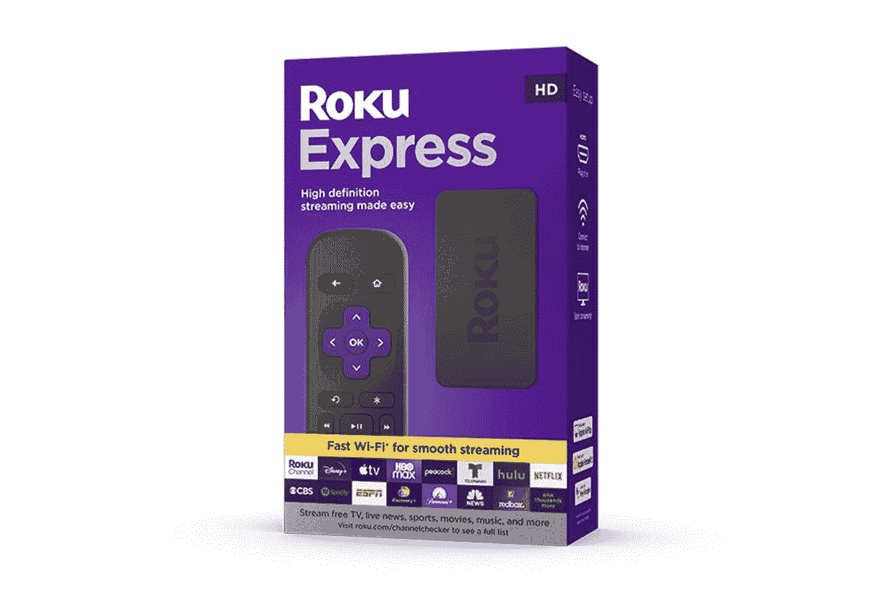
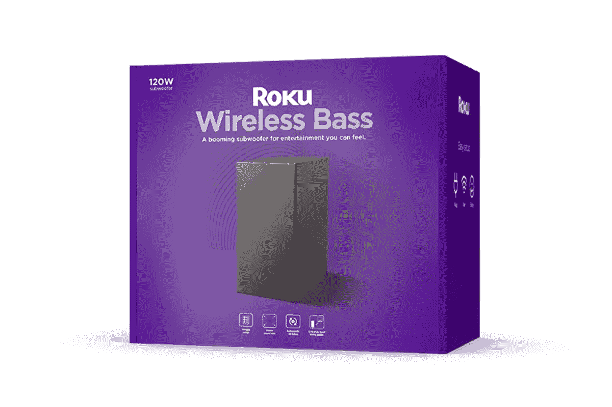

# Roku 首次推出其新的快速媒体流和无线低音低音炮

> 原文：<https://www.xda-developers.com/roku-debuts-its-new-express-media-streamer-and-wireless-bass-subwoofer/>

# Roku 首次推出其新的快速媒体流和无线低音低音炮

Roku 宣布了 2022 年的两款新产品，Roku Express 和 Roku Wireless Bass。这两款产品现在都可以预订。

Roku 宣布了两款新产品，Roku Express 和 Roku Wireless Bass。Roku Express 是去年型号的更新，带来了一些新功能，而 Roku Wireless Bass 是一款全新的产品，将与一些现有的 Roku 产品连接。这两款产品现在都可以预订。

Roku Express 是该公司的入门级流媒体设备，提供了很多实惠。Express 售价 29.99 美元，配有流媒体设备和遥控器。您只需将设备插入电视，并将其连接到无线网络。你需要创建一个 Roku 账户，并输入你所有的流媒体服务凭证。对于 2022 年的型号，没有太多变化，只是新型号提供了双频 Wi-Fi 支持，使流媒体设备可以访问 2.4 和 5 GHz 频段。

 <picture></picture> 

Roku Express 2022

Roku 无线低音是一款紧凑型无线低音炮，可与现有的 Roku 音频产品连接。目前，它可以与 Roku Streambar、Roku 无线扬声器和 Roku TV 无线条形音箱配对。低音炮可以放在房间的任何地方，只要在电视 30 英尺以内。这应该是一个很好的补充，为音乐和视频提供更多的深度。Roku 目前支持广泛的服务，最近增加了苹果音乐，同时 T2 继续与亚马逊合作。

 <picture></picture> 

Roku Wireless Bass

##### Roku 无线低音

无线 Roku 低音炮

Roke Express 目前可以直接从 Roku 预订，价格为 29.99 美元。这款设备将于 10 月 16 日发布，当天也将在各大零售商处发售。Roku Wireless Bass 现在可以直接从 Roku 预订，价格为 129.99 美元，Roku Streambar 套装价格为 249.99 美元，预计将于 11 月 7 日发货，也将在商店销售。

* * *

**来源** : [罗库](https://www.roku.com/blog/introducing-roku-express-roku-wireless-bass)