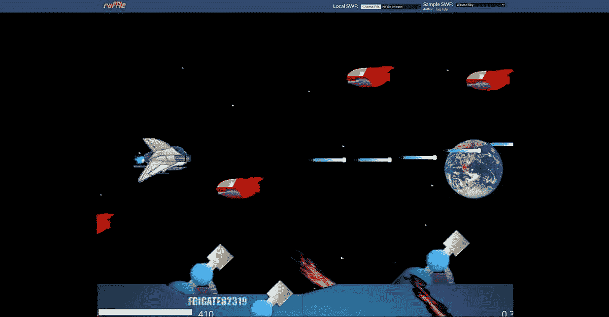

# 使用 Ruffle 模拟器重温存档的 Adobe Flash Player 游戏

> 原文：<https://www.xda-developers.com/ruffle-flash-player-emulator/>

在为网络服务了近 25 年之后，Adobe Flash 终于在上个月(T1)迎来了它的死亡。Adobe 于 2021 年 1 月 1 日将其从各种浏览器中屏蔽，几天后，所有 Flash Player 内容也被屏蔽。然而，如果你是那些存档旧 flash 游戏的人之一，那么我们正好有适合你的东西。

[Ruffle](https://ruffle.rs/) 是一款[开源 Flash Player 模拟器](https://github.com/ruffle-rs/ruffle)，可以用来重温过去美好的 Flash 游戏时光。由于官方不再支持 Flash，Ruffle 最大的问题是安全性。该工具通过作为独立应用程序在几乎所有现代操作系统上运行来解决这一问题。此外，通过使用 WebAssembly，它还可以在大多数浏览器上运行。

模拟器是用 Rust 编程语言编写的，能够运行你所有的老式 SWF 游戏。由于编程语言内置的内存保护特性，它要安全得多。它可以帮助消除各种内存错误，例如，缓冲区溢出、释放后使用、数据竞争情况，以及与指针相关的错误。据该公司的[网站](https://ruffle.rs/)称，“利用现代浏览器沙盒的安全性和 Rust 的内存安全保证，我们可以自信地避免 Flash 以其闻名的所有安全隐患。Ruffle 让 Flash 回到了网络上，回到了属于它的地方——包括 iOS 和 Android！”

 <picture></picture> 

Ruffle's Web Demo

Ruffle 可以用作独立的桌面应用程序，也可以使用 web assembly 嵌入到网站中。你也可以通过浏览器扩展使用 Ruffle，让你通过网络运行 Flash 内容。这实质上意味着你可以在几乎任何运行在 Windows、Linux、macOS 上的系统上重新访问你的 Flash 游戏收藏，如果你愿意，还可以在 Android 上。到目前为止，Android 还没有一个独立的应用程序，所以你可以使用它的唯一方法是将浏览器扩展加载到 Firefox 或基于 Chromium 的支持扩展的浏览器[中，如 Kiwi Browser](https://www.xda-developers.com/tag/kiwi-browser/) 。它可能不会很好地工作，所以你最好的选择是在 PC 上运行应用程序。

根据 [*哔哔声计算机*](https://www.bleepingcomputer.com/news/software/this-flash-player-emulator-lets-you-securely-play-your-old-games/) 的说法，Ruffle 独立桌面应用程序工作得相当无缝。一旦你启动应用程序，它会要求你加载一个 SWF 文件。选择文件，你就可以开始了。如果你只是想简单地重温一下你的老派 flash 游戏体验，那就去看看 [BlueMaxima 的闪点行动](https://bluemaxima.org/flashpoint/)网页游戏保护项目。或者，你可以要求你最喜欢的基于 Flash 的网站整合 Ruffle 的 JavaScript 代码，重新启用 Adobe 关闭 Flash 以来的所有内容。