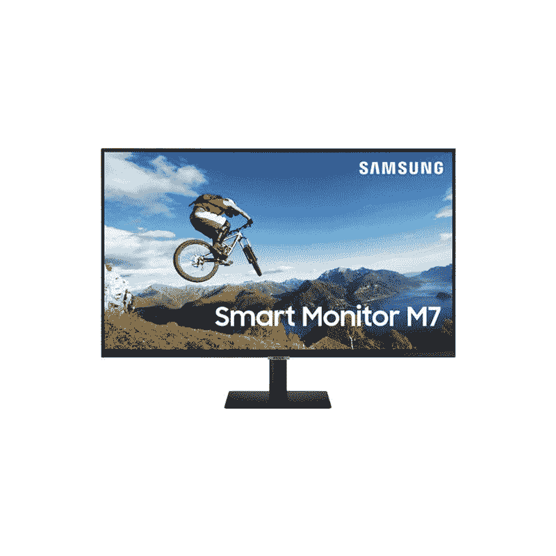

# 三星智能显示器产品线增加了四款新机型

> 原文：<https://www.xda-developers.com/samsung-adds-four-new-models-to-its-smart-monitor-lineup/>

# 三星智能显示器产品线增加了四款新机型

三星今天发布了其一体化智能显示器系列的四款新机型。请继续阅读，了解第二代三星智能显示器系列的更多信息。

去年 11 月，[三星推出了](https://www.xda-developers.com/samsung-smart-monitor-bixby-control-wireless-dex/)一系列新的智能显示器，提供了该公司智能电视上常见的功能。基于三星专有的 Tizen 操作系统，三星智能显示器系列通过无线 DeX 支持、Bixby 语音控制和对大量流行流媒体服务的支持，为用户提供了全新的一体化体验。今年四月早些时候，智能显示器[进入了印度市场](https://www.xda-developers.com/samsung-smart-monitor-india-launch/)。现在，三星又增加了四款新机型。

第二代三星智能显示器系列包括 43 英寸智能显示器 M7 型号，具有 4K UHD 显示屏和 HDR10 支持，入门级 24 英寸智能显示器 M5 型号，具有 FHD 显示屏，以及现有 27 英寸和 32 英寸智能显示器 M5 型号的新白色变体。新的 43 英寸智能显示器 M7 现在是该系列中最高端的产品，它配有一个由回收塑料制成的新型一体化太阳能遥控器。这两款新机型的显示屏为 16:9，视角为 178 度，峰值亮度为 250 尼特，支持 HDR10。显示器还包括 10W 扬声器。

新的三星智能显示器系列在软件方面进行了一些重大升级，包括让用户访问免费直播电视和点播内容的 TV Plus 功能，根据用户的观看模式提供内容推荐的通用指南功能，以及可定制的语音助手支持。最后一个功能特别有用，因为它可以让用户将智能显示器上的语音助手改为谷歌助手或亚马逊的 Alexa。此外，三星将在 6 月份将远程访问功能更新为“屏幕上的电脑”，这将使*“智能显示器和外部电脑之间的连接简单而安全，以提高可用性。”*

三星目前尚未透露新款智能显示器的定价和供货信息。一旦该公司分享更多细节，我们将更新这篇文章。您可以访问三星的网站，了解更多关于新智能显示器系列的信息。

 <picture></picture> 

Samsung Smart Monitor M7

##### 三星智能显示器 M7

由于其华丽的 32 英寸 4K UHD 显示屏、OTT 服务支持、无线 DeX 支持等，三星智能显示器 M7 提供了优质的一体化体验。