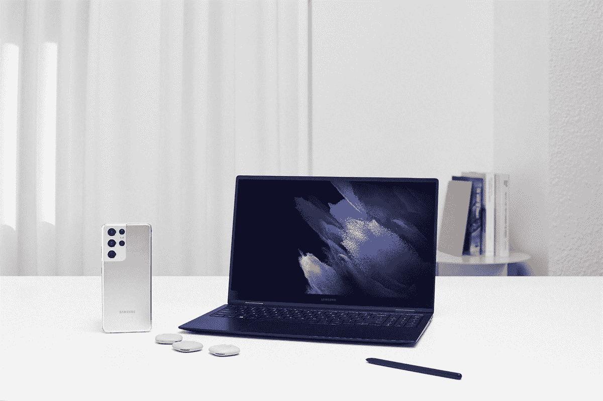

# 三星宣布推出 Galaxy Book Pro 笔记本电脑的商务版

> 原文：<https://www.xda-developers.com/samsung-announces-business-editions-of-its-galaxy-book-pro-laptops/>

三星今天[宣布其 Galaxy Book 和 Galaxy Book Pro 笔记本电脑的](https://news.samsung.com/us/reclaim-workday-with-samsung-galaxy-book-pro/)商务版。就像微软的 Surface for Business 程序一样，这些新的笔记本电脑就像消费者可以购买的一样，只是它们配有 Windows 10 Pro 或 [Windows 11 Pro](https://www.xda-developers.com/windows-11/) 。自然，这意味着您可以获得更好的安全性、可管理性等。

三星 Galaxy Book Pro 是该公司目前的旗舰 Windows 笔记本电脑，搭载英特尔第 11 代处理器，并通过了英特尔 Evo 认证。然而，这并不是这些设备的标题。事实上，有两个关键特征。

一个是它的重量不到两点，是三星所说的“智能手机薄”，13.3 英寸的 Galaxy Book Pro 只有 11.2 毫米。15 英寸的型号稍微厚一点，重一点，但它仍然是市场上最薄最轻的产品之一。

让三星 Galaxy Book Pro for business 脱颖而出的另一个关键特性是它拥有超级 AMOLED 显示屏。13.3 英寸和 15.6 英寸型号都是 FHD，长宽比为 16:9，因此在较低的分辨率下，你实际上应该比竞争对手的 UHD 笔记本电脑获得更长的电池寿命。

三星电子美国公司移动 B2B 产品和上市负责人 Hamshy Raveendran 表示:“各种规模的企业都必须在当今快速变化的经济中具有令人难以置信的适应性，他们需要技术来帮助他们恢复生产力。“在开发 Galaxy Book 系列产品的过程中，我们以全新的视角审视了企业对 PC 的真正需求。凭借我们在移动领域的创新，我们希望打造一款新的笔记本电脑，它将提高工作效率，简化协作，并随时随地为工作做好准备。Galaxy Book Pro for business 旨在实现这一切，它采用超轻设计，具有强大的多任务处理能力，并与整个 Galaxy 生态系统无缝连接。”

至于定价，这里有一些不同的配置。对于三星 Galaxy Book Pro 13 商务版的基本型号，它比消费者型号高出 100 美元，这是非常标准的。基本的 15 英寸型号实际上要便宜 100 美元，因为商务型号的起始内存为酷睿 i5 和 8GB，而消费者型号的起始内存仅为酷睿 i7 和 16GB。事实上，奇怪的是，15 英寸版本的商务型号只有酷睿 i5 / 8GB / 512GB 和酷睿 i7 / 16GB / 256GB 组合。

您现在可以通过下面的链接订购它们，或者您可以在[三星的商业网站](https://shop-links.co/1751482446057724939?u1=1cdcd883-24b9-4c6b-89b8-8fdc39dec8ec)了解更多信息。有趣的是，该网站还没有 Windows 笔记本电脑的位置。你可以找到手机、电视、平板电脑、可穿戴设备、显示器、交互式显示器、加固设备、固态硬盘甚至 Chromebooks 的类别。今天发布的三星 Galaxy Book Pro 商务版似乎是该公司进入商用 Windows 笔记本电脑领域的标志。

 <picture></picture> 

Samsung Galaxy Book Pro for business

##### 三星 Galaxy Book Pro

三星 Galaxy Book Pro 超薄超轻，配有 Super AMOLED 显示屏，现在专为商务人士打造。