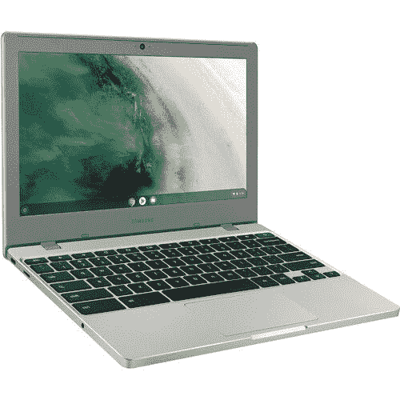
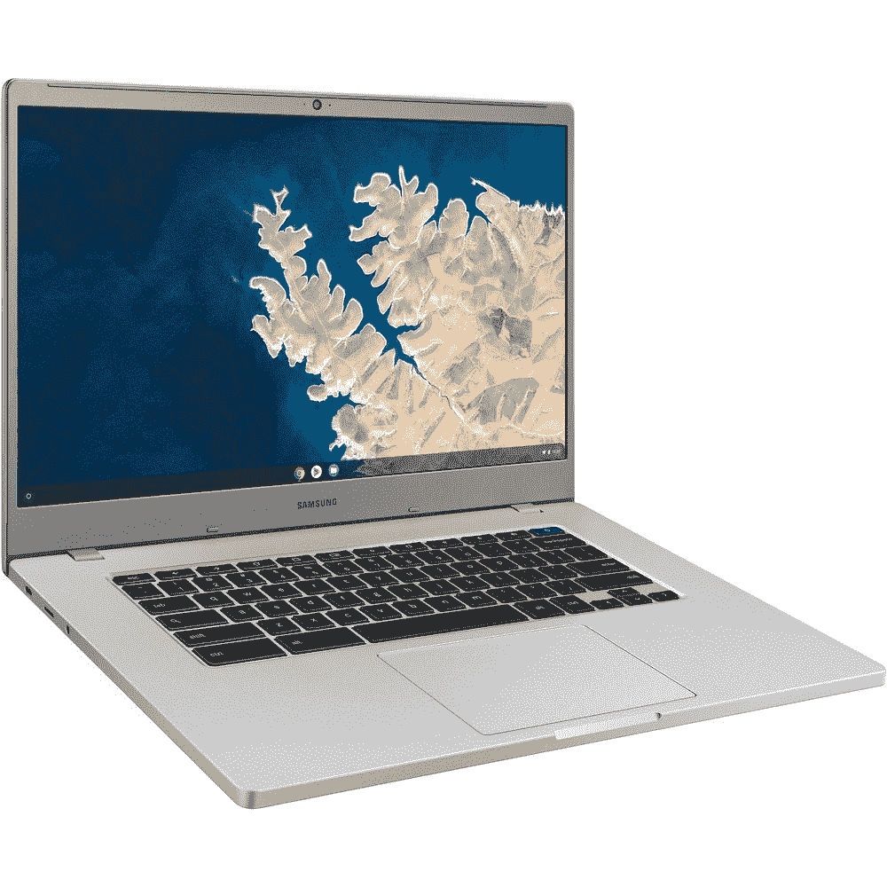

# 三星的 Chromebook 4 系列正在销售，起价仅为 200 美元

> 原文：<https://www.xda-developers.com/samsung-chromebook-4-lineup-sale/>

三星没有像惠普和华硕这样的公司生产那么多不同的 Chromebook 型号，但其 Chromebook 4 系列包括一些目前可用的[最佳预算 chrome book](https://www.xda-developers.com/best-chromebooks/)。现在，你可以从 B & H Photo 买到所有版本的三星 Chromebook 4，有 11.6 或 15.6 英寸屏幕，比通常价格低 30 美元。

目前最便宜的型号是 Chromebook 4 11.6 英寸，内置 32GB 存储空间，售价 199.99 美元。您将获得 1.1 GHz 英特尔赛扬 N4000 处理器、4GB lpddr 4 RAM 和 32GB eMMC 固态硬盘存储。至于连接性，有一个 USB Type-A 端口，一个 USB Type-C 连接器，一个 microSD 卡插槽，Wi-Fi 5 (802.11ac)，蓝牙 4.0 和一个 720p 网络摄像头。4GB 内存仅够 Chrome OS 中的几个标签使用，尽管 1366 x 768 的分辨率并不太好，但小屏幕使得较低的分辨率不太明显。

三星还以 249.99 美元的价格销售了一款稍微好一点的 11 英寸机型，这款机型的内存增加到了 6GB，但所有其他规格都是一样的。如果你需要更大的屏幕，15.6 英寸的机型起价为 269.99 美元，拥有与入门级 11 英寸笔记本电脑相同的 4GB RAM/32GB 存储空间。然而，你可以得到分辨率更高的 1920 x 1080 显示器。最后，升级后的 15.6 英寸笔记本电脑配有 6GB 内存和 64GB 存储，售价为 319.99 美元。

 <picture></picture> 

Samsung 11.6 32GB Chromebook 4

##### 三星 Chromebook 4

这是最便宜的选择，199.99 美元。它配有英特尔赛扬 N4000 CPU、32GB 存储空间和 4GB 内存。

 <picture></picture> 

Samsung 11.6 32GB Chromebook 4

##### 三星 Chromebook 4

这与上面的 11.6 英寸型号相同，但是它有 6GB 的内存而不是 4GB，并且存储容量是原来的两倍。

 <picture></picture> 

Samsung 15.6 32GB Chromebook 4+

##### 三星 Chromebook 4+

这是入门级的 15.6 英寸型号，4GB 内存，32GB 存储。

 <picture></picture> 

Samsung 15.6 32GB Chromebook 4+

##### 三星 Chromebook 4+

这是最高端的 Chromebook 4+，64GB 内部存储，6GB RAM。

无论您选择哪一款三星 Chromebook 4，您都将拥有一台出色的 PC 来完成基本任务，如浏览网页、查看电子邮件和社交媒体、与朋友和家人聊天，甚至运行基于 Android 和 Linux 的应用程序。所有型号都将继续接收 Chrome OS 更新[，直到 2026 年 6 月](https://support.google.com/chrome/a/answer/6220366?hl=en#zippy=%2Csamsung)。还剩五年多一点的支持，你会在很长一段时间内获得新的功能和安全修复，包括新的[电话中心](https://www.xda-developers.com/chrome-os-phone-hub-will-keep-your-phone-and-chromebook-in-sync/)，它可以与你的 Android 手机同步。预计谷歌也将很快推出 Chromebook 的 [Android 11 运行时](https://www.xda-developers.com/android-11-chromebook-dark-theme/)，尽管尚不清楚三星的 Chromebook 4 系列是否会包括在内。