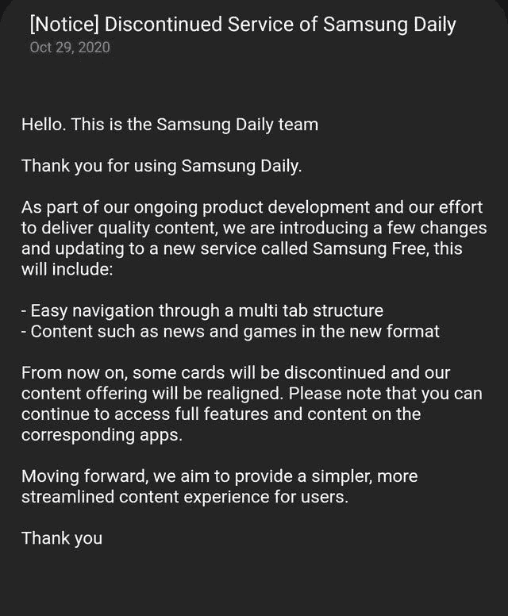

# 三星每日供稿被一项名为三星免费的新服务所取代

> 原文：<https://www.xda-developers.com/samsung-daily-feed-is-now-samsung-free/>

**更新 1(****2020 年 11 月 04 日** **@** **上午 05:02****ET):**一段视频录像展示了三星 Free 的样子。滚动到底部了解更多信息。下面保留了 2020 年 10 月 30 日发表的文章。

根据发给用户的一份通知，三星似乎正在用一项名为 Samsung Free 的改进服务取代其每日订阅。这项新服务据称将提供更精简的内容体验，可以通过滑动到启动器的左侧屏幕来访问，用户可以在那里获得新闻、游戏等信息。

*下面是三星日报的样子。*

三星日报——之前的 bix by Home——本质上是三星对谷歌订阅的回应。它拥有来自 theScore、Twitter 和网飞等公司的 20 多个内容合作伙伴，并提供了一些优秀的定制选项，允许用户只需轻轻一扫就可以获得他们想要的信息。

据三星称，新的三星 Free 将通过多标签结构提供更简单的导航，以及新格式的新闻和游戏等内容。由于公司的内容供应重新调整，三星日报的一些卡片将停止销售。

 <picture></picture> 

Credits: Reddit user /u/[12for10cents](https://www.reddit.com/user/12for10cents)

目前还不清楚是什么促使三星发起这一变化，但这不是该订阅源第一次被修改和重命名。先是 Bixby Home，后来变成了 Samsung Daily。现在，它是三星免费的——三星声称这是一种比以前有很大改进的新体验。

值得一提的是，Reddit 帖子上的评论[似乎都支持这一改变，许多用户表示，feed 肯定需要刷新。没有太多关于 Samsung Free 的其他信息，但请让我们知道当新体验登陆您的设备时您的想法。](https://www.reddit.com/r/Galaxy_S20/comments/jkknt8/looks_like_theyre_replacing_samsung_daily/)

*特色图片:三星日常卡*

* * *

## 更新:三星免费展示新服务的屏幕记录

Twitter 用户 Rydah 的一段屏幕记录展示了三星新的免费服务。

公众对这个是否比它所取代的看起来更好意见不一。