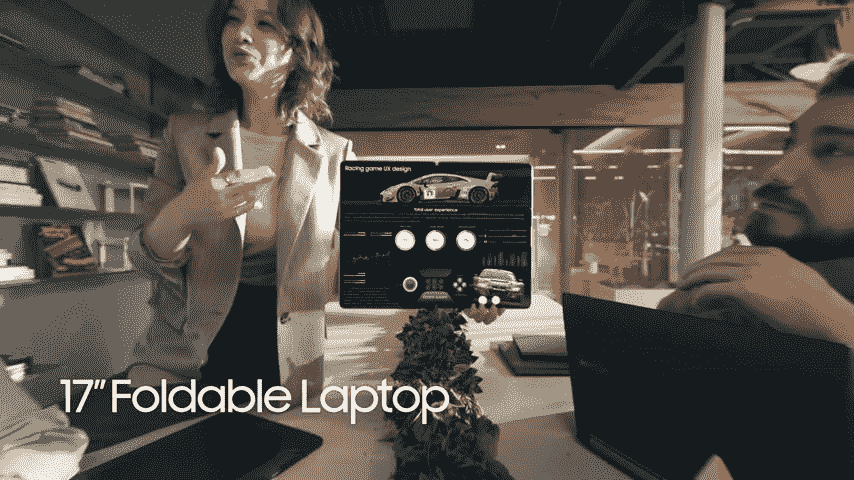

# 三星显示展示了其对可折叠和显示器未来的愿景

> 原文：<https://www.xda-developers.com/samsung-display-shows-off-future-of-foldables/>

三星将通过其三星显示子公司参加本周的 2021 显示周展览。这次活动展示了我们在未来设备中可以看到的所有最新显示技术。活动正在进行中，正如预期的那样，[三星展示了一些关键技术](https://www.xda-developers.com/samsung-showcase-next-gen-displays-sid-2021/)以及它们将如何适应我们未来的生活。

上面的[视频展示了](http://news.samsungdisplay.com/27847/)按键可折叠、可滚动和其他创新显示技术将如何在未来成为我们生活的一部分。

## 可折叠的

S-Foldable 是一种新型的 OLED 面板，可以以多种方式折叠。

三星显示声称，用户可以将 7.2 英寸的面板向内和向外折叠两次。具有这种面板的设备将包括两个双折铰链，允许用户向内和向外折叠。

如果这款产品进入大众市场，它应该会是其他顶级可折叠智能手机的一个很好的转变。

## 17 英寸可折叠笔记本电脑

### 

17 英寸可折叠笔记本电脑采用了可折叠的概念，并将其应用于笔记本电脑。从本质上讲，三星显示设想笔记本电脑将只是有机发光二极管的显示器，所有组件都将放在机身内。此外，该设备将能够在中间对折，实现比 13 英寸戴尔 XPS 13 2in1 更小的尺寸(三星在他们的视频中没有提到设备名称，但这是为了让我们在使用笔记本电脑时能够认出它)。

## 便携式显示器

便携式显示产品 showcase 本质上为您提供了一种薄型显示设备，可用于扩展和增强现有的智能设备。目前还不清楚这款设备与传统平板电脑有什么不同，包括三星自己的 Galaxy Tab S 系列。价格可能是一个区分因素，如果产品上市，我们会了解更多。

## 可滑动有机发光二极管显示器

可滑动的有机发光二极管显示器概念似乎基于与 [OPPO X 2021](https://www.xda-developers.com/oppo-x-2021-hands-on-rollable-phone-closer-to-release/) 相同的格式，即采用传统玻璃板外形尺寸的智能手机在一端扩展以显示更多信息。

## 面板下摄像机

今年早些时候，三星首次展示了其面板下摄像头技术，当时它分享了一款名为 [Samsung Blade Beze](https://www.xda-developers.com/samsung-blade-bezel-first-under-display-camera-laptop/) l 的笔记本电脑的预览视频，展示了显示器下摄像头解决方案。我们在这个视频展示中也看到了类似的实现。

* * *

你对三星显示展示创新有什么看法？您想拥有这些产品中的哪一个？请在下面的评论中告诉我们！