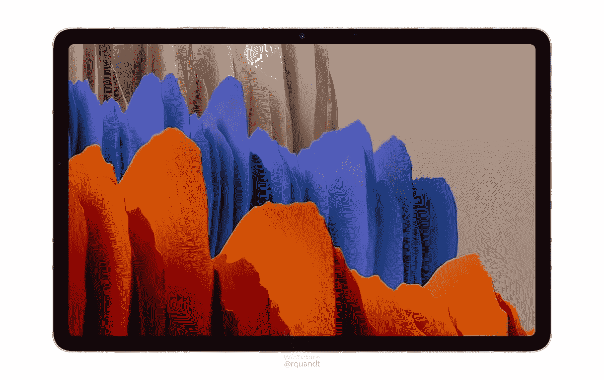

# 以 150 美元的优惠价格购买三星 Galaxy Tab S7，提高工作效率

> 原文：<https://www.xda-developers.com/samsung-gaalxy-tab-s7-deals-best-buy/>

听着，我理解你。在黑色星期五和网络星期一，我花了很多时间为自己购物，而不是买礼物。你只有有限的时间来获得这些交易，毕竟，你不能等待你的叔叔交叉检查你的阿姨的“我不知道，我猜这将是整洁的”愿望清单。当然，现在你需要给梅姨买个礼物，而且你正在努力寻找完美的礼物。也许三星 Galaxy Tab S7 就是那个礼物？

跟着我。Galaxy Tab S7 不仅仅是一款平板电脑。这款平板电脑实际上是一台微型笔记本电脑，可以做很多你想不到的事情，尤其是如果你拿起键盘盖的话。你可以完成工作中需要完成的所有任务，与同事、朋友和家人进行电话会议，等等。Galaxy Tab S7 甚至比大多数笔记本电脑都更便携，可以轻松带到任何地方。

此外，您还将获得 S Pen，这是一款流行的触摸屏手写笔，与 Tab S7 配合使用效果极佳。如果你或你所爱的人是一名艺术家，那么这款平板电脑和更贵的 iPad 是绘画和创作的最佳选择之一。

Galaxy Tab S7 售价仅为 580 美元，比建议零售价低 150 美元。此外，您将获得一张价值 50 美元的百思买礼品卡，并且您可以在上述键盘盖上节省 50%的费用。一点也不差的礼物！

 <picture></picture> 

Samsung Galaxy Tab S7

##### 三星 Galaxy Tab S7

在百思买以 150 美元的价格购买一台出色的生产力平板电脑！这项交易还附带 50 美元的百思买礼品卡，键盘半价

如果你可能正在为自己寻找一些东西，也需要一些更强大的东西，那么 Galaxy Tab S7 Plus 绝对不会错。这款更强大的平板电脑仅售 780 美元，也比建议零售价低 150 美元。

 <picture></picture> 

Samsung Galaxy Tab S7

##### 三星 Galaxy Tab S7 Plus

需要更强大的东西吗？您还可以在 S7 Plus 上节省 150 美元！

你可以在百思买看看[的全部选择，其中包括 100 美元折扣的 Tab S7 的其他型号。或者你可以看看我们在其他零售商的](https://shop-links.co/1725909471778656408?u1=654a18f6-24b9-4528-8b41-8a2d0bcaab9f) [Tab S7 Plus deals](https://www.xda-developers.com/best-galaxy-tab-s7-plus-deals/) 综述。购物愉快！