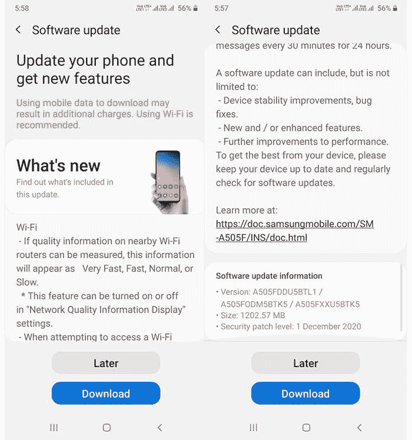
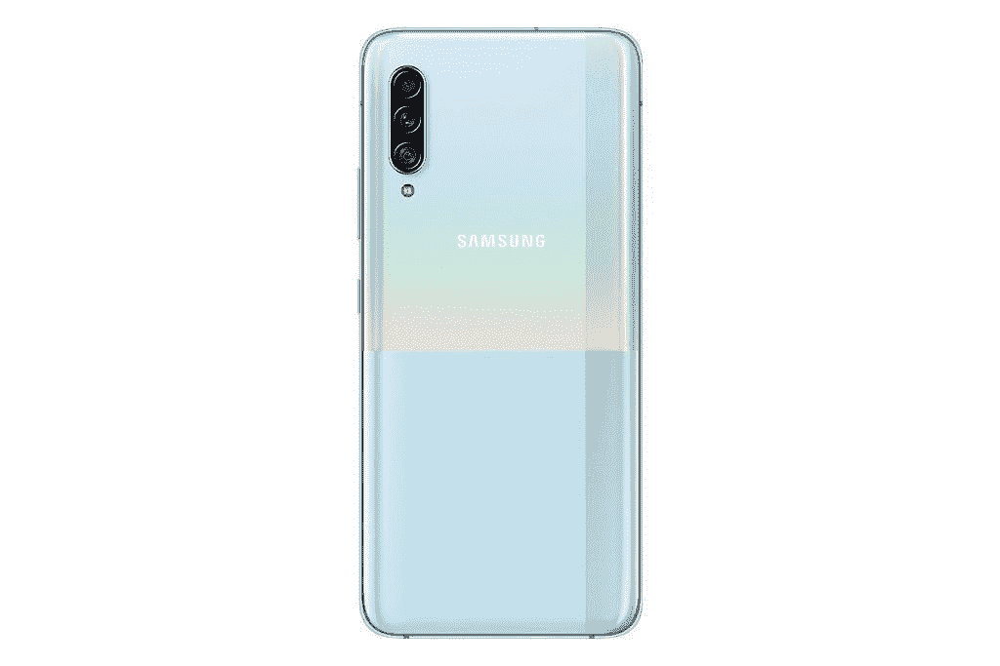

# 三星向 Galaxy A50 和 Galaxy A90 5G 推出了一个 UI 2.5

> 原文：<https://www.xda-developers.com/samsung-galaxy-a50-galaxy-a90-5g-one-ui-2-5-software-update/>

据报道，三星已经开始为 Galaxy A50 和 Galaxy A90 5G 智能手机推出新的更新。这两个是三星收到一个 UI 2.5 的设备列表中的最新成员。Galaxy A50 的最新更新版本是固件版本 A505FDDU5BTL1，据说将在印度和斯里兰卡推出。此次更新的大小为 1，203MB，还提供了最新的 12 月 Android 安全补丁。另一方面，Galaxy A90 5G 的新更新据说将在韩国推出，版本号为 A908NKSU3CTL3。

**[三星 Galaxy A50 论坛](https://forum.xda-developers.com/c/samsung-galaxy-a50.8679/)**| |**|[三星 Galaxy A90 5G 论坛](https://forum.xda-developers.com/c/samsung-galaxy-a90-5g.9256/)**

 <picture></picture> 

Image credits: Samsung Community

据[S*amMobile*报道，新的更新为 Galaxy A50 和 A90 5G 带来了类似的功能，包括 Wi-Fi 网络质量指示器，请求 Wi-Fi 密码的能力，支持在永远在线的显示屏上贴 Bitmoji 贴纸，相机应用程序中的 Pro video，分离键盘布局，以及一系列常见的性能调整和错误修复。Galaxy A90 5G 还支持三星无线 DeX。](https://www.sammobile.com/news/galaxy-a50-galaxy-a90-one-ui-2-5-update-released/)

 <picture></picture> 

Samsung Galaxy A90 5G

上述国家的 Galaxy A50 和 Galaxy A90 5G 用户应该会收到更新设备的通知。如果你还没有，你可以点击设置>软件更新并点击下载和安装来手动检查。新更新的推出预计将在未来几周内扩展到更多地区。

早在 2019 年 10 月，三星就更新了其更新时间表，以反映其对[为 Galaxy A50](https://www.xda-developers.com/samsung-promises-galaxy-fold-a50-monthly-security-updates/) 提供每月更新的承诺，看起来三星正在尽自己的努力来遵守其时间表。另一方面，Galaxy A90 5G 是[推出的](https://www.xda-developers.com/samsung-galaxy-a90-5g-snapdragon-855-dex-launched/)，作为该公司 A 系列下第一款支持 5G 连接的手机，它运行的是高通的上一代旗舰芯片组骁龙 855。因此，该手机在有限的市场推出，包括欧洲和亚洲的某些地区。