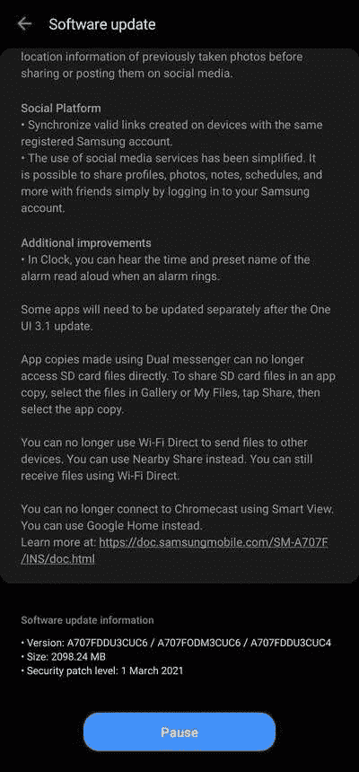
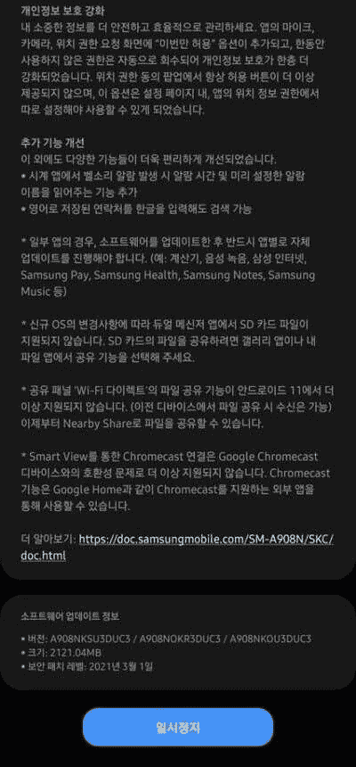

# 三星 Galaxy A70s 和 Galaxy A90 5G 是最新获得 Android 11 更新的一款 UI 3.1

> 原文：<https://www.xda-developers.com/samsung-galaxy-a70s-a90-one-ui-3-1-android-11/>

# 三星 Galaxy A70s 和 Galaxy A90 5G 是最新获得 Android 11 更新的一款 UI 3.1

三星已经开始在特定市场向 Galaxy A70s 和 Galaxy A90 5G 推出 Android 11 的 One UI 3.1 更新。请继续阅读！

对于三星来说，这是忙碌的一年，该公司继续为其庞大的设备组合带来一个 UI 3.1。韩国原始设备制造商最近为 Galaxy A40 和 Galaxy A80 推出了最新版本的 One UI。现在，该公司已经开始向 Galaxy A70s 和 Galaxy A90 推送基于 Android 11 的 One UI 3.1 稳定版本。

## Galaxy A70s

不久前，三星[为 Galaxy A70](https://www.xda-developers.com/samsung-galaxy-a70-one-ui-3-1-update-android-11/) 带来了一个 UI 3.1，现在，同样的爱正在向 Galaxy A70s 展示。Galaxy A70s 的 **SM-A707F** 变种正在以软件版本 **A707FDDU3CUC6** 的形式接收新的更新。除了所有 Android 11 特有的好东西，更新还带来了 2021 年 3 月的安全补丁。

 <picture></picture> 

Thanks to Samsung Members Community user [cpkaneria](https://r2.community.samsung.com/t5/user/viewprofilepage/user-id/2143) for the screenshot!

新版本可以在 INS 区域下载，这是三星在印度的代码。由于该公司更喜欢进行分阶段的软件推广，更新可能需要几个星期才能到达其他地区市场。

**[三星 Galaxy A70s XDA 论坛](https://forum.xda-developers.com/c/samsung-galaxy-a70s.9477/)**

## 银河 A90

 <picture></picture> 

Thanks to Samsung Members Community user [서태진](https://r1.community.samsung.com/t5/user/viewprofilepage/user-id/16919521) for the screenshot!

Galaxy A90 5G 的 **SM-A908N** 变种也获得了基于 Android 11 的 One UI 3.1 更新。新固件被标记为 **A908NKSU3DUC3** ，它携带 2021 年 3 月的安全补丁，就像 Galaxy A70s 一样。遗憾的是，该更新仅适用于韩国的 Galaxy A90 用户。随着时间的推移，我们可以期待它能为全球更多的用户所用。

**[三星 Galaxy A90 XDA 论坛](https://forum.xda-developers.com/c/samsung-galaxy-a90-5g.9256/)**

上述地区的 Galaxy A70s 和 Galaxy A90 5G 用户应该会收到更新设备的通知。如果你还没有，你可以点击设置>软件更新并点击下载和安装来手动检查。另一方面，高级用户可以跳过队列，使用 XDA 的内部工具，如[三星固件下载器](https://www.xda-developers.com/download-samsung-software-updates-samsung-firmware-downloader/)，直接从公司的更新服务器手动下载更新的固件包。