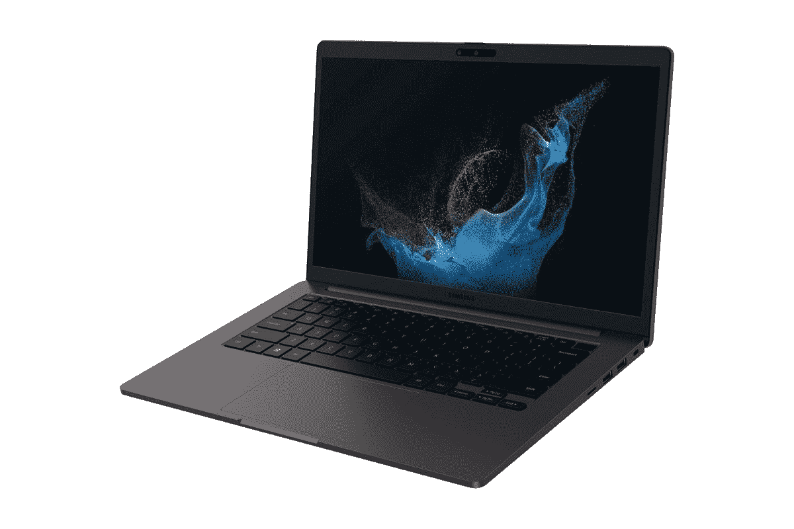

# 三星 Galaxy Book 2 业务可以更换电池吗？

> 原文：<https://www.xda-developers.com/samsung-galaxy-book-2-business-replace-battery/>

由于 BIOS 内置的系统管理选项以及英特尔博锐处理器，[三星 Galaxy Book 2](https://www.xda-developers.com/samsung-galaxy-book-2-business/) 是企业的绝佳选择。这是最棒的设计。但是你可能想知道，你能更换电池吗？不幸的是，这个问题的答案是不，你不能。

官方上，我们向三星核实，并被告知 Galaxy Book 2 上的电池是不可更换的。如果你希望更换它，那么你可能必须通过保修服务向[三星维修该设备。或者，更糟的是，买一个新设备。这种情况在新电脑中并不少见，很多部件都是粘合或焊接在一起的，用户无法更换。](https://shop-links.co/1784429750877127537?u1=0db65b48-a851-4c7d-9ef7-ace7ea4a1d73)

不过，三星的产品开箱后会有一年的保修期，所以一旦出现问题，你可以去修理。对于额外保修，您可以选择 Samsung Care+ for Business，它附带了额外的服务选项。尽管如此，如果你想充分利用 Galaxy Book 2 的电池，我们确实有一些关于如何充分利用电池寿命的提示。

## 管理三星 Galaxy Book 2 的电池以避免更换

为了充分利用三星 Galaxy Book 2 的电池，并避免更换电池，您应该妥善保护电池本身。不要在不使用时长时间插着电源给手机充电。此外，为了获得最佳的电池续航时间，您可以控制屏幕亮度，确保屏幕亮度不会长时间过高。更高的亮度将消耗更多的能量。

特别是，Windows 还提供了电池管理选项。你可以通过按下 *Windows 键* + *I.* 进入设置应用，然后从那里选择*电源和电池*。你可以看到电池的使用模式。Windows 将为您提供一些提示，以确保电池性能良好，例如在一段时间不活动后将设备置于睡眠状态，以及降低屏幕亮度。你也可以在电池设置页面的*电量*下更改 Windows 11 设置中的滑块，设置为*推荐*。Windows 将根据您在三星 Galaxy Book 2 断电时的使用方式来调整性能。

作为另一种选择，如果你真的想充分利用你的 Galaxy Book 2 电池，我们建议打开 Windows 11 的电池节省程序。你可以在设置应用中找到它。通常它会打开 20%左右，但是您可以将设置的*电源和电池*部分中的百分比值更改为更高的水平，这样您的系统将节省更多的能量。

可以看看下面的三星 Galaxy Book 2 商家。当然，如果它不是你的东西，你想要一台可更换电池的笔记本电脑，你可以按照我们的[指南选择最好的笔记本电脑](https://www.xda-developers.com/best-laptops/)。它有 XPS 13 Plus 等选项，您可以自行更换电池。

 <picture></picture> 

Samsung Galaxy Book 2 Business

##### 三星 Galaxy Book 2 商务版

三星 Galaxy Book 2 Business 是一款商务笔记本电脑，采用支持博锐技术的英特尔第 12 代 P 系列处理器，16GB 内存和高达 1TB 的存储容量。