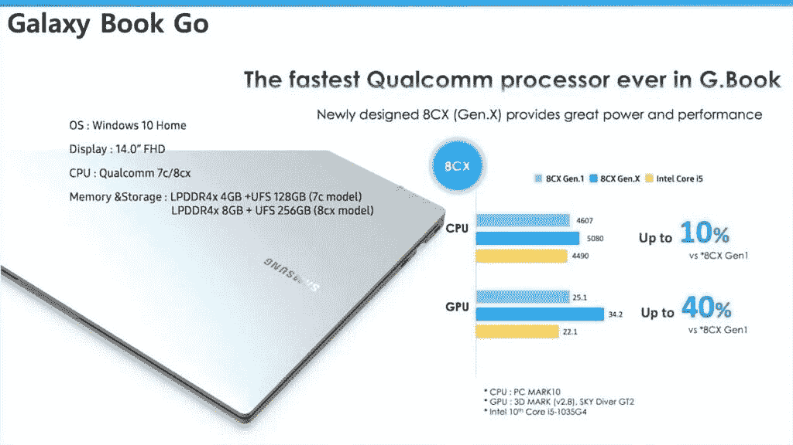

# Galaxy Book Go 可能是最便宜的 ARM Windows 笔记本电脑之一

> 原文：<https://www.xda-developers.com/samsung-galaxy-book-go-cheap-arm-windows-laptop/>

采用高通制造的芯片组的 Windows 笔记本电脑已经问世两年多了，但是第一批机型性能不佳。三星显然没有放弃，因为该公司下一代 ARM Windows 笔记本电脑的细节已经出现。

关于三星 Galaxy Book Go 的内部演示幻灯片在 2 月首次泄露，透露至少会有两种硬件配置，都是 14 英寸 FHD 屏幕和 Windows 10 家庭版。低端选项将拥有低端骁龙 7c SoC、4GB RAM (ew)和 128GB 内部存储。预计还会有更贵的型号，配有骁龙 8cx 芯片、8GB 内存和 256GB 存储空间。

 <picture></picture> 

Credit: WalkingCat (@_h0x0d_ on Twitter)

目前还不清楚三星 Galaxy Book Go 的价格，但来自*WinFuture*T3 的一份新报告称，入门级的骁龙 7c 机型在美国仅售 349.99 美元。这将使它比大多数骁龙 8cx 笔记本电脑便宜得多，如 [Galaxy Book S](https://shop-links.co/1738524451656812359?u1=a3f43ebd-fbf6-4947-b4b2-de038c24b72c) 和 [Surface Pro X](https://shop-links.co/1738524451655542647?u1=b5a3764f-cdc5-40d9-b1c9-cdf01770926d) ，它们都是 1000 美元。然而，它在价格上与采用相同骁龙 7c 处理器的其他型号相似。

Galaxy Book Go 预计将于 4 月 28 日发布，可能会在该公司 2021 年第三次“Galaxy Unpacked”现场活动的同一天发布。该事件很可能将集中在 Galaxy Book Pro 和 Galaxy Book Pro 360 上，这两款产品都已被[广泛泄露](https://www.xda-developers.com/samsung-galaxy-book-pro-360-leaked-renders-s-pen-stylus-support/)。与 Galaxy Book Go 不同，其他笔记本电脑预计将采用基于 x86 的处理器。

Galaxy Book Go 的性能可能无法与苹果位于 M1 的 MacBook 相媲美，但低得多的价格可能会让它更容易被接受。微软也一直在努力改进 ARM 上的 Windows 10，目前正在开发 [x86-64 软件仿真](https://www.xda-developers.com/microsoft-x64-app-emulation-windows-on-arm-pc/)。

*特色图片:Galaxy Book S*