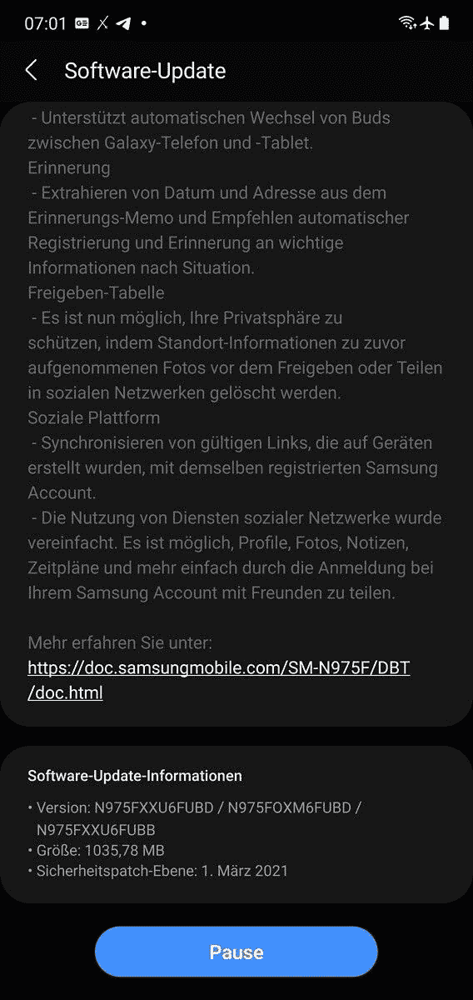

# 三星 Galaxy Fold、Galaxy S10 和 Galaxy Note 10 推出了一个 UI 3.1

> 原文：<https://www.xda-developers.com/samsung-galaxy-fold-galaxy-note-10-one-ui-3-1/>

**更新 1(****02/25/2021****@****02:59PM****ET):**三星也在 Galaxy Fold 和 Galaxy Note 10 的基础上向 Galaxy S10 系列推出一个 UI 3.1。[点击此处了解更多信息。](#update1)这篇文章发表于今天早些时候的 2021 年 2 月 25 日，现保留如下。

One UI 爱好者，欢欣鼓舞！三星已经开始为 Galaxy Fold 和 Galaxy Note 10/Note 10+推出新的更新。这三个是韩国 OEM 厂商获得一个 UI 3.1 的稳定增长的设备列表中的最新成员。作为参考，Galaxy Note 10 系列[在去年 12 月以 One UI 3.0 的形式获得了其 Android 11 更新](https://www.xda-developers.com/samsung-galaxy-note-10-one-ui-3-0-stable-android-11/)，而 Galaxy Fold 在几周之后获得了同样的待遇。大约一周前，三星[承诺](https://www.xda-developers.com/samsung-one-ui-3-1-update-galaxy-s21-features-older-smartphones/)将很快为这些设备推出稳定的 One UI 3.1。该公司兑现了承诺，现在已经开始在特定地区推出期待已久的更新。

 <picture></picture> 

Thanks to Reddit user [u/MehdiMa0507](https://www.reddit.com/user/MehdiMa0507/) for the screenshot!

据 [*SamMobile*](https://www.sammobile.com/news/samsung-note-10-plus-one-ui-3-1-update-rolling-out/) 报道，Galaxy Note 10 的全球 4G 版本(型号 **SM-N970F** )及其“Plus”变种(型号 **SM-N975F** )正在德国以软件版本**n 97 xfx U6 fubd**的形式接收新的更新。除了带来[所有的 One UI 3.1 特有的变化](https://www.xda-developers.com/samsung-one-ui-3-1-features-changes/)，新版本还将 Android 安全补丁级别(SPL)提升至 2021 年 3 月。

**[三星 Galaxy Note 10 论坛](https://forum.xda-developers.com/c/samsung-galaxy-note-10.9007/)| |[三星 Galaxy Note 10+论坛](https://forum.xda-developers.com/c/samsung-galaxy-note-10.9147/)**

以类似的方式，One UI 3.1 更新正在通过软件版本**f 900 FX U4 eubf**推出全球 Galaxy Fold 变体，准确地说是 **SM-F900F** 型号。该更新目前在法国可用，尽管交付过程预计将在未来几周内扩大规模。

**[三星银河折叠论坛](https://forum.xda-developers.com/c/samsung-galaxy-fold.8602/)**

在接下来的几天和几周内，我们应该会看到 One UI 3.1 在更多的国家推出。虽然你可能会试图篡改手机的软件更新部分，以跳过等待队列，立即获取更新，但使用 XDA 的内部工具，如 [Samloader](https://www.xda-developers.com/samloader-download-updates-samsung-galaxy/) 或 [Frija](https://forum.xda-developers.com/t/tool-frija-samsung-firmware-downloader-checker.3910594/) 可以更容易地直接从三星的更新服务器下载新版本。

* * *

## 更新 1:三星 Galaxy S10 系列也获得一个 UI 3.1

我们论坛上的用户报告说，One UI 3.1 更新也适用于欧洲的三星 Galaxy S10 系列。与 Galaxy Fold 和 Galaxy Note 10 的更新一样，这次更新带来了 2021 年 3 月的安全补丁级别。[一位用户](https://forum.xda-developers.com/t/oneui-3-0-beta-exynos-galaxy-s10-e-beta-thread-update-zip-files.4189957/post-84557867)收到了他们的 Exynos Galaxy S10 (SM-G973F)的更新，而[另一位用户](https://forum.xda-developers.com/t/oneui-3-0-beta-exynos-galaxy-s10-e-beta-thread-update-zip-files.4189957/post-84558449)收到了他们的 Exynos Galaxy S10+ (SM-G975F)的更新。更新显然已经开始在瑞士(奥地利地区)推出，但很可能很快就会扩展到其他欧洲市场以及 Galaxy S10e。

**[银河 S10 论坛](https://forum.xda-developers.com/c/samsung-galaxy-s10.8507/)**| |**|[银河 S10+论坛](https://forum.xda-developers.com/c/samsung-galaxy-s10.8693/)|**| |**|[银河 S10e 论坛](https://forum.xda-developers.com/c/samsung-galaxy-s10e.8763/)**

你收到 Galaxy S10 的 One UI 3.1 更新了吗？请在下面的评论中告诉我们！