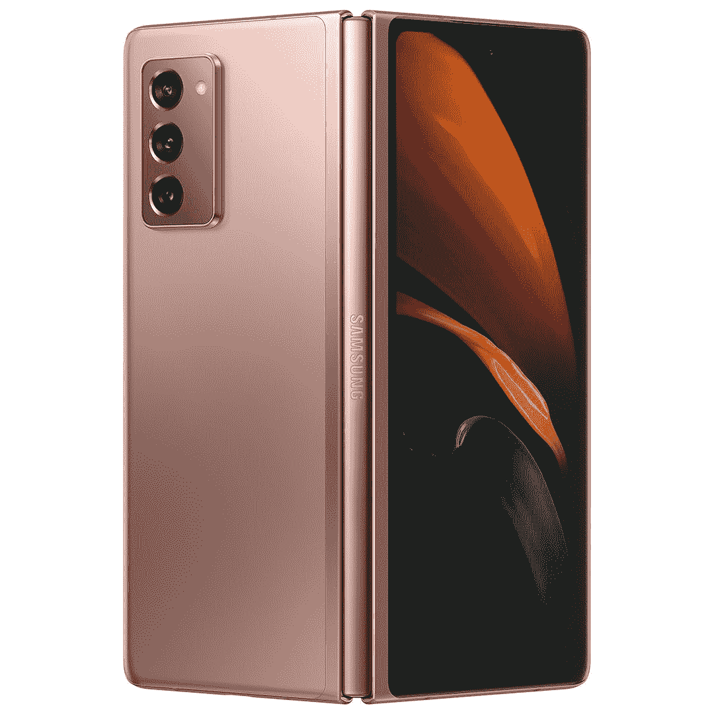

# 三星会给你 100 天的时间来试用 Galaxy foldable

> 原文：<https://www.xda-developers.com/samsung-galaxy-foldable-100-day-return-policy/>

# 三星会给你 100 天的时间来试用 Galaxy foldable

三星推出了一项计划，给 Galazy Z Fold 2 和 Galaxy Z Flip 的买家 100 天时间来决定他们是否要保留可折叠手机。

如果你对 Galaxy Z Fold 2 5G 或 Z Flip 5G 不满意，三星会给你更多的时间来退货。该公司将其最新可折叠手机的退货期限延长至 100 天。这意味着你可以在决定保留它之前使用这两款设备超过三个月。

三星之前的可折叠设备退货窗口是 15 天，所以这次延期意义重大。延长退货政策显然是三星今天推出的新“购买并尝试”计划的一部分。

三星[在给 *The Verge* 的声明](https://www.theverge.com/2021/2/23/22297877/samsung-galaxy-z-fold2-z-flip-return-100-days-foldables-buy-and-try)中表示:“这一新举措将帮助消费者尝试并了解可折叠设备是否适合他们，这是三星承诺让可折叠设备更容易为每个人所用的一部分。”。

这个新项目显然是宣传性的，将持续到 4 月 1 日。在 4 月 1 日之后购买 Galaxy Z Fold 2 5G 或 Z Flip 5G 的消费者似乎将被非促销的 15 天退货窗口卡住。如果你对购买三星的可折叠设备犹豫不决，现在是时候了。

在一个中端产品越来越受欢迎、越来越丰富的市场上，可折叠设备很难销售。Galaxy Z Fold 2 5G 的零售价为 1，999 美元，这不是大多数人能够承受的价格。尽管如此，延长其最新可折叠设备的退货期是说服那些持观望态度的人冒险一试的聪明方法。

三星推出第一款 Galaxy Fold 时跌跌撞撞，但该公司凭借 Galaxy Z Fold 2 和 Z Flip 大幅反弹。该公司已经证明，制造一款出色的可折叠设备是可能的。现在，只是让广大消费者相信可折叠智能手机是未来的问题——从更具吸引力的退货政策开始。

 <picture></picture> 

Samsung Galaxy Z Fold 2

##### 三星 Galaxy Z Fold 2

三星 Galaxy Z Fold 2 是目前市场上最好的可折叠手机，你现在可以在决定保留它之前试用 100 天。如果你曾经想体验可折叠，这是你最好的机会。