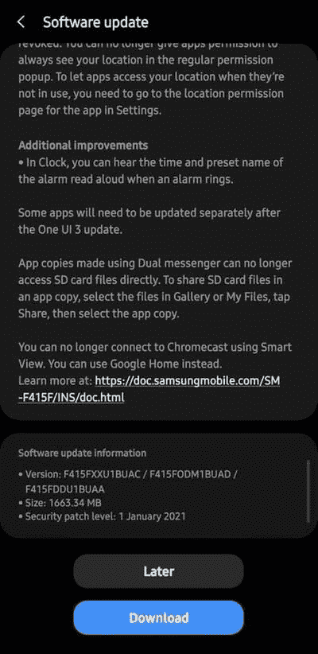
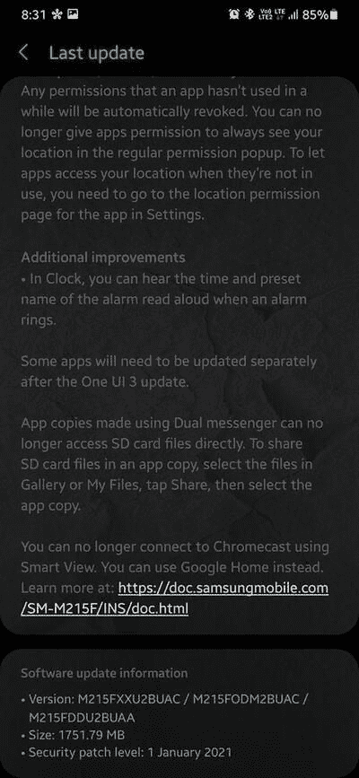

# 三星 Galaxy Note 10 Lite、Galaxy M21 和 Galaxy F41 通过一个 UI 3.0 更新到 Android 11

> 原文：<https://www.xda-developers.com/samsung-galaxy-note-10-lite-m21-f41-one-ui-3-0-android-11/>

在过去，三星的软件更新比新的 Android 操作系统版本的正式发布滞后了好几个月。幸运的是，如今韩国 OEM 厂商似乎大大加快了发布周期。该公司已经将其产品组合中的一系列设备升级到带有一个 UI 3.0 的 Android 11，而 Galaxy Tab S7 甚至获得了一个 UI 3.1 的甜蜜待遇。另外三款手机 Galaxy F41、Galaxy M21 和 Galaxy Note 10 Lite 现在已经在全球范围内获得了稳定的 Android 11 更新。

## 三星 Galaxy F41

 <picture></picture> 

Thanks to Samsung India Community member [anandshankarpandey](https://r2.community.samsung.com/t5/user/viewprofilepage/user-id/721162) for the screenshot!

Galaxy F41 于 2020 年 10 月推出，采用 6.4 英寸全高清+ sAMOLED 显示屏，6，000 毫安时大电池和三摄像头设置。毫无疑问，Android 11 更新现在使这款设备对潜在买家更具吸引力。标签为 **F415FXXU1BUAC** 的 OTA 目前已在印度上市，并附带【2021 年 1 月的安全补丁。

**[三星 Galaxy F41 XDA 论坛](https://forum.xda-developers.com/c/samsung-galaxy-f41.11691/)**

* * *

## 三星 Galaxy M21

 <picture></picture> 

Thanks to Samsung India Community member [Phani2002](https://r2.community.samsung.com/t5/user/viewprofilepage/user-id/13395848) for the screenshot!

谈到 Galaxy M21，该手机的 Android 11 更新以软件版本 **M215FXXU2BUAC** 的形式出现。新版本还将 Android 安全补丁级别提升至 2021 年 1 月。最初的推广仅限于印度，尽管其他地区应该很快就会有 OTA。

**[三星 Galaxy M21 XDA 论坛](https://forum.xda-developers.com/c/samsung-galaxy-m21.11849/)**

* * *

## 三星 Galaxy Note 10 Lite

“Lite”标签是为平价旗舰细分市场保留的，Galaxy Note 10 Lite 也不例外。不到一年前，这款手机推出了基于 Android 10 的 UI 2.0，提供了优质的 S Pen 体验。三星现在已经通过软件版本 **N770FXXU7DUA8** 将 One UI 3.0 的优点带到了设备中。该更新目前在 XEF 地区可用，这是三星在法国的代码。

**三星 Galaxy Note 10 Lite XDA 论坛 **

* * *

上述设备的更新正在批量推出，但您可以跳过队列，使用社区开发的工具之一[直接从三星更新服务器下载新的固件包。感谢在所有情况下未改变的引导程序版本，如果用户愿意，他们应该能够降级到 Android 10，尽管我们仍然建议在这样做之前要谨慎。](https://www.xda-developers.com/download-samsung-updates-free-tools/)