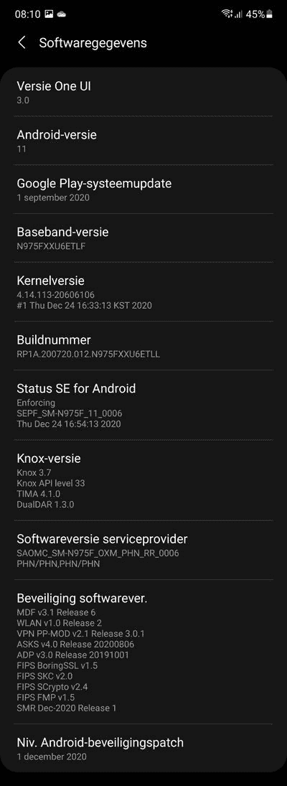

# 三星 Galaxy Note 10 用 One UI 3.0 接收稳定的 Android 11

> 原文：<https://www.xda-developers.com/samsung-galaxy-note-10-one-ui-3-0-stable-android-11/>

# 三星 Galaxy Note 10 的 Android 11 One UI 3.0 稳定更新开始推出

三星已经开始向 Galaxy Note 10 系列推出基于 Android 11 的稳定 One UI 3.0 更新。继续阅读，了解更多信息！

随着 2020 年接近尾声，三星为 Galaxy Note 10 用户准备了一些特别的东西:Android 11 的甜点。根据本月初发布的[更新时间表](https://www.xda-developers.com/samsung-galaxy-phone-one-ui-3-0-android-11-update-timeline/)，韩国 OEM 厂商曾计划从 2021 年 1 月开始向 Galaxy Note 10 阵容发布 One UI 3.0 的稳定版本。然而，令设备所有者惊讶的是，Galaxy Note 10 的 Exynos 4G 和 5G 版本的 Android 11 更新现在已经在许多欧洲国家上线。

**[三星 Galaxy Note 10 论坛](https://forum.xda-developers.com/c/samsung-galaxy-note-10.9007/)| |[三星 Galaxy Note 10+论坛](https://forum.xda-developers.com/c/samsung-galaxy-note-10.9147/)**

搭载 Exynos 9825 的普通 Galaxy Note 10(型号 **SM-N970F** )及其“Plus”兄弟(型号 **SM-N975F** )的全球版本正在德国以软件版本 **N97xFXXU6ETLL** 的形式接收新的更新。后者的 5G 版本(型号为 **SM-N976B** )也加入了这个名单，尽管它的软件版本更新为**n 976 bx U6 etll**可以在澳大利亚和 PHE 地区下载，这两个地区分别是三星在瑞士和西班牙的代码。新版本包含了谷歌在 Android 11 中引入的所有新功能，以及三星的几个显著的 [One UI 具体变化](https://www.xda-developers.com/samsung-one-ui-3-0-new-features-android-11-update/)。

 <picture></picture> 

Thanks to XDA Senior Member [henklbr](https://forum.xda-developers.com/m/henklbr.1586120/) for the screenshot!

正如预期的那样，新固件带来了 2020 年 12 月的安卓安全补丁。不过，bootloader 版本没有变化，这意味着理论上基于软件的降级是可能的。

在未来几天和几周内，我们应该会看到 One UI 3.0 OTA 在更多国家出现。虽然你可能试图摆弄三星智能开关来跳过等待队列并立即获取更新，但 XDA 社区开发的工具，如 [Frija](https://forum.xda-developers.com/t/tool-frija-samsung-firmware-downloader-checker.3910594/) 或 [Samloader](https://www.xda-developers.com/samloader-download-updates-samsung-galaxy/) 使直接从该公司的更新服务器下载新版本变得容易得多。如果您计划执行手动刷新，请注意上述版本与骁龙 Note 10 的变体不兼容，即美国和加拿大型号。