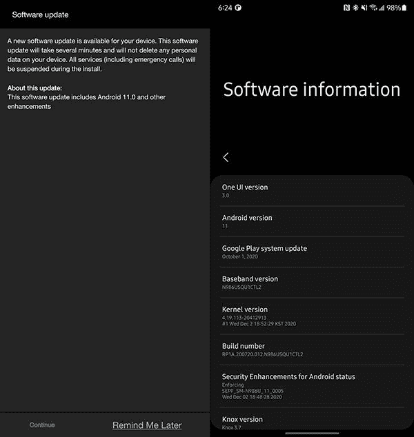

# 三星 Galaxy Note 20、Galaxy Note 20 Ultra 获得 One UI 3.0 (Android 11)稳定更新

> 原文：<https://www.xda-developers.com/samsung-galaxy-note-20-ultra-one-ui-3-0-update-rollout-begins-us/>

# 三星正在为 Galaxy Note 20 推出 One UI 3.0 (Android 11)稳定更新，Galaxy Note 20 Ultra

基于 Android 11 的 One UI 3.0 更新正在为美国三星 Galaxy Note 20 和 Galaxy Note 20 Ultra 的美国电话电报公司用户推出。

据报道，三星已经开始为 Galaxy Note 20 和 Galaxy Note 20 Ultra 推出新的 One UI 3.0。基于最新的 Android 11 更新，该公司在本月早些时候为 Galaxy S20 系列发布了相同的更新。还有一份[设备列表](https://www.xda-developers.com/samsung-galaxy-phone-one-ui-3-0-android-11-update-timeline/)最近发布在三星会员应用上，供埃及用户使用，这表明 Galaxy Note 20 和 Galaxy Note 20 UItra 将在 1 月份获得稳定更新。

然而， [*SamMobile*](https://www.sammobile.com/news/breaking-galaxy-note-20-note-20-ultra-stable-one-ui-3-0-android-11-update) 报道称，美国 AT & T 网络上的 Galaxy Note 20 和 Galaxy Note 20 Ultra 用户已经开始接收最新更新。据称，该更新将针对 Galaxy Note 20 和 Galaxy Note 20 Ultra 的解锁和锁定版本推出，预计将包括 2020 年 12 月的最新安全补丁。新更新的大小为 2.5GB，内部版本号为 N98xUSQU1CTL2，建议使用 Wi-Fi 连接下载新更新。如果你还没有收到通知，你可以通过前往手机的*设置*，然后前往*软件更新*来手动检查更新。

 <picture></picture> 

Image credits: SamMobile

截至目前，美国电话电报公司的 Galaxy Note 20 和 Galaxy Note 20 Ultra 用户是唯一获得最新更新的用户。三星还没有确认在全球推出，所以我们必须等待，看看其他地区是否会在未来几天获得新的更新。考虑到三星在美国销售 Galaxy Note 20 系列的骁龙版本，Exynos 版本有可能在下个月获得更新。

**[三星 Galaxy Note 20 论坛](https://forum.xda-developers.com/c/samsung-galaxy-note-20.11095/)**| |**|[三星 Galaxy Note 20 Ultra 论坛](https://forum.xda-developers.com/c/samsung-galaxy-note-20-ultra.11203/)**

三星在 9 月份推出测试计划期间，分享了新的 One UI 3.0 更新的大量变更日志。你可以在这里查看整个[变更日志。此外，我们还在 Galaxy S20 上进行了 One UI 3.0 测试版的早期实践，你可以](https://www.xda-developers.com/changelog-samsungs-one-ui-3-0-update-based-android-11/)[在这里](https://www.xda-developers.com/one-ui-3-0-beta-galaxy-s20-samsung-android-11-update/)阅读。