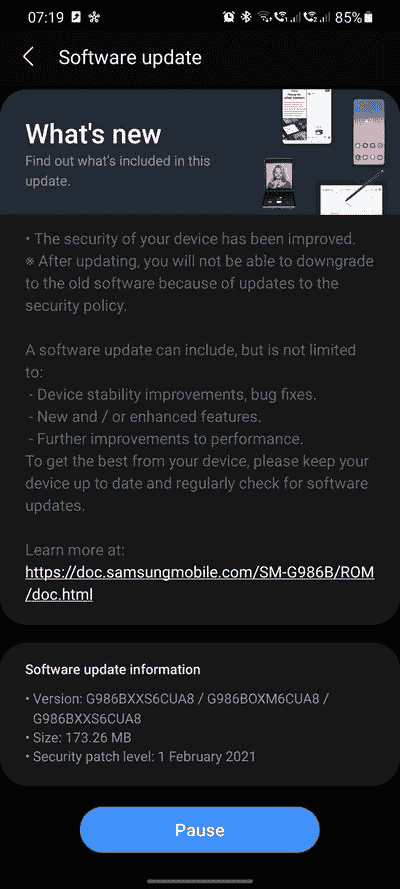

# 三星 Galaxy S20 系列收到 2021 年 2 月安全补丁的更新

> 原文：<https://www.xda-developers.com/samsung-galaxy-s20-february-2021-security-patch/>

谷歌有在每个月的第一个星期一为 Pixel 系列智能手机推出 Android 安全补丁的传统，这意味着我们距离 2021 年 2 月的 Android 安全公告(ASB)上线只有几天时间了。但这并不意味着其他原始设备制造商不能在他们自己的游戏中击败谷歌。不出所料，三星再次赢得了这场比赛。这一次，韩国 OEM 已经开始在多个地区为其一岁的旗舰 Galaxy S20 系列推出 2021 年 2 月的安全补丁。

**[三星 Galaxy S20 / S20+ / S20 超 XDA 论坛](https://forum.xda-developers.com/c/samsung-galaxy-s20-s20-s20-ultra.9711/)**

新版本的版本号是 **G98xxXXS6CUA8** ，这意味着 Galaxy S20、S20 Plus 和 S20 Ultra 的 Exynos 驱动的全球版本。增量更新包的大小约为 173MB，FOTA 目前在许多欧洲国家可用，包括但不限于德国、瑞士和北欧地区。

 <picture></picture> 

Thanks to XDA Senior Member [marselcj](https://forum.xda-developers.com/m/marselcj.4120199/) for the screenshot!

除了提升 Android 安全补丁级别，新版本还将底层引导程序版本从 **v5** 更新为 **v6** 。因此，最终用户在他们的 Galaxy S20 设备上安装此更新后，无法执行降级并恢复到旧版本。

一如既往，OTA 更新正在批量推出。您可能需要等待几天，更新通知才会在您的设备上弹出。然而，如果你对手动刷新不陌生，你可以跳过等待队列，使用我们社区开发的工具之一立即从三星的更新服务器下载适合你的设备版本的固件。不过，如果你有加拿大或美国版的 Galaxy S20，你就没那么幸运了。前面提到的建造**与那些骁龙动力的变种**不兼容，因此交叉闪光严格来说是不可行的。

有关每月安全更新的更多信息，[请务必阅读我们关于每月补丁程序如何工作的概述](https://www.xda-developers.com/how-android-security-patch-updates-work/)。