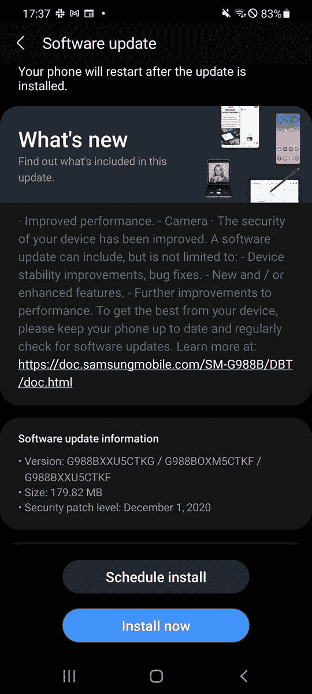

# 三星 Galaxy S20 获得 Android 11 的稳定 One UI 3.0 更新

> 原文：<https://www.xda-developers.com/samsung-galaxy-s20-stable-one-ui-3-android-11/>

三星最近[在三星会员应用上发布了 One UI 3.0 更新推广计划](https://www.xda-developers.com/samsung-galaxy-phone-one-ui-3-0-android-11-update-timeline/)。根据路线图，Galaxy S20 阵容应该会在 12 月内收到基于 Android 11 的 One UI 的最新迭代。为了兑现承诺，该公司[昨天在威瑞森的网络上为骁龙驱动的 Galaxy S20 系列启动了](https://www.xda-developers.com/samsung-galaxy-s20-verizon-one-ui-3-android-11/)One UI 3.0 更新发行。现在，韩国 OEM 已经开始在欧洲各地向 Exynos 驱动的 Galaxy S20、Galaxy S20 Plus 和 Galaxy 20 Ultra 推出 One UI 3.0 的稳定版本。

**[三星 Galaxy S20 / S20+ / S20 超 XDA 论坛](https://forum.xda-developers.com/c/samsung-galaxy-s20-s20-s20-ultra.9711/)**

那些参与测试阶段的人以及几个国家的普通用户现在已经开始在他们的 Galaxy S20 设备上接收三星最新软件更新的第一个稳定版本。固件版本为 **G98xxXXU5CTKG** ，4G 和 5G 机型 OTA 均为 live。与之前的版本一样，这次更新将 Android 11 中引入的所有新功能都带到了设备上，同时[对三星自己的 Android 皮肤进行了一些显著的改进](https://news.samsung.com/global/samsung-one-ui-3-takes-user-experience-to-new-heights-with-android-11)。

 <picture></picture> 

Thanks to XDA member [henklbr](https://forum.xda-developers.com/m/henklbr.1586120/) for the screenshot!

不出所料，三星也在这个版本中发布了 2020 年 12 月的安全补丁。然而，bootloader 版本仍然与最终的基于 Android 10 的固件相同。因此，有经验的用户可以自由地执行手动降级，但我们仍然建议在这样做之前要谨慎。

如果你还没有收到 Galaxy S20 的更新通知，你可以前往设置应用程序的软件更新部分，检查 FOTA 是否适用于你的设备。另一方面，高级用户可以选择 [Frija](https://forum.xda-developers.com/t/tool-frija-samsung-firmware-downloader-checker.3910594/) 或 [Samloader](https://www.xda-developers.com/samloader-download-updates-samsung-galaxy/) ，这使得直接从更新服务器下载新版本变得容易得多，无需等待。预计三星将在未来几周内在其他市场发布更新，但截至目前，该公司尚未发布官方时间表。