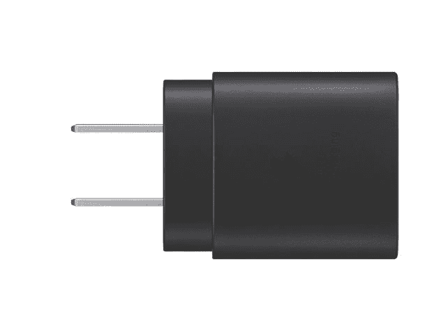

# 三星降低 Galaxy S21 充电砖的价格

> 原文：<https://www.xda-developers.com/samsung-galaxy-s21-25w-charging-brick-lower-price/>

三星的[新 Galaxy S21 系列](https://www.xda-developers.com/samsung-galaxy-s21/)将不带充电砖，以减少电子垃圾和制造成本。为了帮助减轻消费者的负担，三星将 25W 充电器的价格从 35 美元降至 19 美元。

根据 [*SamMobile*](https://www.sammobile.com/news/buy-official-galaxy-s21-charger/) 的说法，你将能够在[三星的网站](https://shop-links.co/1729418420540244340?u1=d0ed3ab1-f67f-4358-91f7-0a23df18f03d)上找到新的定价，在那里你可以选择黑色或白色的 25W 充电器。(*注:在发布*时，价格下跌似乎还没有开始。)该公司对所有订单提供免费送货服务，预计订单将于 1 月 15 日发货(截至发稿时)。幸运的是，Galaxy S21 系列的盒子里确实有一根 USB-C 到 USB-C 的电缆。

据三星称，三星的 25W 充电砖支持快速充电，最高可达 3A，比标准的 1A 或 700mA 充电器快得多。该充电器还具有功率传输(PD)功能，可提供最高效的充电体验。

如果你在过去几个月里一直密切关注该行业，那么在 Galaxy S21 系列发布时，人们预计三星会省略充电器。有许多关于三星放弃充电器的报道导致了今天的声明，而该公司删除了社交媒体上嘲笑苹果在去年底取消了 iPhone 12 系列的类似电影的帖子。

在过去的十年里，智能手机在世界各地变得越来越普遍，所以大多数人都有可能有一个充电砖，或者他们已经转向无线充电。但打开一个价值数百美元的设备，发现它没有合适的工具来充电，这仍然很痛苦。

你可以很容易地[找到一个兼容三星 Galaxy S21 系列的 25W 充电器](https://www.xda-developers.com/best-galaxy-s21-fast-chargers/)，但如果你想要一个三星制造的壁式充电器，你可以以折扣价获得。说到这里，我们已经收集了所有最好的 [Galaxy S21、S21 Plus 和 S21 Ultra deals](https://www.xda-developers.com/best-galaxy-s21-deals/) ，所以如果你打算购买三星的新设备，我们可以满足你。

 <picture></picture> 

Samsung 25W USB-C Charger

##### 三星 25W USB-C 充电器

三星的 25W 壁式充电器支持超级快速充电，并提供电源，为用户提供快速高效的充电体验