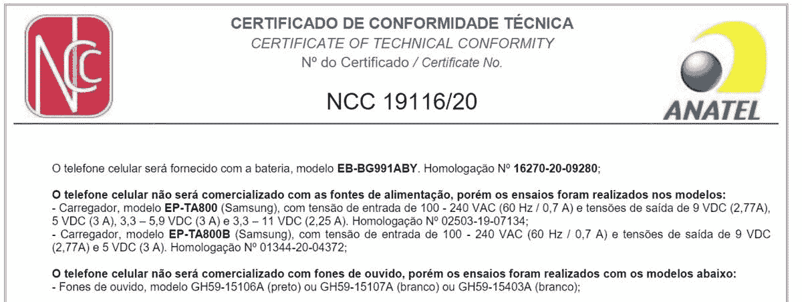

# 三星在某些地区不会为 Galaxy S21 提供充电器

> 原文：<https://www.xda-developers.com/samsung-galaxy-s21-no-power-adapter/>

当三星明年年初推出 Galaxy S21 时，它显然不会在某些地区提供带有 Galaxy S21 的充电器。证据首先由 [*Tecnoblog*](https://tecnoblog.net/391432/exclusivo-samsung-vai-vender-galaxy-s21-sem-fone-e-carregador-na-caixa/) 发现，指向巴西 ANATEL 的一份文件——实质上该国相当于美国的 FCC 揭示了这一变化。

 <picture></picture> 

Snippet from the Anatel filing for SM-G991B, the international version of the Samsung Galaxy S21.

自 7 月以来，一直有传言称三星将做出改变，有报道称三星将很快推出不带充电器的智能手机。如果这是真的，这可以被解释为三星的虚伪，三星之前嘲笑苹果在 iPhone 12 系列上采取了类似的行动。更为虚伪的是，三星似乎已经删除了 iPhone 12 系列推出后不久在脸书发布的嘲讽苹果的帖子。

这已经不是三星第一次脸上有蛋了。该公司之前取笑苹果公司取消了耳机插孔，结果在 Galaxy Note 10 上做了同样的事情。

值得注意的是，Galaxy S21 的申请是在巴西发现的，因此它可能不会在全球每个地区都成立。可能的好消息是，如果你所在的地区三星没有为 Galaxy S21 配备充电器，该公司可能会免费提供一个充电器。当 Galaxy Note 20 在美国推出不带 AKG 耳机的[(T1)时，该公司免费向那些需要耳机的人提供耳机。](https://www.xda-developers.com/samsung-galaxy-note-20-free-usb-c-earbuds-us/)

具有讽刺意味的是，正如 [*9to5Mac*](https://9to5mac.com/2020/12/02/apple-will-be-forced-to-sell-iphones-with-included-power-adapter-in-brazil/) 所指出的，苹果可能会被迫在巴西的 iPhone 12 系列中包含一个电源适配器，所以我们不确定如果这种情况发生，它将如何在该国实现。

**[三星 Galaxy S21 论坛](https://forum.xda-developers.com/c/samsung-galaxy-s21-s21-s21-ultra.11933/)**

对于任何关注此事的人来说，我们可以从一英里外就看到这一点。不仅有传言说三星会做出这样的举动，而且现在苹果已经这么做了，其他公司也可能会效仿。我们在 10 月份分析 2021 年 iPhone 12 将引领智能手机的哪些趋势时也说过同样的话。看起来缺少一个电源块确实会被其他 OEM 厂商采用。

我们知道的一件事是，据说三星正在为一月初的一场发布会做准备，这就在眼前。关于 Galaxy S21 系列有很多传言和泄露，就在本周，我们甚至第一次看到了该设备的所谓真实外观。我们应该知道三星是否会在 1 月份推出 Galaxy S21 时取消电源适配器。