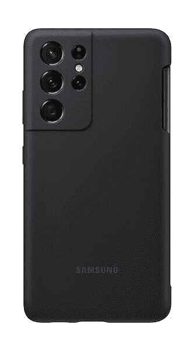
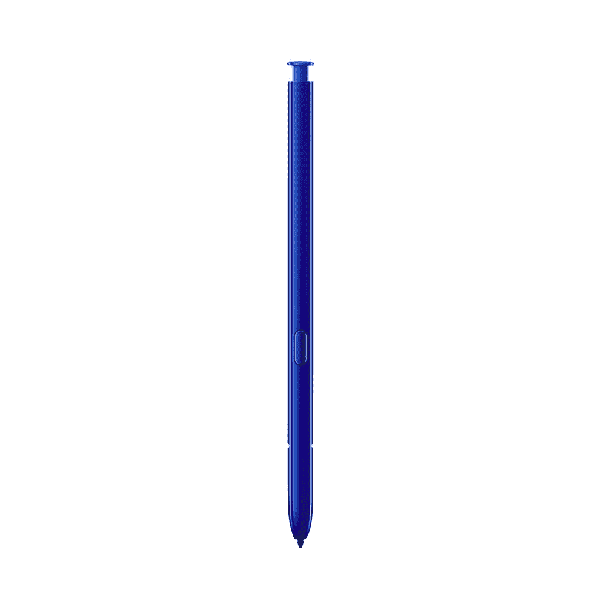

# 哪些 Galaxy S21 机型支持 S-Pen，它的工作原理是什么？

> 原文：<https://www.xda-developers.com/samsung-galaxy-s21-s-pen/>

# Galaxy S21 系列上的 S-Pen 支持是如何工作的？

三星 Galaxy S21 系列刚刚推出，但是支持 S-Pen 吗？它是...复杂。我们这里有所有的细节！

三星 Galaxy S21 系列刚刚发布，我们已经知道了该知道的一切。据报道，随着三星 Galaxy Note 系列被砍掉，许多人担心将不再有任何支持手写笔的三星旗舰智能手机。谢天谢地，三星 Galaxy S21 系列*支持 S-Pen...算是吧。**S-Pen 只在三星 Galaxy S21 Ultra、**上支持，使用起来不如 Note 系列那么方便。请记住，如果你购买了普通的 S Pen，你将无法使用 air 手势或任何蓝牙控制，所以你必须等待 S Pen Pro 稍后发布的[，或者(或者使用*任何* past Tab 或 Note-series 手写笔)将 air 手势与你闪亮的新 S21 Ultra 一起使用。](https://www.xda-developers.com/samsung-s-pen-pro-galaxy-s21-ultra-release-details/)*

 *## 在三星 Galaxy S21 Ultra 上使用 S-Pen

你需要做的第一件事是要么选择一款适用于三星 Galaxy Note 系列的 S-Pen，要么选择三星专门为 S21 Ultra 推出的新款 S-Pen。Galaxy S21 Ultra 向后兼容，可以与 Galaxy Note 20 之类的旧 S-Pen 配合使用。如果你没有以前的三星设备，那么你可以单独购买一支 S-Pen，甚至是第三方的——如果你不想花 40 美元买一支，请查看我们的[最佳 Galaxy S21 Ultra 触控笔](https://www.xda-developers.com/best-galaxy-s21-stylus/)列表。这是一个完全可选的配件，这意味着你可以把你的 Galaxy S21 Ultra 变成 Galaxy Note 21 Ultra，假设 Note 系列永远消失了。

但这有一个问题，因为你只是有一个松散的 S-Pen，无法插入智能手机。如果你不得不把它放在你的包里或口袋里，你可能会丢失或损坏它。这也是为什么三星也推出了 S-Pen *和*的保护套。

这款手写笔保护套很特别，可以固定住手写笔，这样你就不用担心会丢失。本质上，它的工作方式几乎完全相同，就好像你有一个 Galaxy Note 系列设备并想要对接你的笔一样。在未来的更新中，三星将启用手势和蓝牙控制，这样你就可以像在 Galaxy Note 系列设备上一样使用它。该笔本身与您可以为三星 Galaxy Tab S7 购买的笔非常相似，您仍然可以点击笔的顶部和侧面的按钮。如果你想节省一些钱，你可以选择 S-Pen，否则，我们强烈建议你也拿起这个箱子。

 <picture></picture> 

S-Pen for Galaxy S21 Ultra

##### 三星 Galaxy Note 21 Ulra 笔

在规格和功能方面，它与 Galaxy Note 20 Ultra 中的 S-Pen 非常相似，但这是一款新的略厚的 S-Pen，专为 S21 Ultra 设计，并设计为单独存储，而不是像 Note 20 Ultra 那样纤薄到可以装入手机。

 <picture></picture> 

Samsung Galaxy S21 Ultra S Pen Case ($30 off)

##### 三星 S-Pen Galaxy S21 保护套

Galaxy S21 Ultra 的 S-Pen 很棒，但不能连接到手机上，所以除非你想要一个可以在包里漫游的 S-Pen，否则你会想要一个可以存储它的盒子。三星的官方保护套就是这么做的，是让你的 S-Pen 和手机保持在一起的最好方式。

 <picture></picture> 

S-Pen for Galaxy Note 20 Ultra

##### 三星 Galaxy Note 20 Ulra 笔

如果你不想买新的 S-Pen，而喜欢去年 Galaxy Note 20 Ultra S-Pen 的更轻薄设计，请不要再看了。您可以从上一款 Note 旗舰产品中挑选 S-Pen，起价仅为 26 美元，有四种不同的颜色可供选择！*