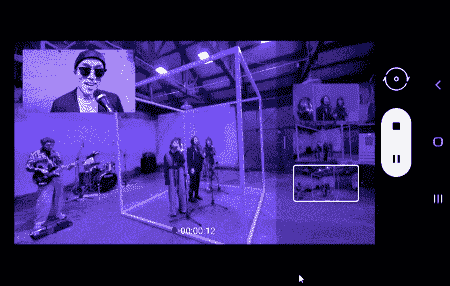

# 三星 Galaxy S21 预告让我们第一次看到导演的观点

> 原文：<https://www.xda-developers.com/samsung-galaxy-s21-teaser-directors-view/>

在去年 Galaxy S20 系列[发布之前，我们在三星相机应用的拆解中发现了一个“导演视角”功能。该专题从未实现，但一段调侃](https://www.xda-developers.com/samsung-camera-directors-view-night-hyperlapse-single-take-photo-vertical-panorama-custom-filters/) [Galaxy S21 系列](https://www.xda-developers.com/samsung-galaxy-s21/)的视频表明，导演的观点终于为黄金时间做好了准备。

在周一分享到 YouTube 的一段预告视频中，三星简要展示了这项功能。当我们去年发现这个功能时，我们将其描述为“一个视图，它可以让你锁定视图中的主题，还可以‘选择特写镜头中的人’。”除此之外，它还能让你“点击左边的缩略图来切换相机镜头。”"

虽然 Galaxy S21 预告中的一瞥很短暂，但我们对它将如何工作有了一个很好的想法。启用该功能后，用户可以看到自己，还可以在广角、超广角和长焦镜头之间切换，以记录内容。最酷的是，你可以在不同的视图之间动态切换，就好像你在使用多摄像头设置一样。这是一种有趣而独特的视频录制方式，无论你是在制作音乐视频(如三星的例子)还是家庭电影。

导演的观点对这个行业来说并不新鲜。iOS 应用程序 Filmic Pro 允许 iPhone 11 用户同时从两个摄像头以 30fps 的速度录制 1080p 视频。然而，三星的应用程序至少会是其相机应用程序的原生版本。随着拍照功能经常成为手机的主要卖点，这是帮助三星脱颖而出的一种方式。

最新的预告就在三星即将推出其 Galaxy S21 系列的几天前发布。在过去的几周里，我们已经在多个场合看到了该系列的泄露，我们对会发生什么有一个很好的想法。如果您想了解更多信息，[请查看我们的报道](https://www.xda-developers.com/samsung-galaxy-s21/)。