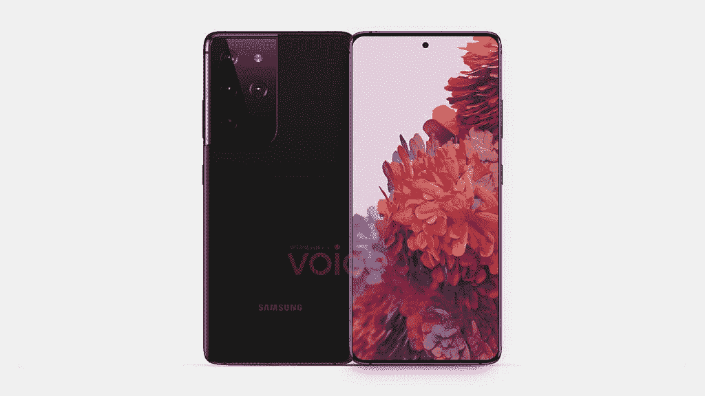

# 三星 Galaxy S21 Ultra leaked 渲染展示了一个大的摄像头凸起和弯曲的显示屏

> 原文：<https://www.xda-developers.com/samsung-galaxy-s21-ultra-render-leak-redesigned-camera-bump-curved-display/>

**更新 1(****2020 年 10 月 29 日** **@** **下午 08:22****ET):**on leaks 发布了后置摄像头设置的新渲染图。滚动到底部了解更多信息。下面保留了 2020 年 10 月 18 日发表的文章。

这是泄密的周末。在过去的两天里，我们通过渲染图看到了两款备受瞩目的即将发布的手机。首先，我们看了看[华为 Mate 40 Pro](https://www.xda-developers.com/huawei-mate-40-pro-leak-reveals-5nm-kirin-9000-soc-circular-camera-bump-curved-display/) ，然后是[三星 Galaxy S21](https://www.xda-developers.com/samsung-galaxy-s21/) 。现在，我们第一次看到了三星 Galaxy S21 Ultra。

这一泄密事件[承蒙 *@OnLeaks*](https://app.voice.com/post/@onleaks/exclusive-first-look-at-the-samsung-galaxy-s21-ultra-1603028096-1) 再次来到我们面前，借他的名声对这一泄密事件充满信心。如前所述，2021 年的三星 Galaxy S 系列可以被称为三星 Galaxy S21 或三星 Galaxy S30，这取决于三星最终决定的名称。目前，我们推测它将被称为 Galaxy S21，这里拍摄的设备是最高端的“Ultra”变体。

正如人们所料，这些泄露的渲染图中的三星 Galaxy S21 Ultra 看起来与 Galaxy S21 泄露的渲染图非常相似。不同之处在于显示屏，预计会略微弯曲，这是更多“高端”手机的常见情况。@OnLeaks 提到屏幕对角线在 6.7”到 6.9”之间，正面有一个居中的自拍打孔摄像头。如果在摄像头凸起处测量厚度，该设备的尺寸约为 165.1 x 75.6 x 8.9 毫米，即 10.8 毫米。

下一个大的变化将是相机。虽然相机岛遵循了我们在泄露的常规版本渲染图中看到的相同设计线索，但 Galaxy S21 Ultra 将有一个更大的相机岛，以容纳相机闪光灯和第四个后置摄像头。相机的规格尚未透露，但人们可以期待一个包括常规，超宽，远距摄影/潜望镜镜头的设置开始。

盛传三星将在 S 系列产品中增加 S Pen 支持，可能会为顶级机型保留该功能。然而，OnLeaks 提到 Galaxy S21 Ultra 没有 S Pen 的专用插槽。这意味着手写笔不能像 Note 系列那样放在手机中，但新设备仍然可以支持手写笔，并像在一些 Galaxy Tabs 上那样将其放在外部。

我们希望很快了解更多关于即将推出的设备。

* * *

## 更新:后置摄像头设置的新渲染

OnLeaks 发布了三星 Galaxy S21 Ultra 的新渲染图。

这张渲染图实际上显示了手机有 5 个摄像头和一个 LED 闪光灯，顶部的 LED 闪光灯被重新定位，其位置被另一个传感器占据。最新的 DVT(设计验证测试)舞台原型包括多达五个后置摄像头，或四个摄像头加一个未知传感器。最新的渲染适应了这种变化。