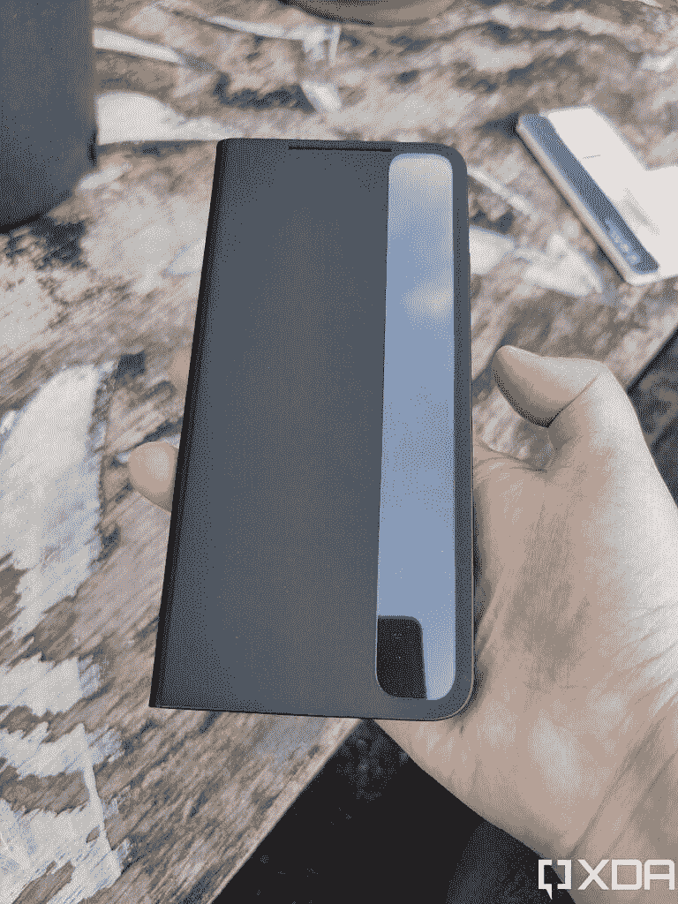
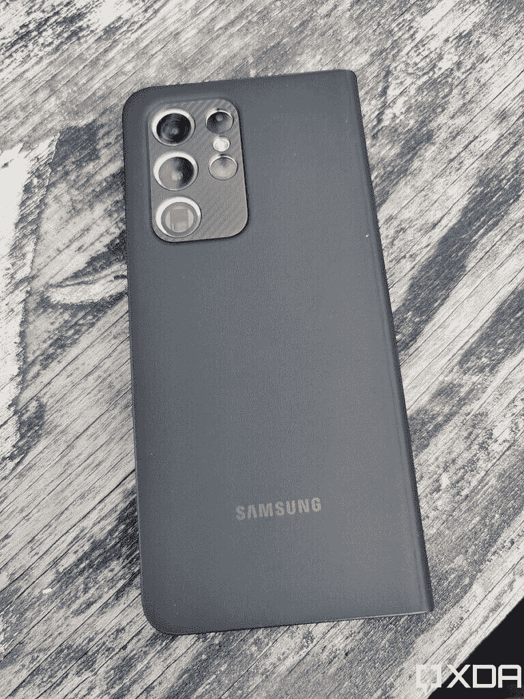
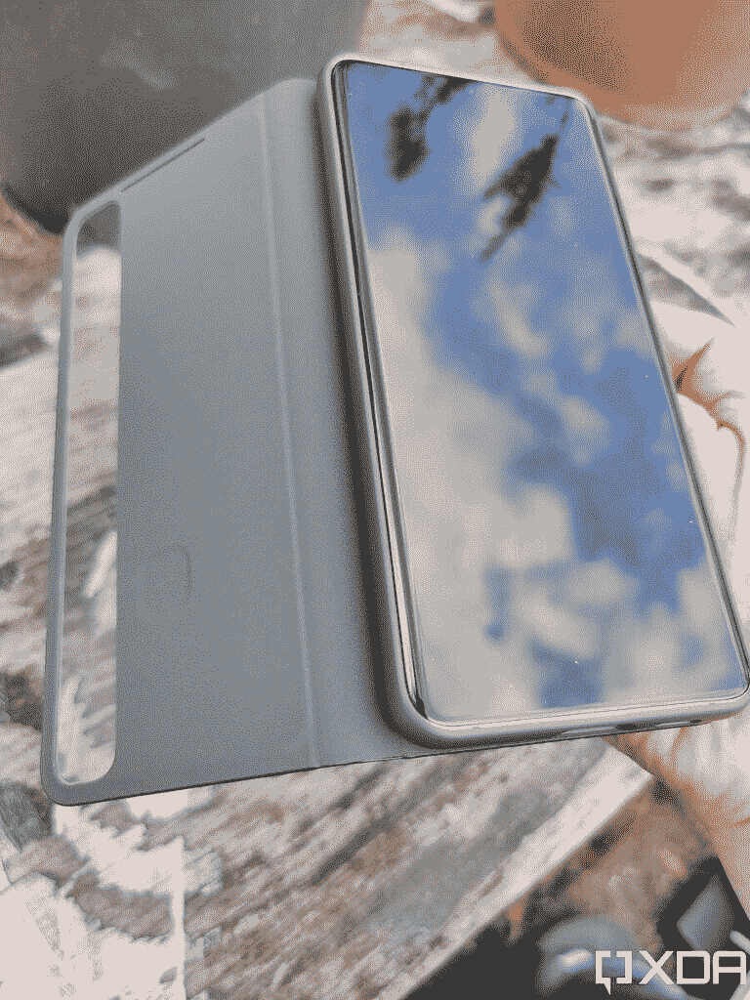
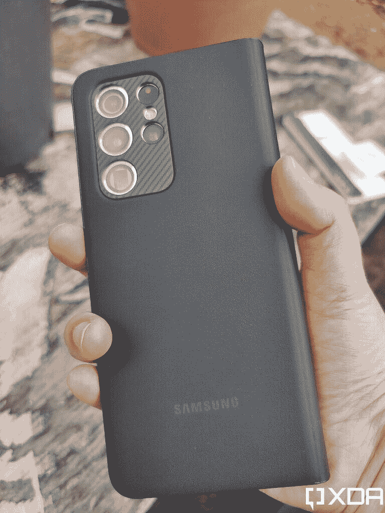
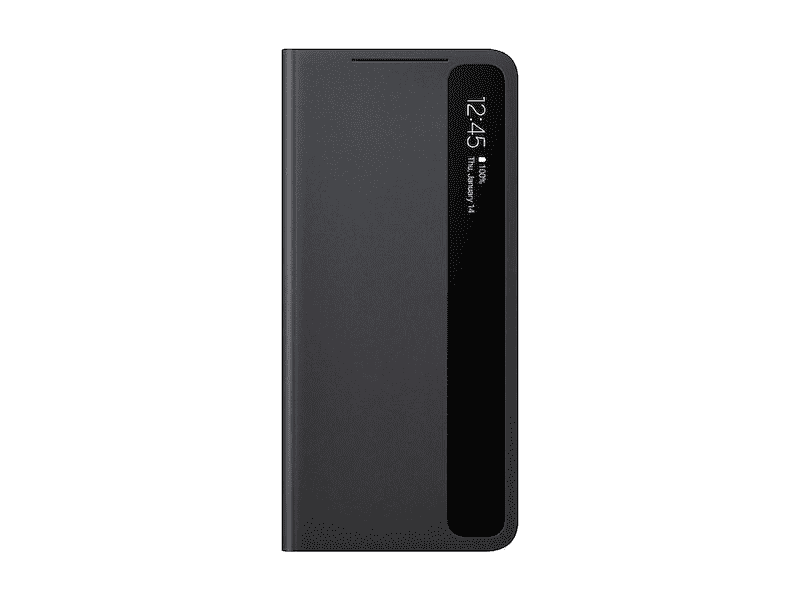

# 三星 Galaxy S21 Ultra S-View 案例回顾:保护和功能

> 原文：<https://www.xda-developers.com/samsung-galaxy-s21-ultra-s-view-case-review/>

翻盖手机壳是我最喜欢的手机壳类型。带有翻盖的外壳可以保护你的屏幕和手机的其他部分，当涉及到像三星 Galaxy S21 Ultra 这样昂贵的设备时，我想尽可能地保护它。虽然钱包保护套和其他翻盖保护套成功进入了我们的 Galaxy S21 Ultra 保护套，但我总是有点担心信用卡会划伤我的屏幕。那么 Galaxy S21 Ultra S-View 保护套是如何堆叠起来的呢？

让我们先弄清楚这一点，第一翻盖保护套往往会让你用设备相机拍照变得很尴尬，Galaxy S21 Ultra S-View 保护套也不例外。虽然覆盖屏幕的翻盖不会让拿着智能手机变得更笨重，但它肯定会盖住摄像头，你需要打开翻盖才能拍照。这并不理想，但这并不是 S-View 案例所独有的。这仍然是需要记住的事情。

 <picture></picture> 

S-View Case Closed

大多数翻盖手机的另一个主要缺点是，你不能很容易地看到你的设备屏幕，所以如果你想快速查看你的通知，接听来电，甚至只是查看时间，都很困难。S-View 外壳*的内置智能清晰视图盖*确实有所帮助。当 Galaxy S21 Ultra S-View 外壳合上后，你打开屏幕，就可以在工具条上看到时间和通知。

真的很整洁，很有帮助！您还可以使用控制杆来控制媒体和接听电话，而无需打开外壳。毕竟，智能清晰视图盖是一个透明的栏，你可以在下面与你的手机屏幕进行交互。

至于外壳本身，Galaxy S21 Ultra 用硬橡胶外壳固定在 S-View 外壳中，外壳的外层和翻盖部分由看起来和摸起来像人造革的材料制成。Galaxy S21 Ultra S-View 外壳在我手中感觉非常好，尽管它是一个翻盖外壳，但并没有增加很多体积。当然，其中一部分原因是因为翻盖不能存储信用卡或金钱，但它不能做任何事情！

然而，有一点需要注意的是，虽然 S-View 外壳保护了 S21 Ultra 的正面和背面，但这种纹理并没有使手机更容易抓握。这绝不是一个大问题，但如果你像我一样拿着智能手机有困难，你可能需要考虑一下，你是否会更经常地使用 S-View 保护套而不是有纹理的橡胶手柄保护套来摔你的昂贵设备。

 <picture></picture> 

S-View Case, Back

Galaxy S21 Ultra S-View 外壳有两种颜色，黑色和灰色，我们选择了黑色进行评估。和任何情况一样，我担心人造革会有怎样的损伤。沿着外壳移动指甲不会对外壳造成任何损坏，正如 50 美元的配件所预期的那样。用中等压力摩擦一个按键会对印在外壳上的三星标志造成轻微损坏，但不会损坏外壳本身。最后，虽然黑色不会显示出太多的污垢，但可以用湿布擦去外壳上的污垢。

 <picture></picture> 

S-View Case, Open

不可否认，这是一个巧妙的案例，但真正的问题是 S-View 是否值得 50 美元。显示你的通知的透明条确实很整洁，但是你买一个翻盖手机是为了什么？你喜欢它们提供额外的保护，还是喜欢能装下所有东西的钱包？由于 Galaxy S21 Ultra S-View 保护套没有任何持卡人插槽，所以如果你想保护屏幕，你只能拿这个保护套。如果你正在寻找一个皮夹套，你将不得不超越三星的线。

不过，有一点很好，对于 Galaxy S21 Ultra，你可以得到一个不同版本的 S-View 外壳，可以搭配一个 S-Pen 。Ultra 是 Galaxy S21 唯一可以使用 S-Pen 的版本，但它没有像 [Galaxy Note 20](https://www.xda-developers.com/samsung-galaxy-note-20/) 手机那样的内置支架。如果你正在寻找一个带有 S-Pen 和内置支架的盒子，那就太棒了。

 <picture></picture> 

S-View Case, Back

S-View 翻盖会改变你对这类案件的看法吗？不，不会的。这个保护套拍照的时候用起来还是会比较别扭，不能把卡片存放在里面。但 S-View 是一个优质的翻盖保护套，让你在按住翻盖的同时查看通知和控制手机。50 美元有点高，但三星有很多方法可以降低价格。

想拿起 Galaxy S21 Ultra S-View 保护套吗？可以从[三星专卖店](https://shop-links.co/1734005380119924498?u1=8928a648-3a79-478c-8f47-52bd7e250232)购买！

 <picture></picture> 

Galaxy S21 Ultra 5G S-View Cover

##### 三星 S-View Galaxy S21 超级外壳

寻找一个好的翻盖？三星的 S-View 翻盖保护套可能非常适合你！您可以保护您的 Galaxy S21 Ultra 屏幕，同时仍然能够查看通知和控制您的媒体。

如果你想找到更多的外壳选项，你可以在这里找到更多三星 Galaxy S21 Ultra 的外壳。