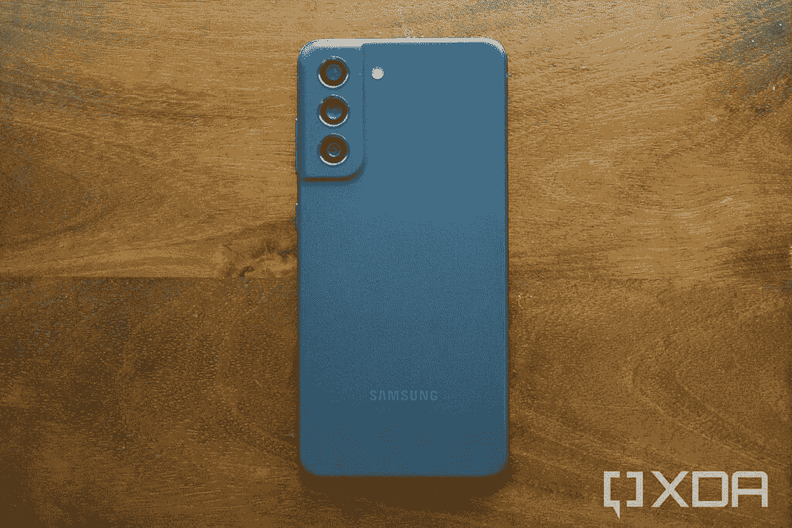

# 三星 Galaxy S22 FE 可能不会重见天日

> 原文：<https://www.xda-developers.com/samsung-galaxy-s22-fe-canceled/>

如果最近的报道可信，三星可能会搁置其下一款粉丝版设备 Galaxy S22 FE。熟悉三星计划的消息人士称，该公司不会发布 Galaxy S22 FE，并且该公司有可能彻底结束粉丝版阵容。

## 三星粉丝版设备简史

随着 2020 年 9 月 Galaxy S20 FE T1 的发布，三星恢复了在 Note 7 惨败后首次亮相的粉丝版系列。当时，该公司承诺在未来几年推出更多旗舰设备的粉丝版。三星信守承诺，于去年 5 月推出了旗舰产品 Galaxy Tab S7 的低调版本，作为粉丝版系列的一部分。

 <picture></picture> 

Samsung Galaxy S21 FE

在它发布后不久，我们开始看到关于 Galaxy S21 FE 的泄露和谣言。然而，该设备面临多次延迟，我们甚至看到多份报告表明三星已经搁置了这款手机。幸运的是，事实证明并非如此，三星终于在今年 1 月早些时候揭开了 Galaxy S21 FE 的盖子，就在它发布旗舰产品 [Galaxy S22](https://www.xda-developers.com/samsung-galaxy-s22-review/) 阵容之前。

## 会有 Galaxy S22 FE 吗？

现在距离 Galaxy S22 系列上市已经过去了几个月，我们期待看到关于 Galaxy S22 FE 的泄露。但是来自 SamMobile 的一份新报告称三星可能会被取消。该报道引用了多个未透露姓名的消息来源，他们声称三星不会发布 Galaxy S22 FE。该出版物的研究还表明，型号为 SM-S900 的设备，即 Galaxy S22 FE，目前并不存在。

SamMobile 推测三星可能会削减 Galaxy S22 FE，因为 Galaxy S21 FE 由于几个原因取得了有限的成功。正如我们在 Galaxy S21 FE 的评论中指出的那样，这款设备在错误的时间上市，就在 Galaxy S22 系列发布之前，价格较高。这使得买家没有动力选择 Galaxy S22，后者以略高的价格提供最新的硬件。

这些因素可能导致了三星取消 Galaxy S22 FE，但目前我们还不能确定这一点。如果三星确实取消了 Galaxy S22 FE，我们预计该公司会正式宣布。毕竟，它会让它的粉丝失望，因为它剥夺了他们买得起旗舰的权利。

* * *

**来源:** [SamMobile](https://www.sammobile.com/news/exclusive-samsung-galaxy-s22-fe-may-end-up-being-cancelled/)